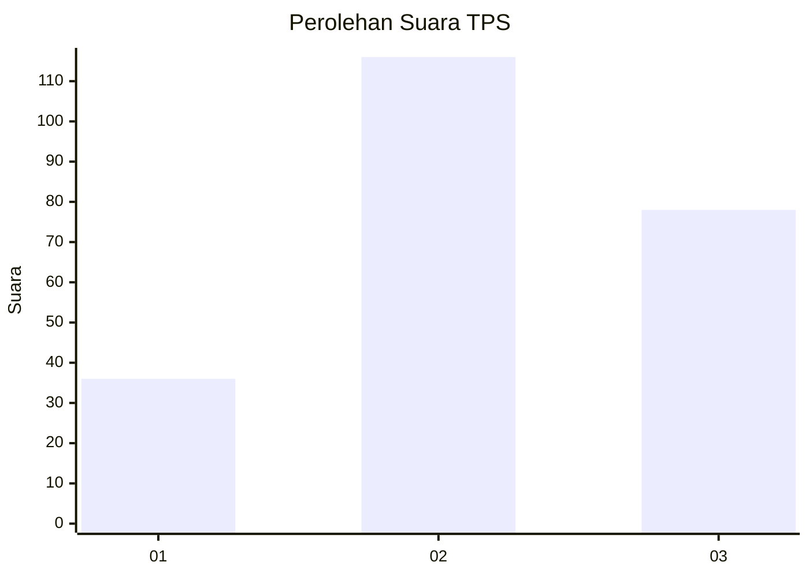
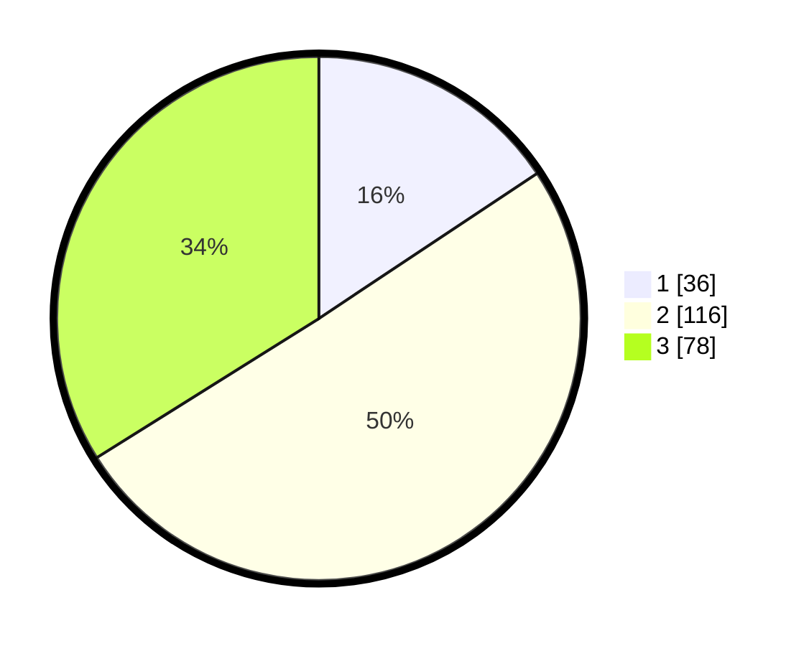

# Hasil

## Grafik

## Tabel

| No. | Nama Paslon    | Suara | Suara (raw) | Persentase |
|:--- |:-------------- | -----:| -----------:| ----------:|
| 1   | ANIES MUHAIMIN | 36    | [36][p-1]   | 15,65      |
| 2   | PRABOWO GIBRAN | 116   | [116][p-2]  | 50,43      |
| 3   | GANJAR MAHFUD  | 78    | [78][p-3]   | 33,91      |

[p-1]: https://github.com/gigit-pemilu/pemilu-2024-51-bali/blob/main/pilpres/hitung-suara/sub/51-bali/sub/03-badung/sub/01-kuta/sub/1001-tuban/sub/027-tps/sub/paslon-1.txt
[p-2]: https://github.com/gigit-pemilu/pemilu-2024-51-bali/blob/main/pilpres/hitung-suara/sub/51-bali/sub/03-badung/sub/01-kuta/sub/1001-tuban/sub/027-tps/sub/paslon-2.txt
[p-3]: https://github.com/gigit-pemilu/pemilu-2024-51-bali/blob/main/pilpres/hitung-suara/sub/51-bali/sub/03-badung/sub/01-kuta/sub/1001-tuban/sub/027-tps/sub/paslon-3.txt

## Foto C Plano

https://sirekap-obj-formc.kpu.go.id/e071/pemilu/ppwp/51/03/01/10/01/5103011001027-20240215-024356--7921edc9-e6c3-4d97-ab6f-ebb2b029ee76.jpg

https://sirekap-obj-formc.kpu.go.id/e071/pemilu/ppwp/51/03/01/10/01/5103011001027-20240215-024130--1396ba7f-dcde-4c1f-b229-ee650d1a68dc.jpg

https://sirekap-obj-formc.kpu.go.id/e071/pemilu/ppwp/51/03/01/10/01/5103011001027-20240215-024206--dd37c36a-654a-4434-9233-44479e948b85.jpg

## Metadata

| Key        | Value               |
| ---------- | ------------------- |
| Time Stamp | 2024-02-24 22:31:28 |

