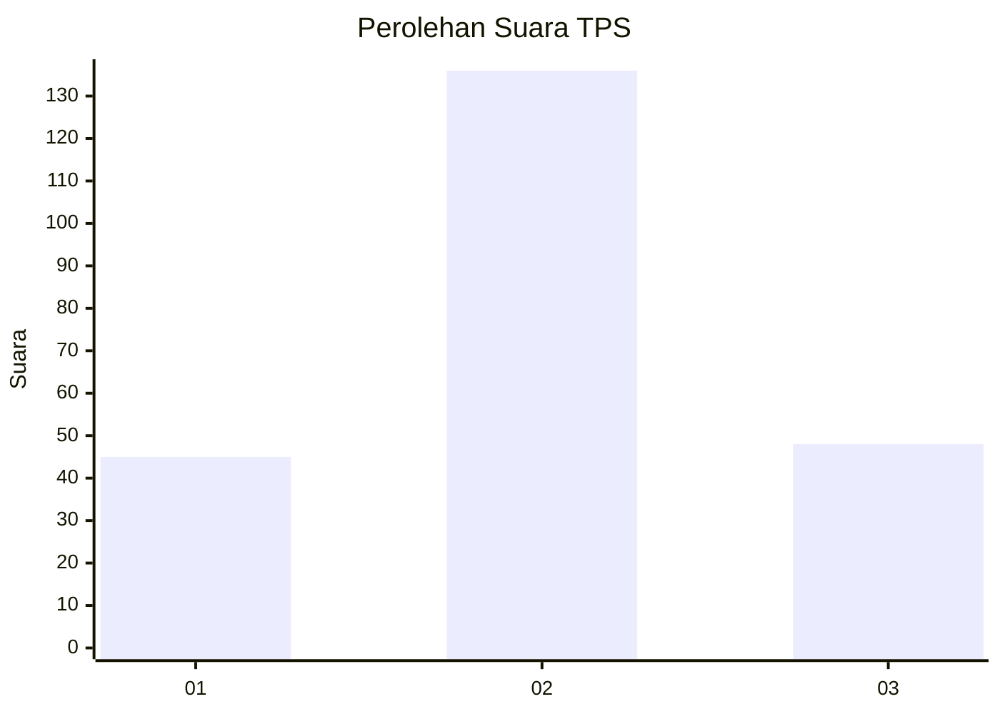
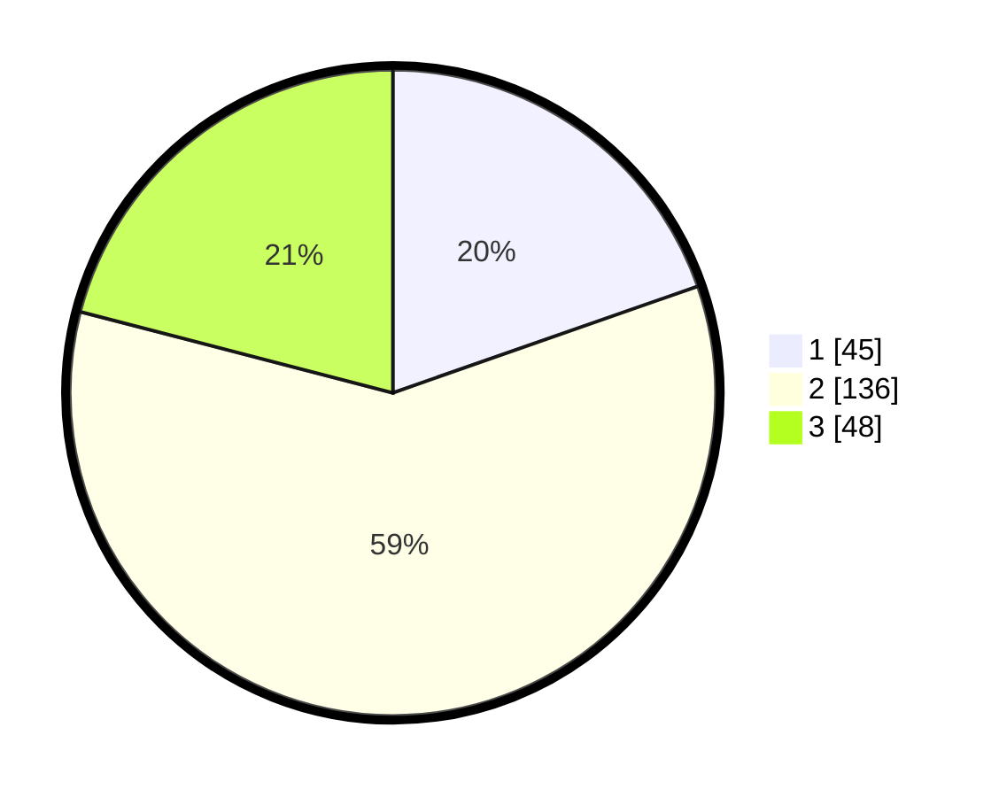

# Hasil

## Grafik

## Tabel

| No. | Nama Paslon    | Suara | Suara (raw) | Persentase |
|:--- |:-------------- | -----:| -----------:| ----------:|
| 1   | ANIES MUHAIMIN | 45    | [45][p-1]   | 19,65      |
| 2   | PRABOWO GIBRAN | 136   | [136][p-2]  | 59,39      |
| 3   | GANJAR MAHFUD  | 48    | [48][p-3]   | 20,96      |

[p-1]: https://github.com/gigit-pemilu/pemilu-2024-51-bali/blob/main/pilpres/hitung-suara/sub/51-bali/sub/03-badung/sub/01-kuta/sub/1001-tuban/sub/028-tps/sub/paslon-1.txt
[p-2]: https://github.com/gigit-pemilu/pemilu-2024-51-bali/blob/main/pilpres/hitung-suara/sub/51-bali/sub/03-badung/sub/01-kuta/sub/1001-tuban/sub/028-tps/sub/paslon-2.txt
[p-3]: https://github.com/gigit-pemilu/pemilu-2024-51-bali/blob/main/pilpres/hitung-suara/sub/51-bali/sub/03-badung/sub/01-kuta/sub/1001-tuban/sub/028-tps/sub/paslon-3.txt

## Foto C Plano

https://sirekap-obj-formc.kpu.go.id/0414/pemilu/ppwp/51/03/01/10/01/5103011001028-20240214-212124--b86413e6-8538-452f-b162-30baeaeec991.jpg

https://sirekap-obj-formc.kpu.go.id/0414/pemilu/ppwp/51/03/01/10/01/5103011001028-20240214-211945--fb58cba8-5fc8-42d9-ab85-2f7d82b544c6.jpg

https://sirekap-obj-formc.kpu.go.id/0414/pemilu/ppwp/51/03/01/10/01/5103011001028-20240214-211818--207ab23f-2c70-4986-a9a2-d3f0b6aaad8c.jpg

## Metadata

| Key        | Value               |
| ---------- | ------------------- |
| Time Stamp | 2024-02-24 22:31:28 |

