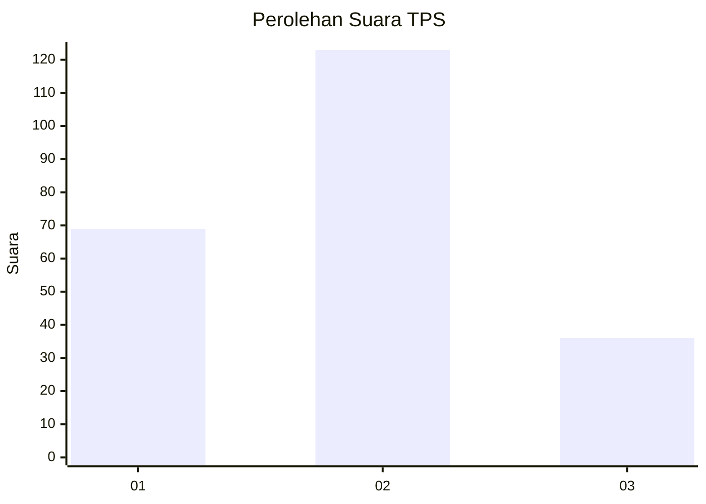
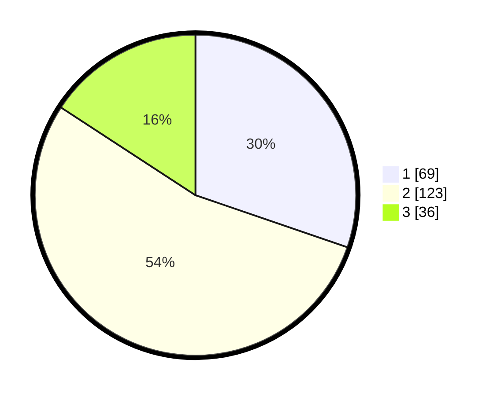

# Hasil

## Grafik

## Tabel

| No. | Nama Paslon    | Suara | Suara (raw) | Persentase |
|:--- |:-------------- | -----:| -----------:| ----------:|
| 1   | ANIES MUHAIMIN | 69    | [69][p-1]   | 30,26      |
| 2   | PRABOWO GIBRAN | 123   | [123][p-2]  | 53,95      |
| 3   | GANJAR MAHFUD  | 36    | [36][p-3]   | 15,79      |

[p-1]: https://github.com/gigit-pemilu/pemilu-2024-51-bali/blob/main/pilpres/hitung-suara/sub/51-bali/sub/03-badung/sub/01-kuta/sub/1001-tuban/sub/030-tps/sub/paslon-1.txt
[p-2]: https://github.com/gigit-pemilu/pemilu-2024-51-bali/blob/main/pilpres/hitung-suara/sub/51-bali/sub/03-badung/sub/01-kuta/sub/1001-tuban/sub/030-tps/sub/paslon-2.txt
[p-3]: https://github.com/gigit-pemilu/pemilu-2024-51-bali/blob/main/pilpres/hitung-suara/sub/51-bali/sub/03-badung/sub/01-kuta/sub/1001-tuban/sub/030-tps/sub/paslon-3.txt

## Foto C Plano

https://sirekap-obj-formc.kpu.go.id/978c/pemilu/ppwp/51/03/01/10/01/5103011001030-20240214-220244--cdb7505c-c71b-451f-84a4-619c32820bcd.jpg

https://sirekap-obj-formc.kpu.go.id/978c/pemilu/ppwp/51/03/01/10/01/5103011001030-20240214-220204--9266c30b-60ba-446a-87bd-57cd002e7590.jpg

https://sirekap-obj-formc.kpu.go.id/978c/pemilu/ppwp/51/03/01/10/01/5103011001030-20240214-220413--3219dcc3-1add-4484-980b-f682e5d26b60.jpg

## Metadata

| Key        | Value               |
| ---------- | ------------------- |
| Time Stamp | 2024-02-24 22:31:28 |

