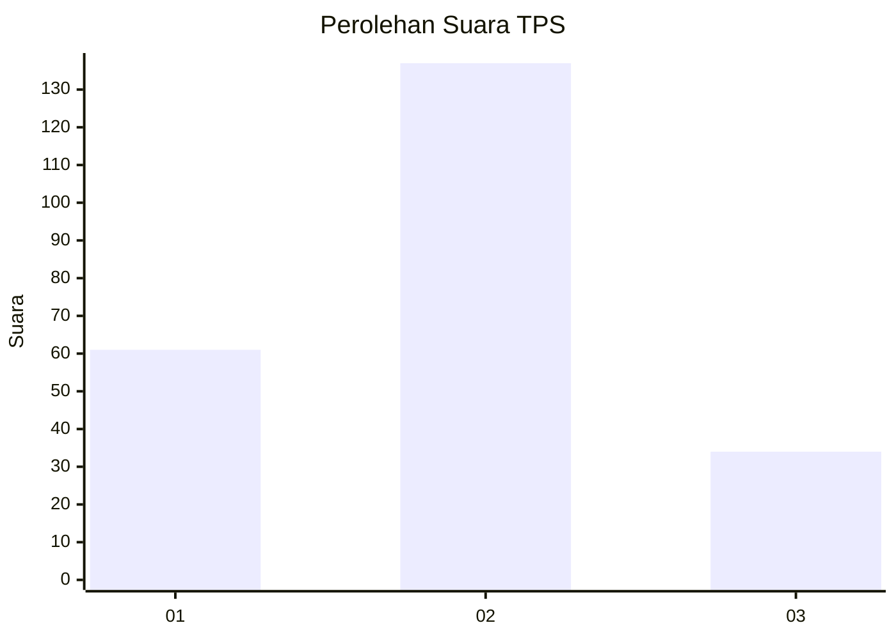
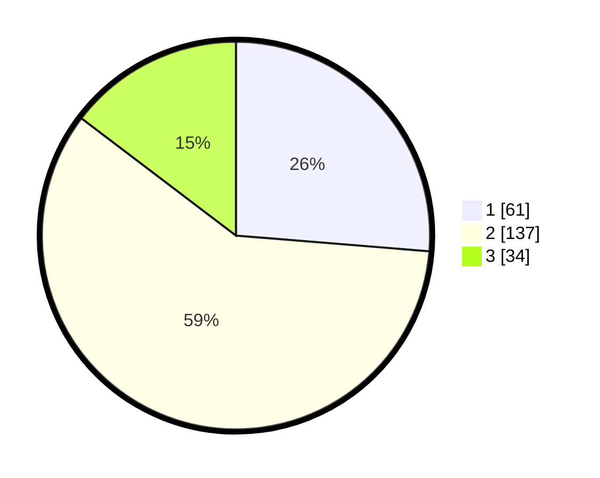

# Hasil

## Grafik

## Tabel

| No. | Nama Paslon    | Suara | Suara (raw) | Persentase |
|:--- |:-------------- | -----:| -----------:| ----------:|
| 1   | ANIES MUHAIMIN | 61    | [61][p-1]   | 26,29      |
| 2   | PRABOWO GIBRAN | 137   | [137][p-2]  | 59,05      |
| 3   | GANJAR MAHFUD  | 34    | [34][p-3]   | 14,66      |

[p-1]: https://github.com/gigit-pemilu/pemilu-2024-51-bali/blob/main/pilpres/hitung-suara/sub/51-bali/sub/03-badung/sub/01-kuta/sub/1001-tuban/sub/035-tps/sub/paslon-1.txt
[p-2]: https://github.com/gigit-pemilu/pemilu-2024-51-bali/blob/main/pilpres/hitung-suara/sub/51-bali/sub/03-badung/sub/01-kuta/sub/1001-tuban/sub/035-tps/sub/paslon-2.txt
[p-3]: https://github.com/gigit-pemilu/pemilu-2024-51-bali/blob/main/pilpres/hitung-suara/sub/51-bali/sub/03-badung/sub/01-kuta/sub/1001-tuban/sub/035-tps/sub/paslon-3.txt

## Foto C Plano

https://sirekap-obj-formc.kpu.go.id/30a9/pemilu/ppwp/51/03/01/10/01/5103011001035-20240214-215539--dd58187f-523d-4dc7-8761-5a1bcc656027.jpg

https://sirekap-obj-formc.kpu.go.id/30a9/pemilu/ppwp/51/03/01/10/01/5103011001035-20240214-215429--b409f993-0137-4635-82b6-8ad1b4c9e8f1.jpg

https://sirekap-obj-formc.kpu.go.id/30a9/pemilu/ppwp/51/03/01/10/01/5103011001035-20240214-215657--fed79738-e200-4b7f-b75c-45b613aed35a.jpg

## Metadata

| Key        | Value               |
| ---------- | ------------------- |
| Time Stamp | 2024-02-24 22:31:28 |

