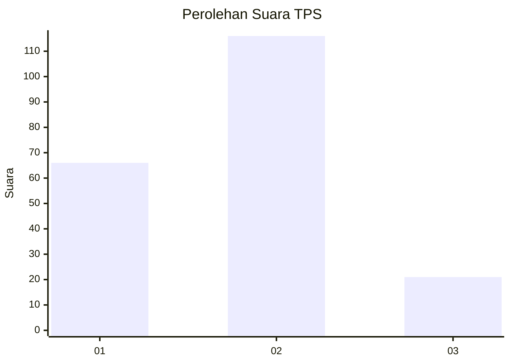
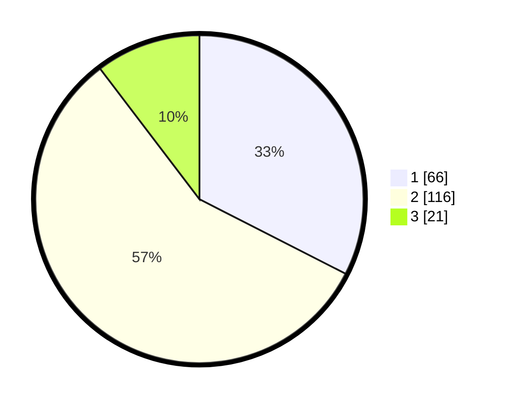

# Hasil

## Grafik

## Tabel

| No. | Nama Paslon    | Suara | Suara (raw) | Persentase |
|:--- |:-------------- | -----:| -----------:| ----------:|
| 1   | ANIES MUHAIMIN | 66    | [66][p-1]   | 32,51      |
| 2   | PRABOWO GIBRAN | 116   | [116][p-2]  | 57,14      |
| 3   | GANJAR MAHFUD  | 21    | [21][p-3]   | 10,34      |

[p-1]: https://github.com/gigit-pemilu/pemilu-2024-51-bali/blob/main/pilpres/hitung-suara/sub/51-bali/sub/03-badung/sub/01-kuta/sub/1001-tuban/sub/041-tps/sub/paslon-1.txt
[p-2]: https://github.com/gigit-pemilu/pemilu-2024-51-bali/blob/main/pilpres/hitung-suara/sub/51-bali/sub/03-badung/sub/01-kuta/sub/1001-tuban/sub/041-tps/sub/paslon-2.txt
[p-3]: https://github.com/gigit-pemilu/pemilu-2024-51-bali/blob/main/pilpres/hitung-suara/sub/51-bali/sub/03-badung/sub/01-kuta/sub/1001-tuban/sub/041-tps/sub/paslon-3.txt

## Foto C Plano

https://sirekap-obj-formc.kpu.go.id/be2f/pemilu/ppwp/51/03/01/10/01/5103011001041-20240214-185350--bc8fa3b3-7154-4ccf-bac4-00f4df95ee06.jpg

https://sirekap-obj-formc.kpu.go.id/be2f/pemilu/ppwp/51/03/01/10/01/5103011001041-20240214-185438--6477a7e8-4952-4f0a-98e6-53d58ddf871d.jpg

## Metadata

| Key        | Value               |
| ---------- | ------------------- |
| Time Stamp | 2024-02-24 22:31:28 |

