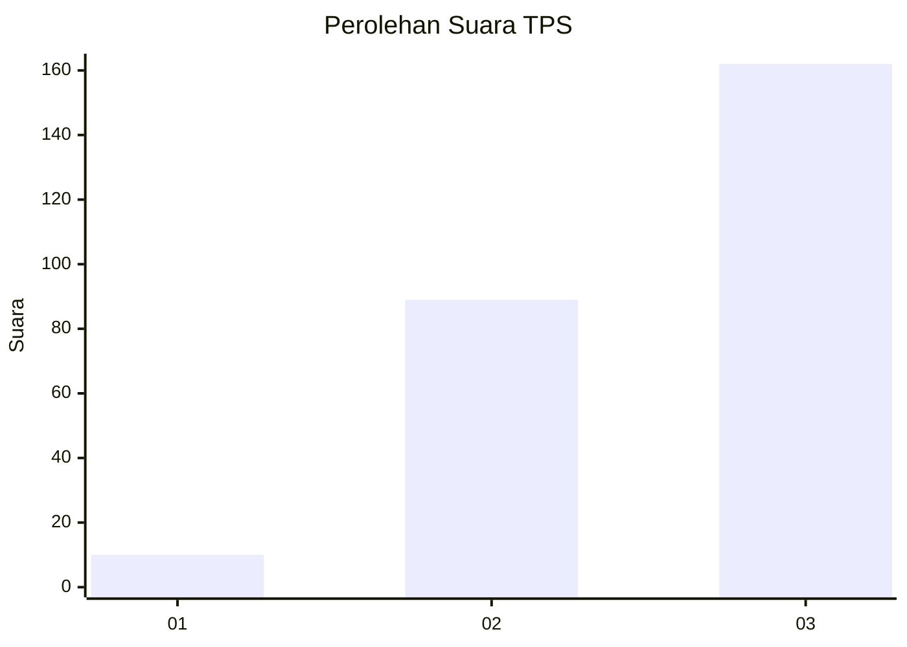
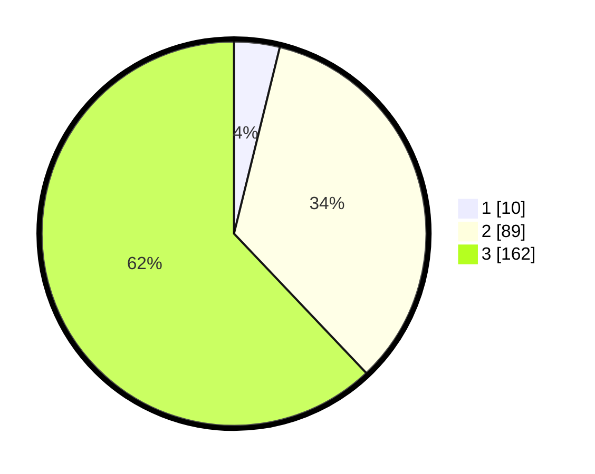

# Hasil

## Grafik

## Tabel

| No. | Nama Paslon    | Suara | Suara (raw) | Persentase |
|:--- |:-------------- | -----:| -----------:| ----------:|
| 1   | ANIES MUHAIMIN | 10    | [10][p-1]   | 3,83       |
| 2   | PRABOWO GIBRAN | 89    | [89][p-2]   | 34,10      |
| 3   | GANJAR MAHFUD  | 162   | [162][p-3]  | 62,07      |

[p-1]: https://github.com/gigit-pemilu/pemilu-2024-51-bali/blob/main/pilpres/hitung-suara/sub/51-bali/sub/03-badung/sub/01-kuta/sub/1001-tuban/sub/054-tps/sub/paslon-1.txt
[p-2]: https://github.com/gigit-pemilu/pemilu-2024-51-bali/blob/main/pilpres/hitung-suara/sub/51-bali/sub/03-badung/sub/01-kuta/sub/1001-tuban/sub/054-tps/sub/paslon-2.txt
[p-3]: https://github.com/gigit-pemilu/pemilu-2024-51-bali/blob/main/pilpres/hitung-suara/sub/51-bali/sub/03-badung/sub/01-kuta/sub/1001-tuban/sub/054-tps/sub/paslon-3.txt

## Foto C Plano

https://sirekap-obj-formc.kpu.go.id/a2f3/pemilu/ppwp/51/03/01/10/01/5103011001054-20240214-234853--e31ba94a-0bd2-453e-819f-220ff1efc798.jpg

https://sirekap-obj-formc.kpu.go.id/a2f3/pemilu/ppwp/51/03/01/10/01/5103011001054-20240214-234901--80c29c81-5450-4d80-bbb5-f1928051d2d9.jpg

https://sirekap-obj-formc.kpu.go.id/a2f3/pemilu/ppwp/51/03/01/10/01/5103011001054-20240214-234910--28db6961-455a-43ad-a0a5-53428dd1e9dc.jpg

## Metadata

| Key        | Value               |
| ---------- | ------------------- |
| Time Stamp | 2024-02-24 22:31:28 |

