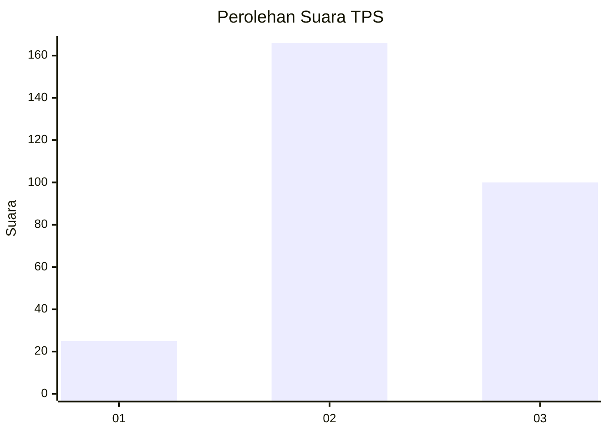
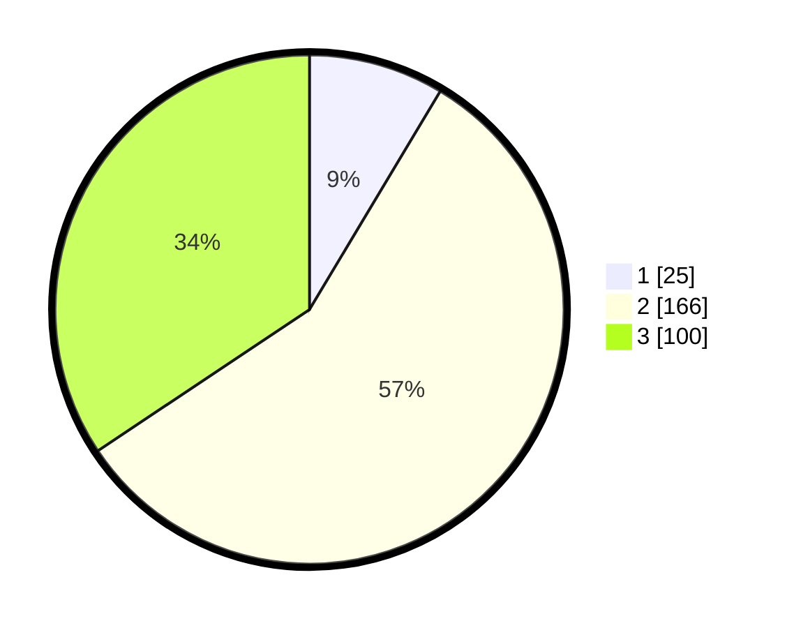

# Hasil

## Grafik

## Tabel

| No. | Nama Paslon    | Suara | Suara (raw) | Persentase |
|:--- |:-------------- | -----:| -----------:| ----------:|
| 1   | ANIES MUHAIMIN | 25    | [25][p-1]   | 8,59       |
| 2   | PRABOWO GIBRAN | 166   | [166][p-2]  | 57,04      |
| 3   | GANJAR MAHFUD  | 100   | [100][p-3]  | 34,36      |

[p-1]: https://github.com/gigit-pemilu/pemilu-2024-51-bali/blob/main/pilpres/hitung-suara/sub/51-bali/sub/03-badung/sub/01-kuta/sub/1002-kuta/sub/002-tps/sub/paslon-1.txt
[p-2]: https://github.com/gigit-pemilu/pemilu-2024-51-bali/blob/main/pilpres/hitung-suara/sub/51-bali/sub/03-badung/sub/01-kuta/sub/1002-kuta/sub/002-tps/sub/paslon-2.txt
[p-3]: https://github.com/gigit-pemilu/pemilu-2024-51-bali/blob/main/pilpres/hitung-suara/sub/51-bali/sub/03-badung/sub/01-kuta/sub/1002-kuta/sub/002-tps/sub/paslon-3.txt

## Foto C Plano

https://sirekap-obj-formc.kpu.go.id/d1a1/pemilu/ppwp/51/03/01/10/02/5103011002002-20240214-141538--15be51d9-f324-4aa0-befb-9c4e000e3de6.jpg

https://sirekap-obj-formc.kpu.go.id/d1a1/pemilu/ppwp/51/03/01/10/02/5103011002002-20240214-141946--3644928e-7ee7-4638-9775-5388a980f2e5.jpg

## Metadata

| Key        | Value               |
| ---------- | ------------------- |
| Time Stamp | 2024-02-25 22:00:00 |

