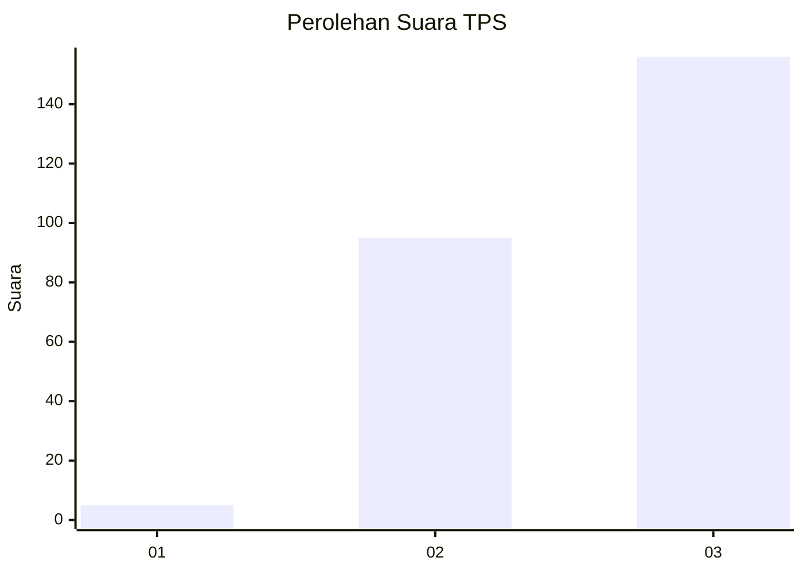
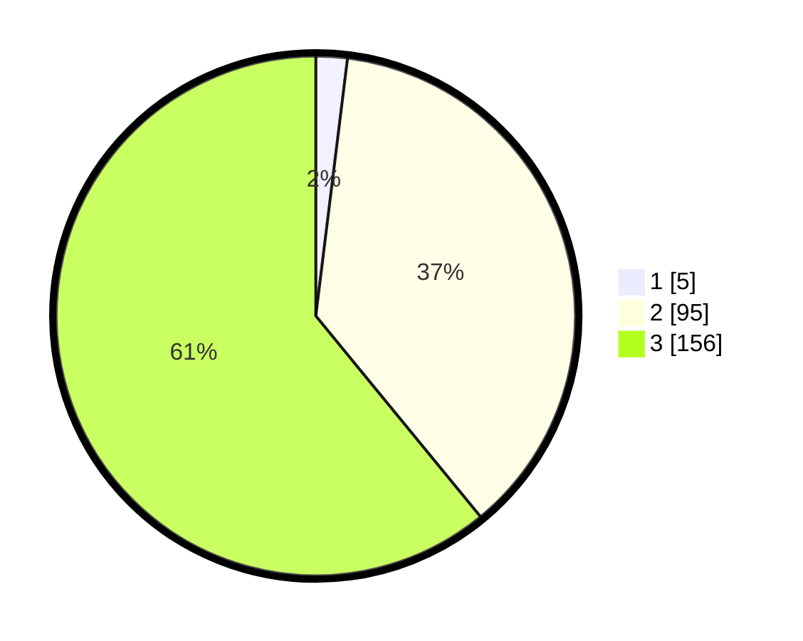

# Hasil

## Grafik

## Tabel

| No. | Nama Paslon    | Suara | Suara (raw) | Persentase |
|:--- |:-------------- | -----:| -----------:| ----------:|
| 1   | ANIES MUHAIMIN | 5     | [5][p-1]    | 1,95       |
| 2   | PRABOWO GIBRAN | 95    | [95][p-2]   | 37,11      |
| 3   | GANJAR MAHFUD  | 156   | [156][p-3]  | 60,94      |

[p-1]: https://github.com/gigit-pemilu/pemilu-2024-51-bali/blob/main/pilpres/hitung-suara/sub/51-bali/sub/03-badung/sub/01-kuta/sub/1002-kuta/sub/010-tps/sub/paslon-1.txt
[p-2]: https://github.com/gigit-pemilu/pemilu-2024-51-bali/blob/main/pilpres/hitung-suara/sub/51-bali/sub/03-badung/sub/01-kuta/sub/1002-kuta/sub/010-tps/sub/paslon-2.txt
[p-3]: https://github.com/gigit-pemilu/pemilu-2024-51-bali/blob/main/pilpres/hitung-suara/sub/51-bali/sub/03-badung/sub/01-kuta/sub/1002-kuta/sub/010-tps/sub/paslon-3.txt

## Foto C Plano

https://sirekap-obj-formc.kpu.go.id/8ec8/pemilu/ppwp/51/03/01/10/02/5103011002010-20240214-215150--49edafdd-88da-4123-b99e-e54b59d2ae45.jpg

https://sirekap-obj-formc.kpu.go.id/8ec8/pemilu/ppwp/51/03/01/10/02/5103011002010-20240214-215153--b7615845-0d0a-44da-a00d-57e46d4dd483.jpg

https://sirekap-obj-formc.kpu.go.id/8ec8/pemilu/ppwp/51/03/01/10/02/5103011002010-20240214-215159--f8725f05-ffc9-492c-9f48-c4106ce19df7.jpg

## Metadata

| Key        | Value               |
| ---------- | ------------------- |
| Time Stamp | 2024-02-15 07:00:44 |

## DATA PEMILIH TETAP

Jumlah pemilih dalam DPT: **267**.
 * L: **130**.
 * P: **137**.

## DATA PENGGUNA HAK PILIH

Jumlah pengguna hak pilih dalam DPT: **259**.
 * L: **125**.
 * P: **134**.

Jumlah pengguna hak pilih dalam DPTb: **0**.
 * L: **0**.
 * P: **0**.

Jumlah pengguna hak pilih dalam DPK: **0**.
 * L: **0**.
 * P: **0**.

Jumlah pengguna hak pilih: **259**.
 * L: **125**.
 * P: **134**.

## JUMLAH SUARA SAH DAN TIDAK SAH

JUMLAH SELURUH SUARA SAH: **256**.

JUMLAH SUARA TIDAK SAH: **3**.

JUMLAH SELURUH SUARA SAH DAN SUARA TIDAK SAH: **259**.

