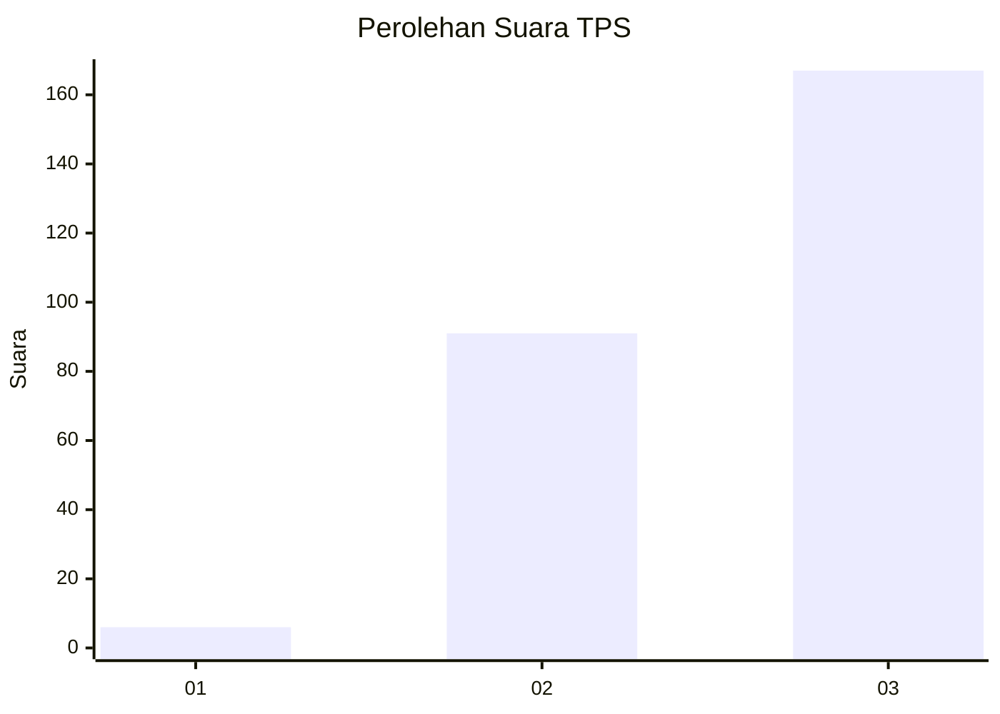
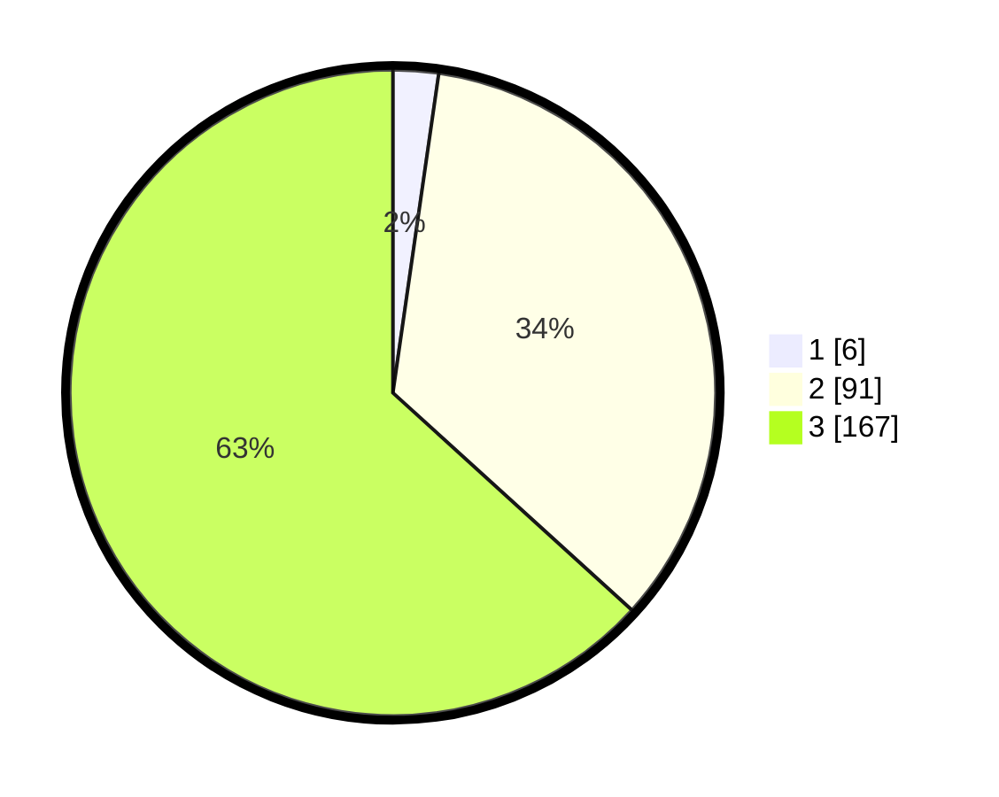

# Hasil

## Grafik

## Tabel

| No. | Nama Paslon    | Suara | Suara (raw) | Persentase |
|:--- |:-------------- | -----:| -----------:| ----------:|
| 1   | ANIES MUHAIMIN | 6     | [6][p-1]    | 2,27       |
| 2   | PRABOWO GIBRAN | 91    | [91][p-2]   | 34,47      |
| 3   | GANJAR MAHFUD  | 167   | [167][p-3]  | 63,26      |

[p-1]: https://github.com/gigit-pemilu/pemilu-2024-51-bali/blob/main/pilpres/hitung-suara/sub/51-bali/sub/03-badung/sub/01-kuta/sub/1002-kuta/sub/011-tps/sub/paslon-1.txt
[p-2]: https://github.com/gigit-pemilu/pemilu-2024-51-bali/blob/main/pilpres/hitung-suara/sub/51-bali/sub/03-badung/sub/01-kuta/sub/1002-kuta/sub/011-tps/sub/paslon-2.txt
[p-3]: https://github.com/gigit-pemilu/pemilu-2024-51-bali/blob/main/pilpres/hitung-suara/sub/51-bali/sub/03-badung/sub/01-kuta/sub/1002-kuta/sub/011-tps/sub/paslon-3.txt

## Foto C Plano

https://sirekap-obj-formc.kpu.go.id/8aac/pemilu/ppwp/51/03/01/10/02/5103011002011-20240215-184910--bd8ccb03-74a8-49d1-97f6-fbc9f2003dcc.jpg

https://sirekap-obj-formc.kpu.go.id/8aac/pemilu/ppwp/51/03/01/10/02/5103011002011-20240215-184930--6ffb5bd8-9778-4bd9-9f1a-e8a768a274dc.jpg

https://sirekap-obj-formc.kpu.go.id/8aac/pemilu/ppwp/51/03/01/10/02/5103011002011-20240215-184947--487b4a41-0958-4866-a79c-0cfe39e9dca4.jpg

## Metadata

| Key        | Value               |
| ---------- | ------------------- |
| Time Stamp | 2024-02-16 05:30:26 |

## DATA PEMILIH TETAP

Jumlah pemilih dalam DPT: **270**.
 * L: **130**.
 * P: **140**.

## DATA PENGGUNA HAK PILIH

Jumlah pengguna hak pilih dalam DPT: **270**.
 * L: **130**.
 * P: **140**.

Jumlah pengguna hak pilih dalam DPTb: **3**.
 * L: **2**.
 * P: **1**.

Jumlah pengguna hak pilih dalam DPK: **4**.
 * L: **2**.
 * P: **2**.

Jumlah pengguna hak pilih: **277**.
 * L: **134**.
 * P: **143**.

## JUMLAH SUARA SAH DAN TIDAK SAH

JUMLAH SELURUH SUARA SAH: **264**.

JUMLAH SUARA TIDAK SAH: **5**.

JUMLAH SELURUH SUARA SAH DAN SUARA TIDAK SAH: **269**.

