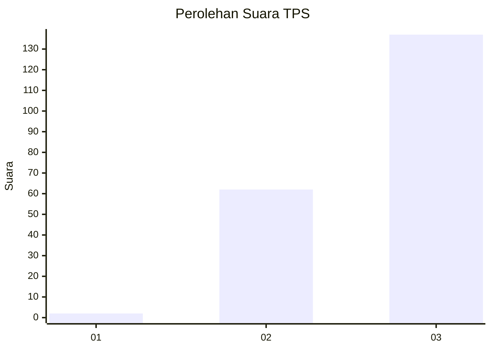
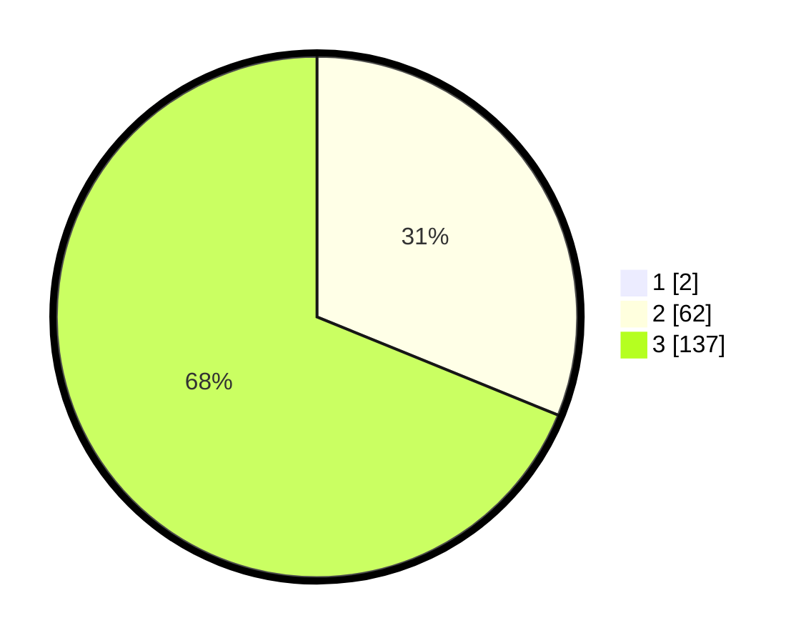

# Hasil

## Grafik

## Tabel

| No. | Nama Paslon    | Suara | Suara (raw) | Persentase |
|:--- |:-------------- | -----:| -----------:| ----------:|
| 1   | ANIES MUHAIMIN | 2     | [2][p-1]    | 1,00       |
| 2   | PRABOWO GIBRAN | 62    | [62][p-2]   | 30,85      |
| 3   | GANJAR MAHFUD  | 137   | [137][p-3]  | 68,16      |

[p-1]: https://github.com/gigit-pemilu/pemilu-2024-51-bali/blob/main/pilpres/hitung-suara/sub/51-bali/sub/03-badung/sub/01-kuta/sub/1002-kuta/sub/018-tps/sub/paslon-1.txt
[p-2]: https://github.com/gigit-pemilu/pemilu-2024-51-bali/blob/main/pilpres/hitung-suara/sub/51-bali/sub/03-badung/sub/01-kuta/sub/1002-kuta/sub/018-tps/sub/paslon-2.txt
[p-3]: https://github.com/gigit-pemilu/pemilu-2024-51-bali/blob/main/pilpres/hitung-suara/sub/51-bali/sub/03-badung/sub/01-kuta/sub/1002-kuta/sub/018-tps/sub/paslon-3.txt

## Foto C Plano

https://sirekap-obj-formc.kpu.go.id/57cf/pemilu/ppwp/51/03/01/10/02/5103011002018-20240214-192042--07ca34c4-0d89-4941-9261-0f0d34f4b691.jpg

https://sirekap-obj-formc.kpu.go.id/57cf/pemilu/ppwp/51/03/01/10/02/5103011002018-20240214-210032--dac4bf79-1208-4f24-a038-19c38d0d0637.jpg

https://sirekap-obj-formc.kpu.go.id/57cf/pemilu/ppwp/51/03/01/10/02/5103011002018-20240214-210037--2002e0ca-4121-43dc-86c6-d78e72b069aa.jpg

## Metadata

| Key        | Value               |
| ---------- | ------------------- |
| Time Stamp | 2024-02-24 22:31:28 |

## DATA PEMILIH TETAP

Jumlah pemilih dalam DPT: **249**.
 * L: **123**.
 * P: **126**.

## DATA PENGGUNA HAK PILIH

Jumlah pengguna hak pilih dalam DPT: **219**.
 * L: **109**.
 * P: **110**.

Jumlah pengguna hak pilih dalam DPTb: **0**.
 * L: **0**.
 * P: **0**.

Jumlah pengguna hak pilih dalam DPK: **0**.
 * L: **0**.
 * P: **0**.

Jumlah pengguna hak pilih: **219**.
 * L: **109**.
 * P: **110**.

## JUMLAH SUARA SAH DAN TIDAK SAH

JUMLAH SELURUH SUARA SAH: **201**.

JUMLAH SUARA TIDAK SAH: **18**.

JUMLAH SELURUH SUARA SAH DAN SUARA TIDAK SAH: **219**.

