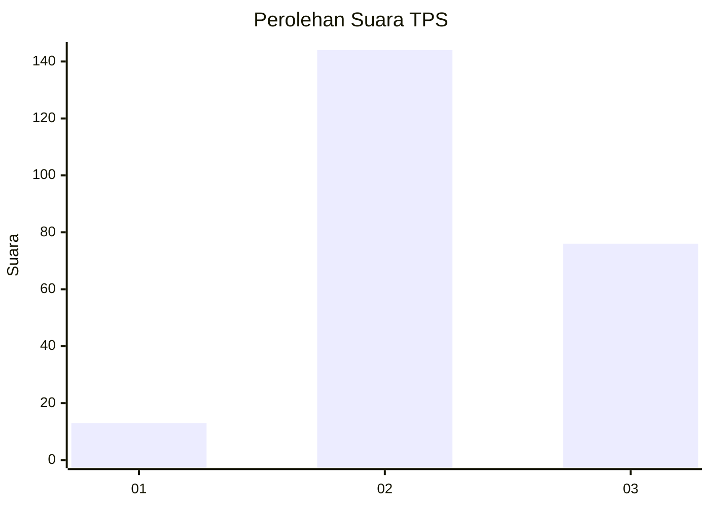
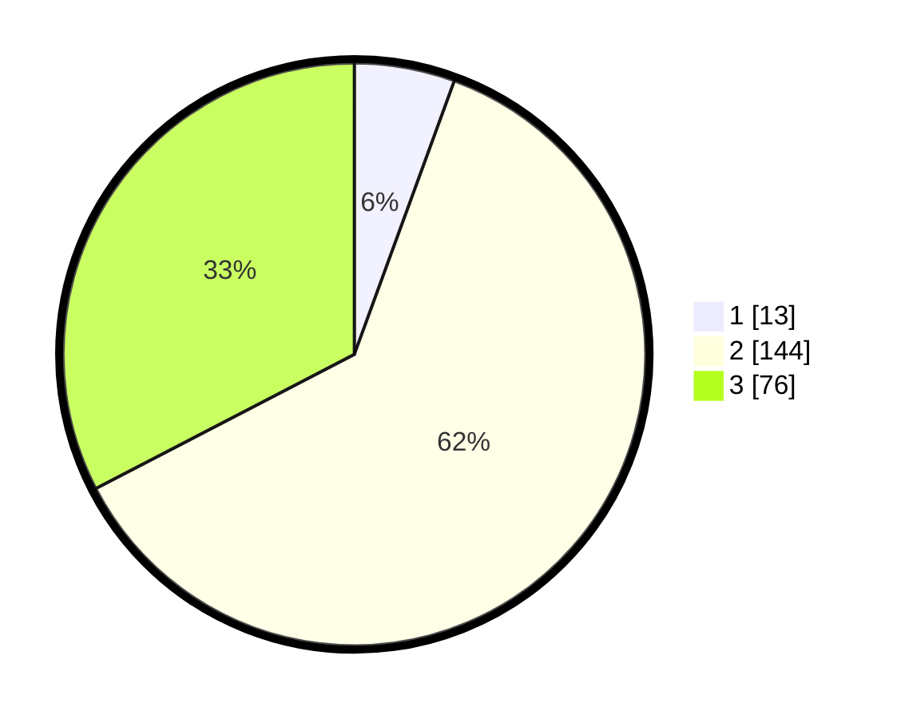

# Hasil

## Grafik

## Tabel

| No. | Nama Paslon    | Suara | Suara (raw) | Persentase |
|:--- |:-------------- | -----:| -----------:| ----------:|
| 1   | ANIES MUHAIMIN | 13    | [13][p-1]   | 5,58       |
| 2   | PRABOWO GIBRAN | 144   | [144][p-2]  | 61,80      |
| 3   | GANJAR MAHFUD  | 76    | [76][p-3]   | 32,62      |

[p-1]: https://github.com/gigit-pemilu/pemilu-2024-51-bali/blob/main/pilpres/hitung-suara/sub/51-bali/sub/03-badung/sub/01-kuta/sub/1002-kuta/sub/030-tps/sub/paslon-1.txt
[p-2]: https://github.com/gigit-pemilu/pemilu-2024-51-bali/blob/main/pilpres/hitung-suara/sub/51-bali/sub/03-badung/sub/01-kuta/sub/1002-kuta/sub/030-tps/sub/paslon-2.txt
[p-3]: https://github.com/gigit-pemilu/pemilu-2024-51-bali/blob/main/pilpres/hitung-suara/sub/51-bali/sub/03-badung/sub/01-kuta/sub/1002-kuta/sub/030-tps/sub/paslon-3.txt

## Foto C Plano

https://sirekap-obj-formc.kpu.go.id/27aa/pemilu/ppwp/51/03/01/10/02/5103011002030-20240215-084354--906b570a-3ba0-4a62-8bab-46cda0d1cae7.jpg

https://sirekap-obj-formc.kpu.go.id/27aa/pemilu/ppwp/51/03/01/10/02/5103011002030-20240215-084402--23fce6ea-7295-4bed-86ca-b290b0061432.jpg

https://sirekap-obj-formc.kpu.go.id/27aa/pemilu/ppwp/51/03/01/10/02/5103011002030-20240215-084408--5e13cd0e-02ed-4fc3-a313-ba47f96fa8d3.jpg

## Metadata

| Key        | Value               |
| ---------- | ------------------- |
| Time Stamp | 2024-02-16 08:30:27 |

## DATA PEMILIH TETAP

Jumlah pemilih dalam DPT: **276**.
 * L: **129**.
 * P: **147**.

## DATA PENGGUNA HAK PILIH

Jumlah pengguna hak pilih dalam DPT: **236**.
 * L: **110**.
 * P: **126**.

Jumlah pengguna hak pilih dalam DPTb: **2**.
 * L: **1**.
 * P: **1**.

Jumlah pengguna hak pilih dalam DPK: **0**.
 * L: **0**.
 * P: **0**.

Jumlah pengguna hak pilih: **238**.
 * L: **111**.
 * P: **127**.

## JUMLAH SUARA SAH DAN TIDAK SAH

JUMLAH SELURUH SUARA SAH: **233**.

JUMLAH SUARA TIDAK SAH: **5**.

JUMLAH SELURUH SUARA SAH DAN SUARA TIDAK SAH: **238**.

