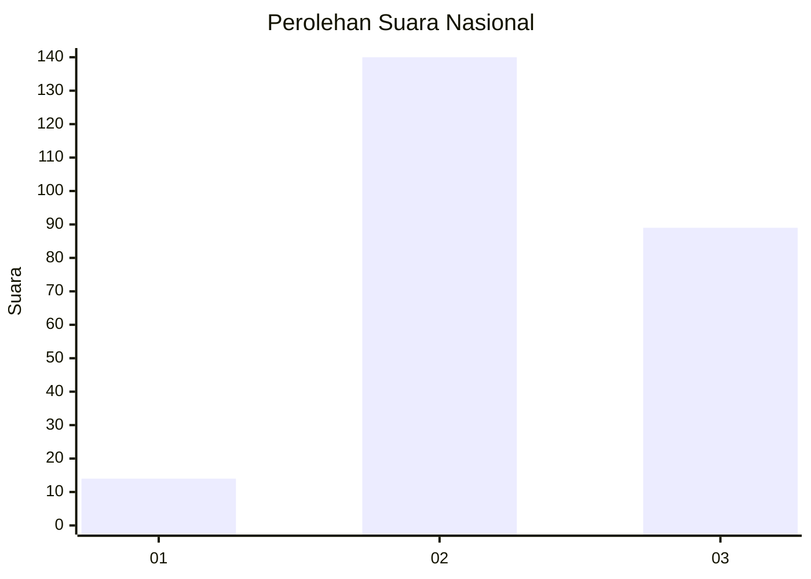
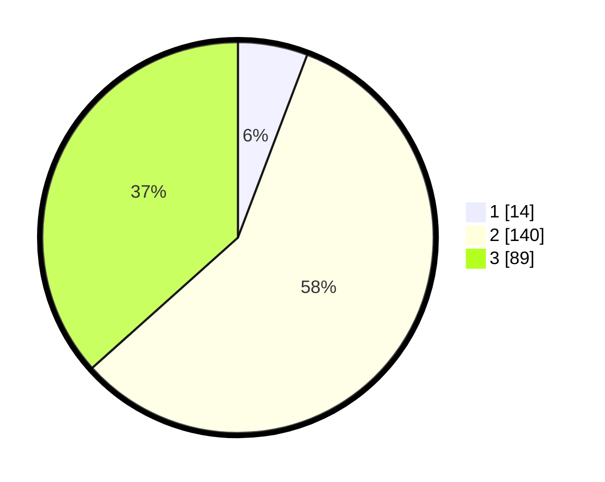

# Hasil

## Grafik

## Tabel

| No. | Nama Paslon    | Suara | Suara (raw) | Persentase |
|:--- |:-------------- | -----:| -----------:| ----------:|
| 1   | ANIES MUHAIMIN | 14    | [14][p-1]   | 5,76       |
| 2   | PRABOWO GIBRAN | 140   | [140][p-2]  | 57,61      |
| 3   | GANJAR MAHFUD  | 89    | [89][p-3]   | 36,63      |

[p-1]: https://github.com/gigit-pemilu/pemilu-2024/blob/main/pilpres/hitung-suara/sub/51-bali/sub/03-badung/sub/01-kuta/sub/1002-kuta/sub/033-tps/sub/paslon-1.txt
[p-2]: https://github.com/gigit-pemilu/pemilu-2024/blob/main/pilpres/hitung-suara/sub/51-bali/sub/03-badung/sub/01-kuta/sub/1002-kuta/sub/033-tps/sub/paslon-2.txt
[p-3]: https://github.com/gigit-pemilu/pemilu-2024/blob/main/pilpres/hitung-suara/sub/51-bali/sub/03-badung/sub/01-kuta/sub/1002-kuta/sub/033-tps/sub/paslon-3.txt

## Foto C Plano

https://sirekap-obj-formc.kpu.go.id/29ee/pemilu/ppwp/51/03/01/10/02/5103011002033-20240214-203300--8c993651-0042-403a-b2b0-f7bf66547a9f.jpg

https://sirekap-obj-formc.kpu.go.id/29ee/pemilu/ppwp/51/03/01/10/02/5103011002033-20240214-203538--d693ab0d-4542-4a0c-b83e-14d31d7dabe1.jpg

https://sirekap-obj-formc.kpu.go.id/29ee/pemilu/ppwp/51/03/01/10/02/5103011002033-20240214-194409--2cdd7647-8844-4bbd-89b8-6f5b8c7fad4a.jpg

## Metadata

| Key        | Value               |
| ---------- | ------------------- |
| Time Stamp | 2024-02-16 08:30:27 |

## DATA PEMILIH TETAP

Jumlah pemilih dalam DPT: **281**.
 * L: **140**.
 * P: **141**.

## DATA PENGGUNA HAK PILIH

Jumlah pengguna hak pilih dalam DPT: **240**.
 * L: **118**.
 * P: **122**.

Jumlah pengguna hak pilih dalam DPTb: **5**.
 * L: **4**.
 * P: **1**.

Jumlah pengguna hak pilih dalam DPK: **2**.
 * L: **2**.
 * P: **0**.

Jumlah pengguna hak pilih: **247**.
 * L: **124**.
 * P: **123**.

## JUMLAH SUARA SAH DAN TIDAK SAH

JUMLAH SELURUH SUARA SAH: **243**.

JUMLAH SUARA TIDAK SAH: **4**.

JUMLAH SELURUH SUARA SAH DAN SUARA TIDAK SAH: **247**.

