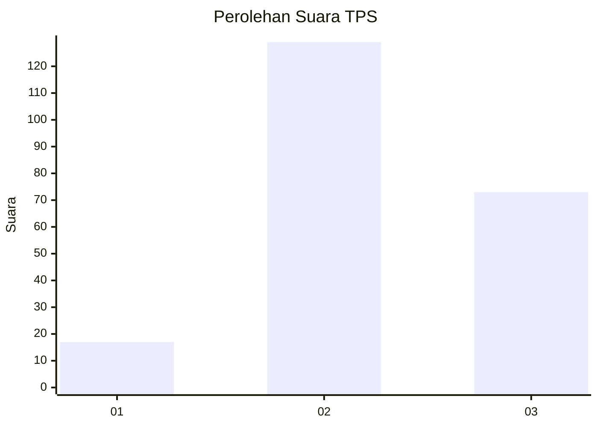
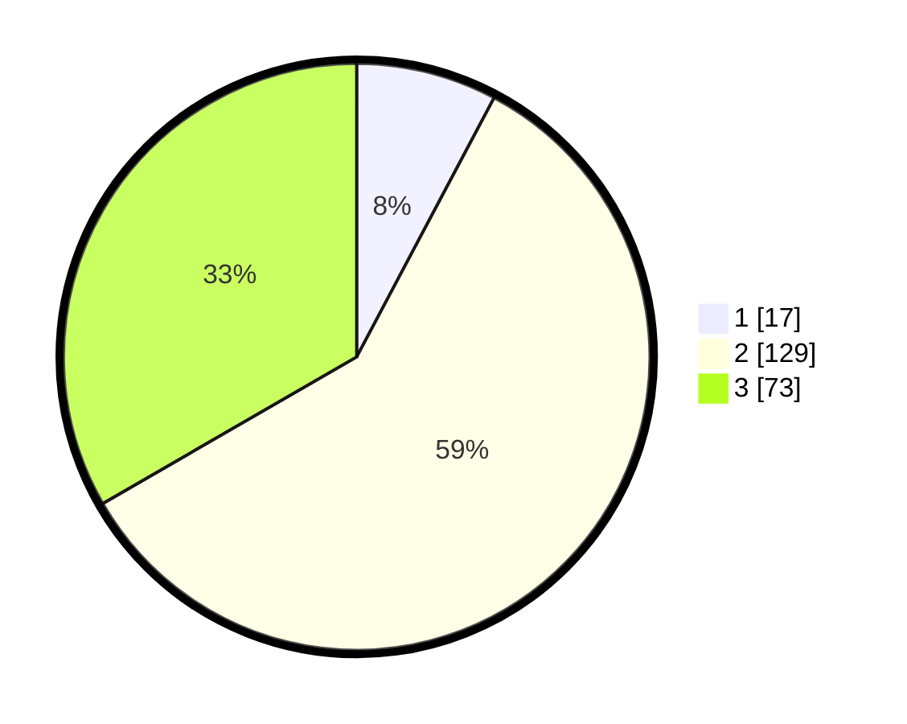

# Hasil

## Grafik

## Tabel

| No. | Nama Paslon    | Suara | Suara (raw) | Persentase |
|:--- |:-------------- | -----:| -----------:| ----------:|
| 1   | ANIES MUHAIMIN | 17    | [17][p-1]   | 7,76       |
| 2   | PRABOWO GIBRAN | 129   | [129][p-2]  | 58,90      |
| 3   | GANJAR MAHFUD  | 73    | [73][p-3]   | 33,33      |

[p-1]: https://github.com/gigit-pemilu/pemilu-2024-51-bali/blob/main/pilpres/hitung-suara/sub/51-bali/sub/03-badung/sub/01-kuta/sub/1002-kuta/sub/034-tps/sub/paslon-1.txt
[p-2]: https://github.com/gigit-pemilu/pemilu-2024-51-bali/blob/main/pilpres/hitung-suara/sub/51-bali/sub/03-badung/sub/01-kuta/sub/1002-kuta/sub/034-tps/sub/paslon-2.txt
[p-3]: https://github.com/gigit-pemilu/pemilu-2024-51-bali/blob/main/pilpres/hitung-suara/sub/51-bali/sub/03-badung/sub/01-kuta/sub/1002-kuta/sub/034-tps/sub/paslon-3.txt

## Foto C Plano

https://sirekap-obj-formc.kpu.go.id/ae06/pemilu/ppwp/51/03/01/10/02/5103011002034-20240214-131611--330a0d54-4049-4969-8793-87d772353e4f.jpg

https://sirekap-obj-formc.kpu.go.id/ae06/pemilu/ppwp/51/03/01/10/02/5103011002034-20240214-132006--8d243136-9aff-4dd3-a33e-925d15e1c85e.jpg

https://sirekap-obj-formc.kpu.go.id/ae06/pemilu/ppwp/51/03/01/10/02/5103011002034-20240214-132057--7d09f04d-f0e2-4af6-b917-287917e9612e.jpg

## Metadata

| Key        | Value               |
| ---------- | ------------------- |
| Time Stamp | 2024-02-16 08:30:27 |

## DATA PEMILIH TETAP

Jumlah pemilih dalam DPT: **284**.
 * L: **138**.
 * P: **146**.

## DATA PENGGUNA HAK PILIH

Jumlah pengguna hak pilih dalam DPT: **213**.
 * L: **105**.
 * P: **108**.

Jumlah pengguna hak pilih dalam DPTb: **5**.
 * L: **2**.
 * P: **3**.

Jumlah pengguna hak pilih dalam DPK: **2**.
 * L: **1**.
 * P: **1**.

Jumlah pengguna hak pilih: **220**.
 * L: **108**.
 * P: **112**.

## JUMLAH SUARA SAH DAN TIDAK SAH

JUMLAH SELURUH SUARA SAH: **219**.

JUMLAH SUARA TIDAK SAH: **1**.

JUMLAH SELURUH SUARA SAH DAN SUARA TIDAK SAH: **220**.

