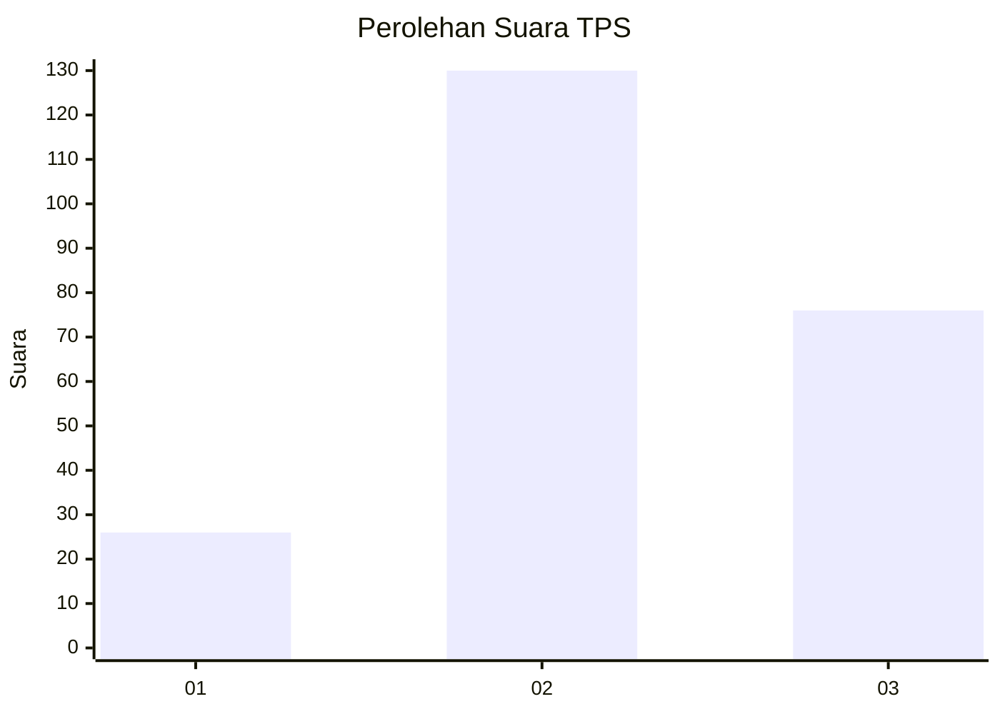
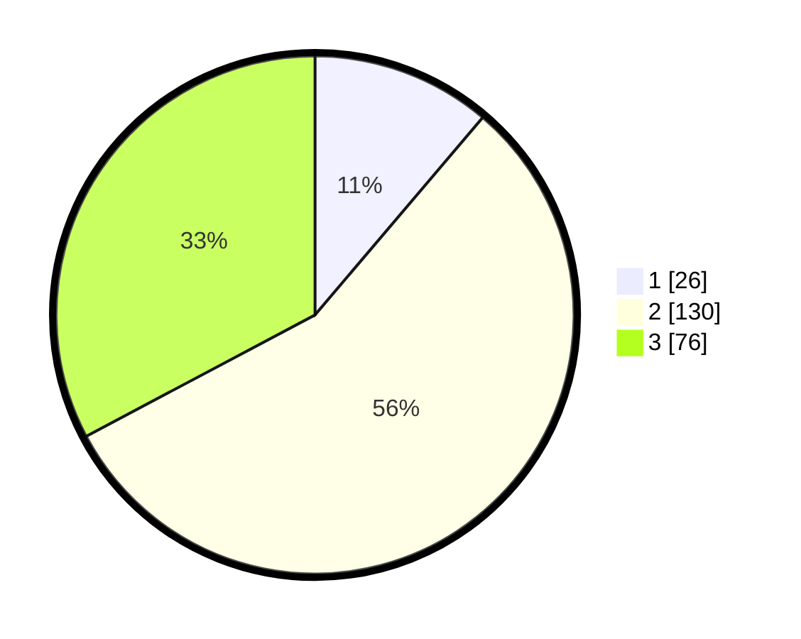

# Hasil

## Grafik

## Tabel

| No. | Nama Paslon    | Suara | Suara (raw) | Persentase |
|:--- |:-------------- | -----:| -----------:| ----------:|
| 1   | ANIES MUHAIMIN | 26    | [26][p-1]   | 11,21      |
| 2   | PRABOWO GIBRAN | 130   | [130][p-2]  | 56,03      |
| 3   | GANJAR MAHFUD  | 76    | [76][p-3]   | 32,76      |

[p-1]: https://github.com/gigit-pemilu/pemilu-2024-51-bali/blob/main/pilpres/hitung-suara/sub/51-bali/sub/03-badung/sub/01-kuta/sub/1002-kuta/sub/035-tps/sub/paslon-1.txt
[p-2]: https://github.com/gigit-pemilu/pemilu-2024-51-bali/blob/main/pilpres/hitung-suara/sub/51-bali/sub/03-badung/sub/01-kuta/sub/1002-kuta/sub/035-tps/sub/paslon-2.txt
[p-3]: https://github.com/gigit-pemilu/pemilu-2024-51-bali/blob/main/pilpres/hitung-suara/sub/51-bali/sub/03-badung/sub/01-kuta/sub/1002-kuta/sub/035-tps/sub/paslon-3.txt

## Foto C Plano

https://sirekap-obj-formc.kpu.go.id/2325/pemilu/ppwp/51/03/01/10/02/5103011002035-20240214-232503--645f5bb4-a1e5-4728-9d7b-8550dab29602.jpg

https://sirekap-obj-formc.kpu.go.id/2325/pemilu/ppwp/51/03/01/10/02/5103011002035-20240214-232734--d89a6418-3f04-469a-b571-967e99dcdf4d.jpg

https://sirekap-obj-formc.kpu.go.id/2325/pemilu/ppwp/51/03/01/10/02/5103011002035-20240214-232935--3fd84e93-3501-43e2-9348-3318b33a811d.jpg

## Metadata

| Key        | Value               |
| ---------- | ------------------- |
| Time Stamp | 2024-02-24 22:31:28 |

