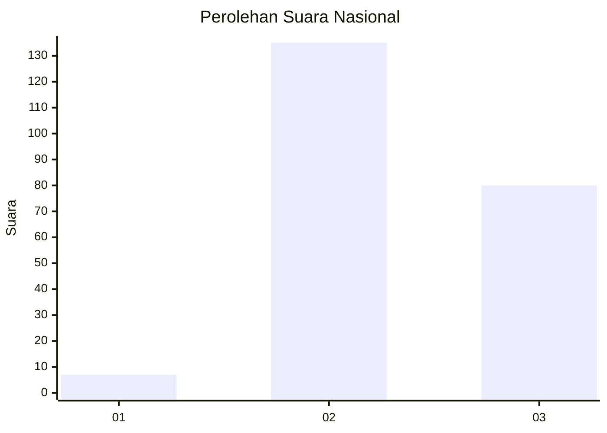
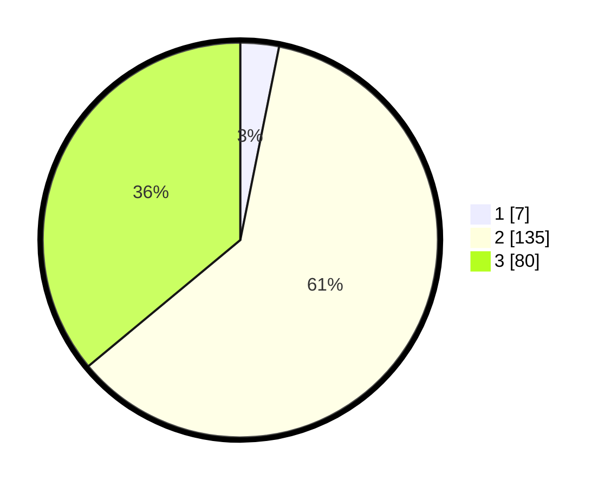

# Hasil

## Grafik

## Tabel

| No. | Nama Paslon    | Suara | Suara (raw) | Persentase |
|:--- |:-------------- | -----:| -----------:| ----------:|
| 1   | ANIES MUHAIMIN | 7     | [7][p-1]    | 3,15       |
| 2   | PRABOWO GIBRAN | 135   | [135][p-2]  | 60,81      |
| 3   | GANJAR MAHFUD  | 80    | [80][p-3]   | 36,04      |

[p-1]: https://github.com/gigit-pemilu/pemilu-2024/blob/main/pilpres/hitung-suara/sub/51-bali/sub/03-badung/sub/01-kuta/sub/1002-kuta/sub/036-tps/sub/paslon-1.txt
[p-2]: https://github.com/gigit-pemilu/pemilu-2024/blob/main/pilpres/hitung-suara/sub/51-bali/sub/03-badung/sub/01-kuta/sub/1002-kuta/sub/036-tps/sub/paslon-2.txt
[p-3]: https://github.com/gigit-pemilu/pemilu-2024/blob/main/pilpres/hitung-suara/sub/51-bali/sub/03-badung/sub/01-kuta/sub/1002-kuta/sub/036-tps/sub/paslon-3.txt

## Foto C Plano

https://sirekap-obj-formc.kpu.go.id/7d97/pemilu/ppwp/51/03/01/10/02/5103011002036-20240214-221721--108c5d9b-64dc-411a-980e-47b28e0ce301.jpg

https://sirekap-obj-formc.kpu.go.id/7d97/pemilu/ppwp/51/03/01/10/02/5103011002036-20240214-221831--22de3068-e889-4cd1-9cf5-9f3bbfdda359.jpg

https://sirekap-obj-formc.kpu.go.id/7d97/pemilu/ppwp/51/03/01/10/02/5103011002036-20240214-221906--d58ed842-db31-462d-bd07-556688226a11.jpg

## Metadata

| Key        | Value               |
| ---------- | ------------------- |
| Time Stamp | 2024-02-24 22:31:28 |

