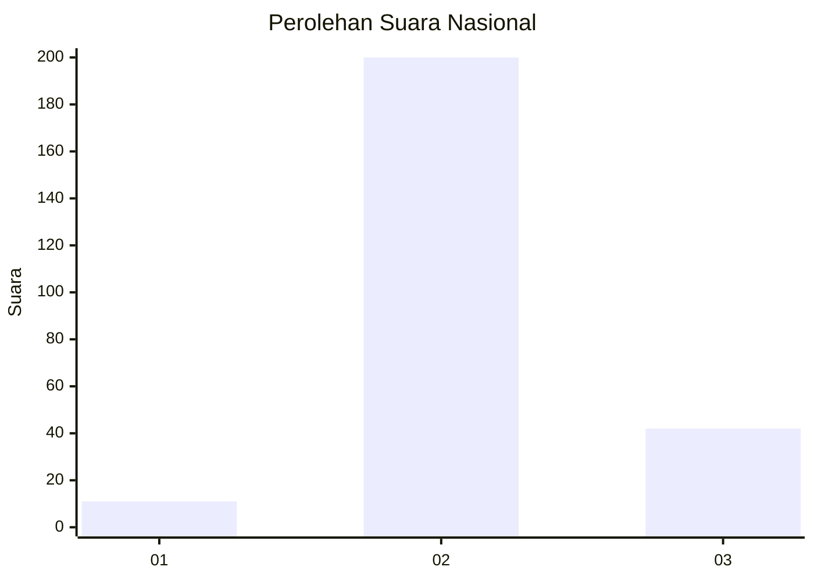
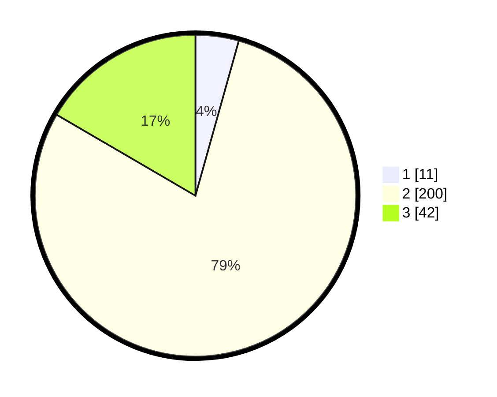

# Hasil

## Grafik

## Tabel

| No. | Nama Paslon    | Suara | Suara (raw) | Persentase |
|:--- |:-------------- | -----:| -----------:| ----------:|
| 1   | ANIES MUHAIMIN | 11    | [11][p-1]   | 4,35       |
| 2   | PRABOWO GIBRAN | 200   | [200][p-2]  | 79,05      |
| 3   | GANJAR MAHFUD  | 42    | [42][p-3]   | 16,60      |

[p-1]: https://github.com/gigit-pemilu/pemilu-2024/blob/main/pilpres/hitung-suara/sub/51-bali/sub/03-badung/sub/01-kuta/sub/1002-kuta/sub/042-tps/sub/paslon-1.txt
[p-2]: https://github.com/gigit-pemilu/pemilu-2024/blob/main/pilpres/hitung-suara/sub/51-bali/sub/03-badung/sub/01-kuta/sub/1002-kuta/sub/042-tps/sub/paslon-2.txt
[p-3]: https://github.com/gigit-pemilu/pemilu-2024/blob/main/pilpres/hitung-suara/sub/51-bali/sub/03-badung/sub/01-kuta/sub/1002-kuta/sub/042-tps/sub/paslon-3.txt

## Foto C Plano

https://sirekap-obj-formc.kpu.go.id/735f/pemilu/ppwp/51/03/01/10/02/5103011002042-20240214-212609--ffc22c81-6b70-469d-aeca-a34b2a8d830c.jpg

https://sirekap-obj-formc.kpu.go.id/735f/pemilu/ppwp/51/03/01/10/02/5103011002042-20240214-212738--3e38d27f-e0b5-4a4f-ab21-5edd7113ee4a.jpg

https://sirekap-obj-formc.kpu.go.id/735f/pemilu/ppwp/51/03/01/10/02/5103011002042-20240214-212946--177c1dff-1504-4afc-a090-30a312d63bc1.jpg

## Metadata

| Key        | Value               |
| ---------- | ------------------- |
| Time Stamp | 2024-02-24 22:31:28 |

## DATA PEMILIH TETAP

Jumlah pemilih dalam DPT: **289**.
 * L: **137**.
 * P: **152**.

## DATA PENGGUNA HAK PILIH

Jumlah pengguna hak pilih dalam DPT: **242**.
 * L: **117**.
 * P: **125**.

Jumlah pengguna hak pilih dalam DPTb: **6**.
 * L: **3**.
 * P: **3**.

Jumlah pengguna hak pilih dalam DPK: **5**.
 * L: **1**.
 * P: **4**.

Jumlah pengguna hak pilih: **253**.
 * L: **121**.
 * P: **132**.

## JUMLAH SUARA SAH DAN TIDAK SAH

JUMLAH SELURUH SUARA SAH: **253**.

JUMLAH SUARA TIDAK SAH: **0**.

JUMLAH SELURUH SUARA SAH DAN SUARA TIDAK SAH: **253**.

