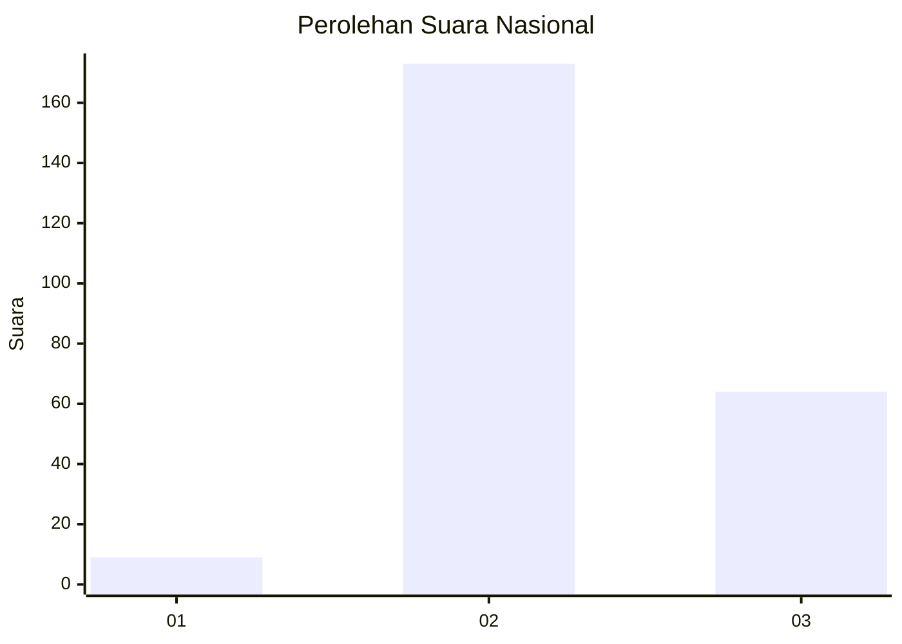
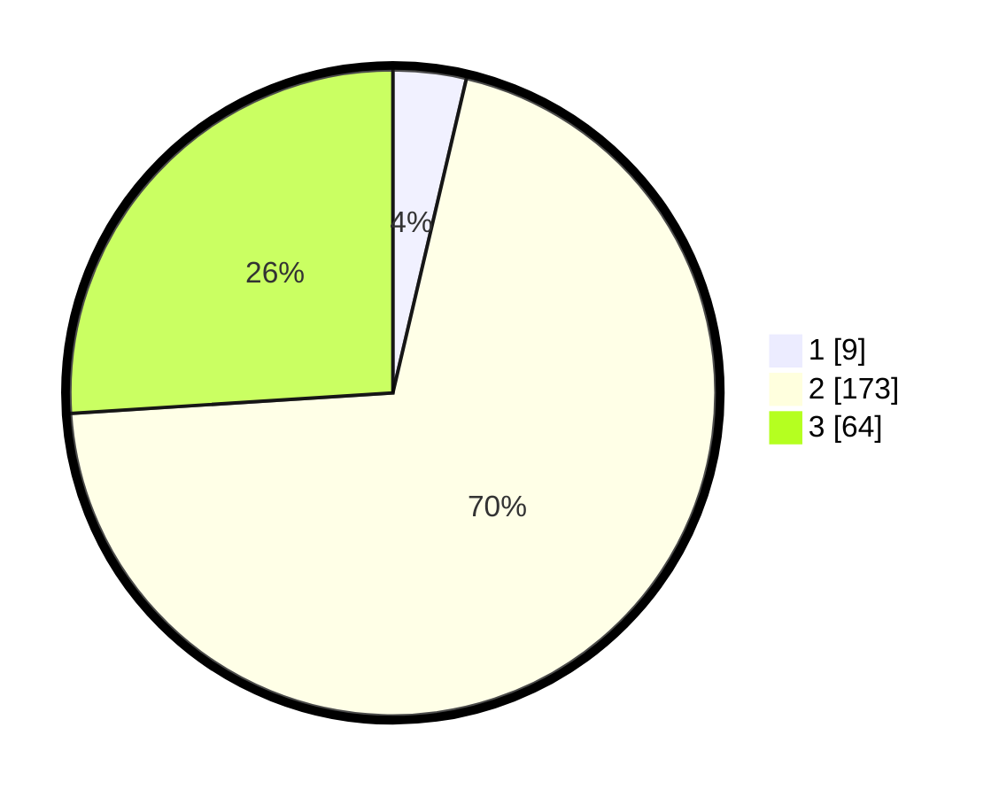

# Hasil

## Grafik

## Tabel

| No. | Nama Paslon    | Suara | Suara (raw) | Persentase |
|:--- |:-------------- | -----:| -----------:| ----------:|
| 1   | ANIES MUHAIMIN | 9     | [9][p-1]    | 3,66       |
| 2   | PRABOWO GIBRAN | 173   | [173][p-2]  | 70,33      |
| 3   | GANJAR MAHFUD  | 64    | [64][p-3]   | 26,02      |

[p-1]: https://github.com/gigit-pemilu/pemilu-2024/blob/main/pilpres/hitung-suara/sub/51-bali/sub/03-badung/sub/01-kuta/sub/1002-kuta/sub/045-tps/sub/paslon-1.txt
[p-2]: https://github.com/gigit-pemilu/pemilu-2024/blob/main/pilpres/hitung-suara/sub/51-bali/sub/03-badung/sub/01-kuta/sub/1002-kuta/sub/045-tps/sub/paslon-2.txt
[p-3]: https://github.com/gigit-pemilu/pemilu-2024/blob/main/pilpres/hitung-suara/sub/51-bali/sub/03-badung/sub/01-kuta/sub/1002-kuta/sub/045-tps/sub/paslon-3.txt

## Foto C Plano

https://sirekap-obj-formc.kpu.go.id/0cfa/pemilu/ppwp/51/03/01/10/02/5103011002045-20240215-033300--0dceb208-6ed3-4825-af98-9d94c3c38784.jpg

https://sirekap-obj-formc.kpu.go.id/0cfa/pemilu/ppwp/51/03/01/10/02/5103011002045-20240215-033336--59a71244-cb15-4e7f-9877-2d7c139b10e1.jpg

https://sirekap-obj-formc.kpu.go.id/0cfa/pemilu/ppwp/51/03/01/10/02/5103011002045-20240215-033428--b31983c8-3fc2-41d1-bc26-bdcdd0300215.jpg

## Metadata

| Key        | Value               |
| ---------- | ------------------- |
| Time Stamp | 2024-02-24 22:31:28 |

