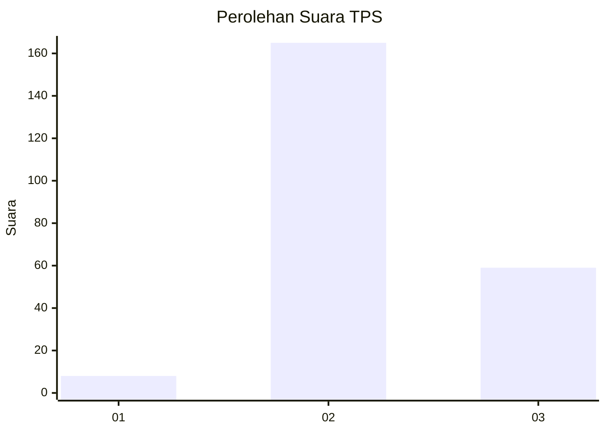
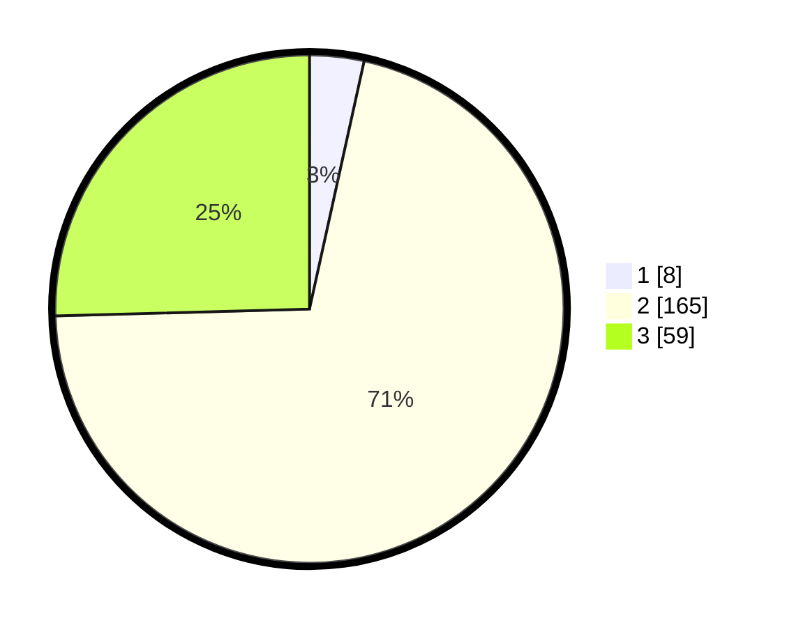

# Hasil

## Grafik

## Tabel

| No. | Nama Paslon    | Suara | Suara (raw) | Persentase |
|:--- |:-------------- | -----:| -----------:| ----------:|
| 1   | ANIES MUHAIMIN | 8     | [8][p-1]    | 3,45       |
| 2   | PRABOWO GIBRAN | 165   | [165][p-2]  | 71,12      |
| 3   | GANJAR MAHFUD  | 59    | [59][p-3]   | 25,43      |

[p-1]: https://github.com/gigit-pemilu/pemilu-2024-51-bali/blob/main/pilpres/hitung-suara/sub/51-bali/sub/03-badung/sub/01-kuta/sub/1002-kuta/sub/046-tps/sub/paslon-1.txt
[p-2]: https://github.com/gigit-pemilu/pemilu-2024-51-bali/blob/main/pilpres/hitung-suara/sub/51-bali/sub/03-badung/sub/01-kuta/sub/1002-kuta/sub/046-tps/sub/paslon-2.txt
[p-3]: https://github.com/gigit-pemilu/pemilu-2024-51-bali/blob/main/pilpres/hitung-suara/sub/51-bali/sub/03-badung/sub/01-kuta/sub/1002-kuta/sub/046-tps/sub/paslon-3.txt

## Foto C Plano

https://sirekap-obj-formc.kpu.go.id/bb75/pemilu/ppwp/51/03/01/10/02/5103011002046-20240215-022348--e173f009-0259-40ac-a346-4c1455c4a3ce.jpg

https://sirekap-obj-formc.kpu.go.id/bb75/pemilu/ppwp/51/03/01/10/02/5103011002046-20240215-022414--df7c1f3f-8264-4357-82c0-b64c1e284ec9.jpg

https://sirekap-obj-formc.kpu.go.id/bb75/pemilu/ppwp/51/03/01/10/02/5103011002046-20240215-022438--12affbc5-948d-45f9-ab14-ce5583de89b7.jpg

## Metadata

| Key        | Value               |
| ---------- | ------------------- |
| Time Stamp | 2024-02-24 22:31:28 |

