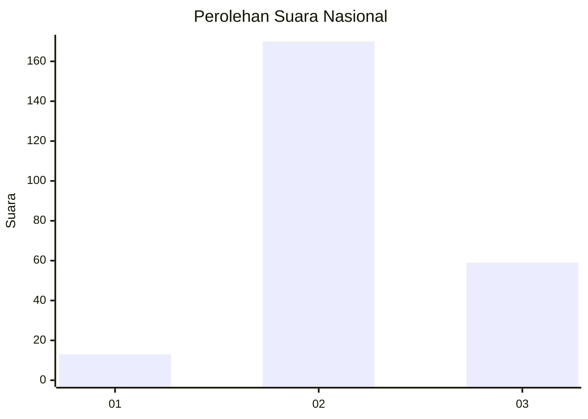
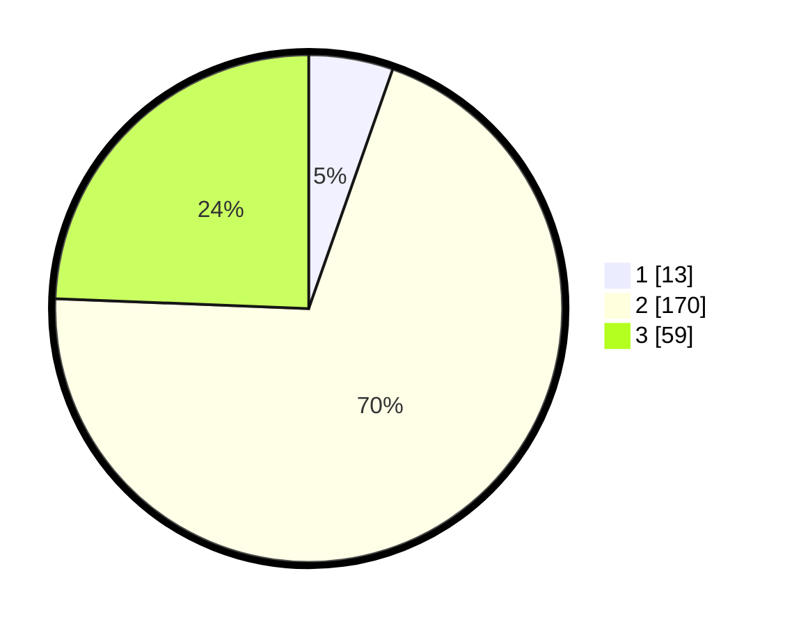

# Hasil

## Grafik

## Tabel

| No. | Nama Paslon    | Suara | Suara (raw) | Persentase |
|:--- |:-------------- | -----:| -----------:| ----------:|
| 1   | ANIES MUHAIMIN | 13    | [13][p-1]   | 5,37       |
| 2   | PRABOWO GIBRAN | 170   | [170][p-2]  | 70,25      |
| 3   | GANJAR MAHFUD  | 59    | [59][p-3]   | 24,38      |

[p-1]: https://github.com/gigit-pemilu/pemilu-2024/blob/main/pilpres/hitung-suara/sub/51-bali/sub/03-badung/sub/01-kuta/sub/1002-kuta/sub/048-tps/sub/paslon-1.txt
[p-2]: https://github.com/gigit-pemilu/pemilu-2024/blob/main/pilpres/hitung-suara/sub/51-bali/sub/03-badung/sub/01-kuta/sub/1002-kuta/sub/048-tps/sub/paslon-2.txt
[p-3]: https://github.com/gigit-pemilu/pemilu-2024/blob/main/pilpres/hitung-suara/sub/51-bali/sub/03-badung/sub/01-kuta/sub/1002-kuta/sub/048-tps/sub/paslon-3.txt

## Foto C Plano

https://sirekap-obj-formc.kpu.go.id/0bd7/pemilu/ppwp/51/03/01/10/02/5103011002048-20240215-012214--df423da5-50ee-4f84-bee1-a94e29fa30ce.jpg

https://sirekap-obj-formc.kpu.go.id/0bd7/pemilu/ppwp/51/03/01/10/02/5103011002048-20240215-012411--0033183e-b127-4e4b-9fa3-3de854a02153.jpg

https://sirekap-obj-formc.kpu.go.id/0bd7/pemilu/ppwp/51/03/01/10/02/5103011002048-20240215-012537--b247c0d2-bd94-48e8-b6f0-aae85de5cce5.jpg

## Metadata

| Key        | Value               |
| ---------- | ------------------- |
| Time Stamp | 2024-02-24 22:31:28 |

