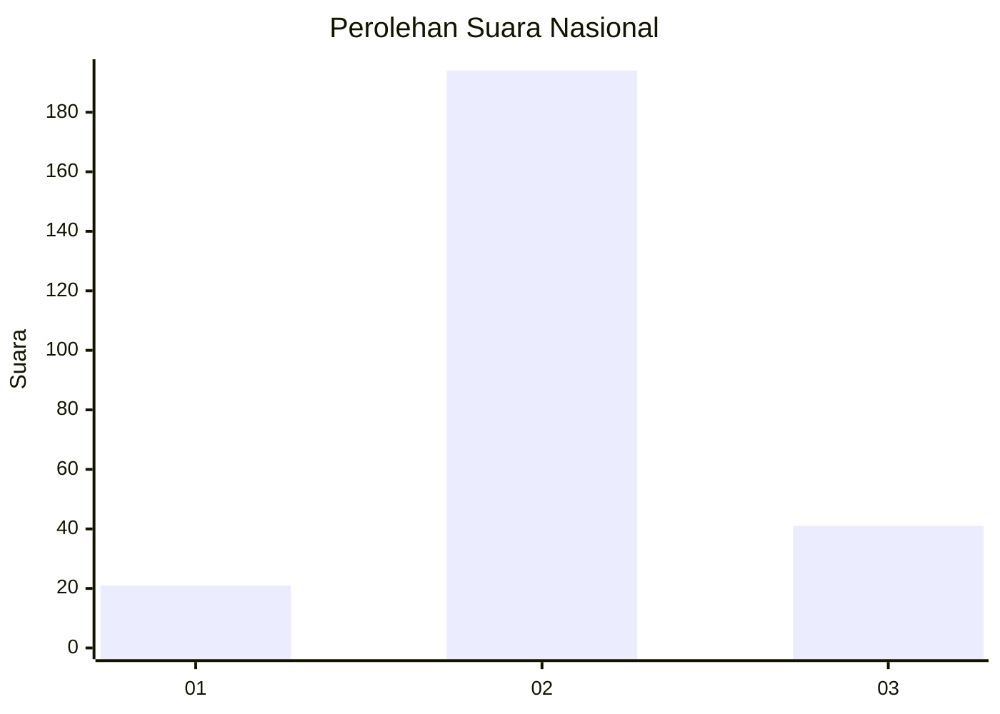
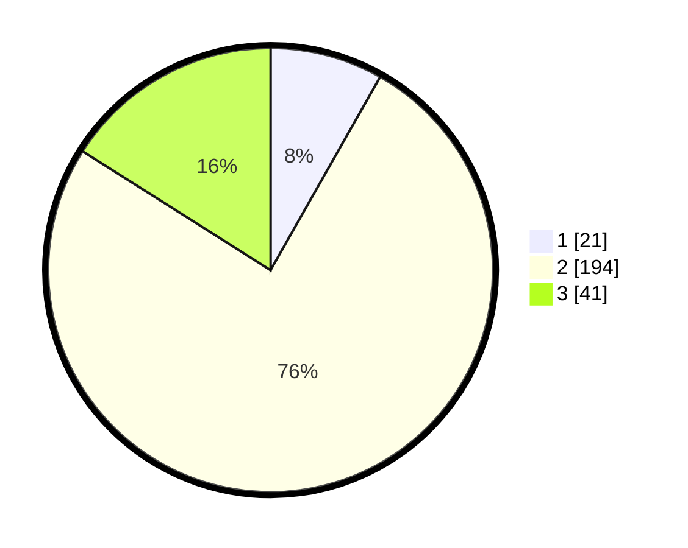

# Hasil

## Grafik

## Tabel

| No. | Nama Paslon    | Suara | Suara (raw) | Persentase |
|:--- |:-------------- | -----:| -----------:| ----------:|
| 1   | ANIES MUHAIMIN | 21    | [21][p-1]   | 8,20       |
| 2   | PRABOWO GIBRAN | 194   | [194][p-2]  | 75,78      |
| 3   | GANJAR MAHFUD  | 41    | [41][p-3]   | 16,02      |

[p-1]: https://github.com/gigit-pemilu/pemilu-2024/blob/main/pilpres/hitung-suara/sub/51-bali/sub/03-badung/sub/01-kuta/sub/1002-kuta/sub/049-tps/sub/paslon-1.txt
[p-2]: https://github.com/gigit-pemilu/pemilu-2024/blob/main/pilpres/hitung-suara/sub/51-bali/sub/03-badung/sub/01-kuta/sub/1002-kuta/sub/049-tps/sub/paslon-2.txt
[p-3]: https://github.com/gigit-pemilu/pemilu-2024/blob/main/pilpres/hitung-suara/sub/51-bali/sub/03-badung/sub/01-kuta/sub/1002-kuta/sub/049-tps/sub/paslon-3.txt

## Foto C Plano

https://sirekap-obj-formc.kpu.go.id/966d/pemilu/ppwp/51/03/01/10/02/5103011002049-20240215-013516--7a70b228-799e-4678-afdd-d85372ab21dd.jpg

https://sirekap-obj-formc.kpu.go.id/966d/pemilu/ppwp/51/03/01/10/02/5103011002049-20240215-013535--f61a8697-4702-45a5-bb5c-fbd2f78c9e85.jpg

https://sirekap-obj-formc.kpu.go.id/966d/pemilu/ppwp/51/03/01/10/02/5103011002049-20240215-013559--fd7bc977-762e-41ac-a1b0-ac8b52cf61da.jpg

## Metadata

| Key        | Value               |
| ---------- | ------------------- |
| Time Stamp | 2024-02-24 22:31:28 |

