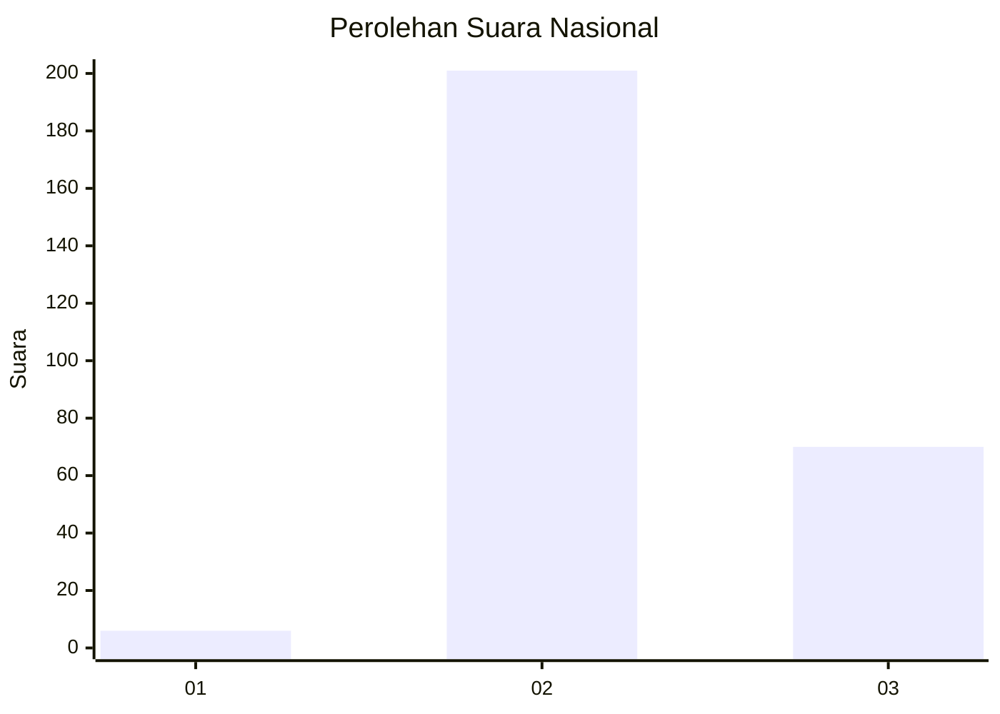
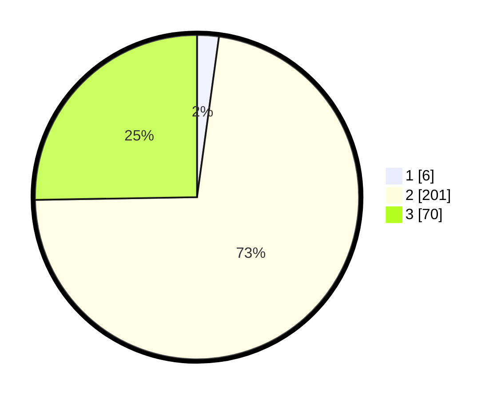

# Hasil

## Grafik

## Tabel

| No. | Nama Paslon    | Suara | Suara (raw) | Persentase |
|:--- |:-------------- | -----:| -----------:| ----------:|
| 1   | ANIES MUHAIMIN | 6     | [6][p-1]    | 2,17       |
| 2   | PRABOWO GIBRAN | 201   | [201][p-2]  | 72,56      |
| 3   | GANJAR MAHFUD  | 70    | [70][p-3]   | 25,27      |

[p-1]: https://github.com/gigit-pemilu/pemilu-2024/blob/main/pilpres/hitung-suara/sub/51-bali/sub/03-badung/sub/01-kuta/sub/1003-kedonganan/sub/001-tps/sub/paslon-1.txt
[p-2]: https://github.com/gigit-pemilu/pemilu-2024/blob/main/pilpres/hitung-suara/sub/51-bali/sub/03-badung/sub/01-kuta/sub/1003-kedonganan/sub/001-tps/sub/paslon-2.txt
[p-3]: https://github.com/gigit-pemilu/pemilu-2024/blob/main/pilpres/hitung-suara/sub/51-bali/sub/03-badung/sub/01-kuta/sub/1003-kedonganan/sub/001-tps/sub/paslon-3.txt

## Foto C Plano

https://sirekap-obj-formc.kpu.go.id/1c58/pemilu/ppwp/51/03/01/10/03/5103011003001-20240215-003540--95b5289e-fcac-47ae-8565-2f8d9ce56bb7.jpg

https://sirekap-obj-formc.kpu.go.id/1c58/pemilu/ppwp/51/03/01/10/03/5103011003001-20240215-003756--a44336a1-d7c4-495c-ab6c-6b0319388df1.jpg

## Metadata

| Key        | Value               |
| ---------- | ------------------- |
| Time Stamp | 2024-02-25 17:00:00 |

