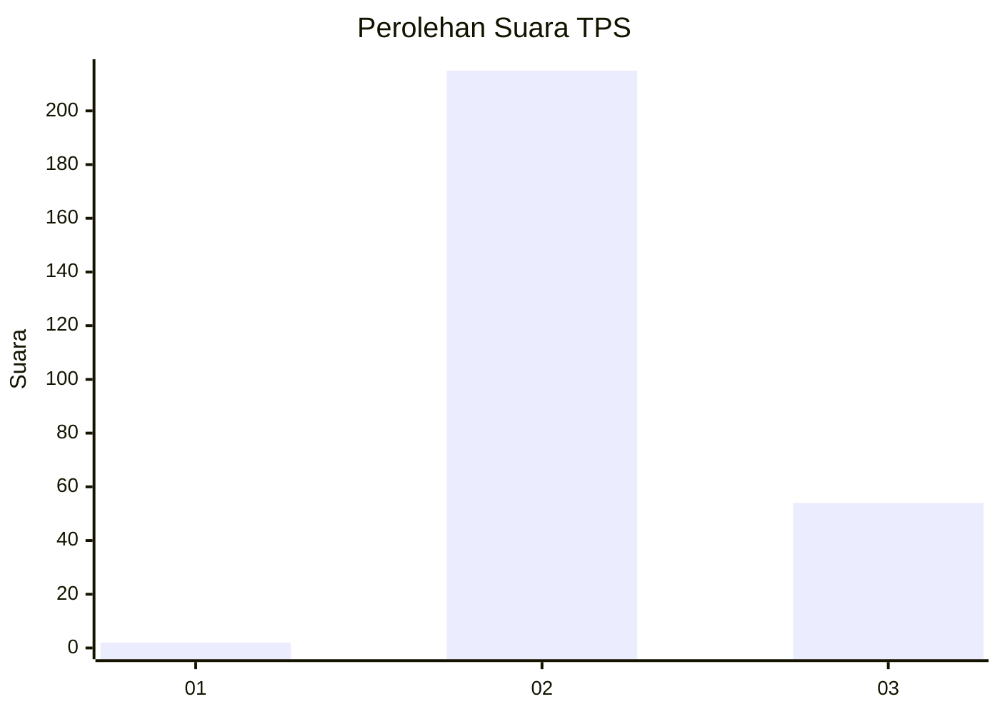
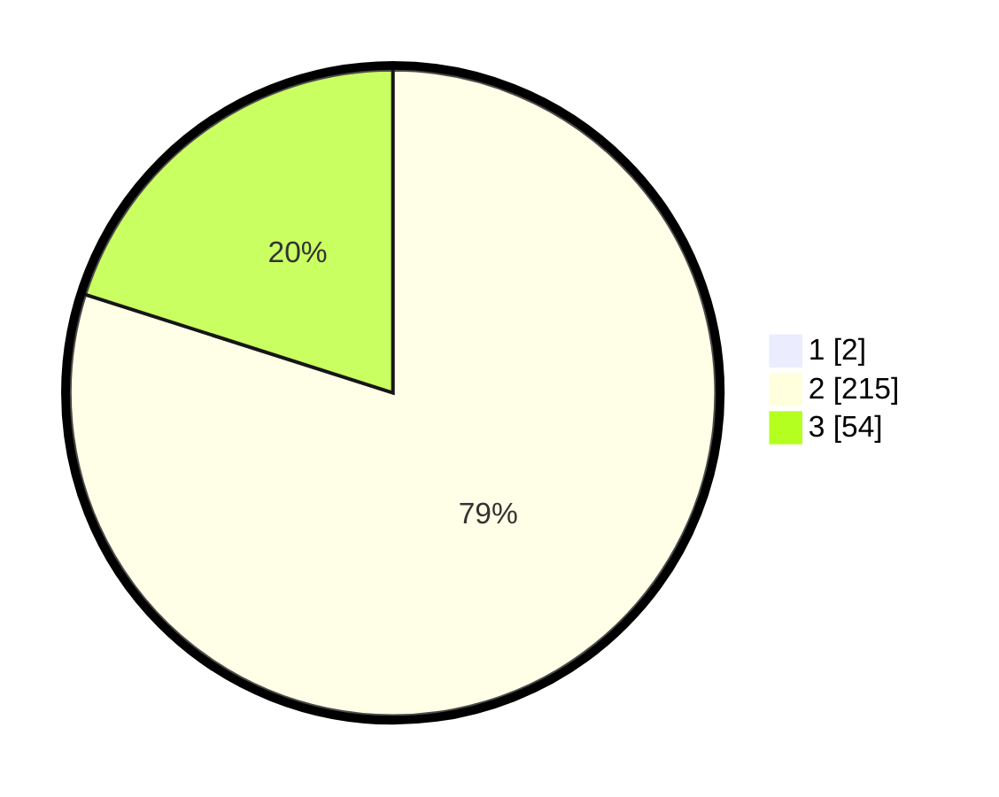

# Hasil

## Grafik

## Tabel

| No. | Nama Paslon    | Suara | Suara (raw) | Persentase |
|:--- |:-------------- | -----:| -----------:| ----------:|
| 1   | ANIES MUHAIMIN | 2     | [2][p-1]    | 0,74       |
| 2   | PRABOWO GIBRAN | 215   | [215][p-2]  | 79,34      |
| 3   | GANJAR MAHFUD  | 54    | [54][p-3]   | 19,93      |

[p-1]: https://github.com/gigit-pemilu/pemilu-2024-51-bali/blob/main/pilpres/hitung-suara/sub/51-bali/sub/03-badung/sub/01-kuta/sub/1003-kedonganan/sub/002-tps/sub/paslon-1.txt
[p-2]: https://github.com/gigit-pemilu/pemilu-2024-51-bali/blob/main/pilpres/hitung-suara/sub/51-bali/sub/03-badung/sub/01-kuta/sub/1003-kedonganan/sub/002-tps/sub/paslon-2.txt
[p-3]: https://github.com/gigit-pemilu/pemilu-2024-51-bali/blob/main/pilpres/hitung-suara/sub/51-bali/sub/03-badung/sub/01-kuta/sub/1003-kedonganan/sub/002-tps/sub/paslon-3.txt

## Foto C Plano

https://sirekap-obj-formc.kpu.go.id/1758/pemilu/ppwp/51/03/01/10/03/5103011003002-20240214-214803--b349b133-b569-43cd-b5bc-f5502a740a89.jpg

https://sirekap-obj-formc.kpu.go.id/1758/pemilu/ppwp/51/03/01/10/03/5103011003002-20240214-214918--237b2525-d10e-4d54-b3a4-b3f90e9e8945.jpg

https://sirekap-obj-formc.kpu.go.id/1758/pemilu/ppwp/51/03/01/10/03/5103011003002-20240214-215008--dbbb3b2b-6036-4b1b-9042-7967a8934594.jpg

## Metadata

| Key        | Value               |
| ---------- | ------------------- |
| Time Stamp | 2024-02-24 22:31:28 |

