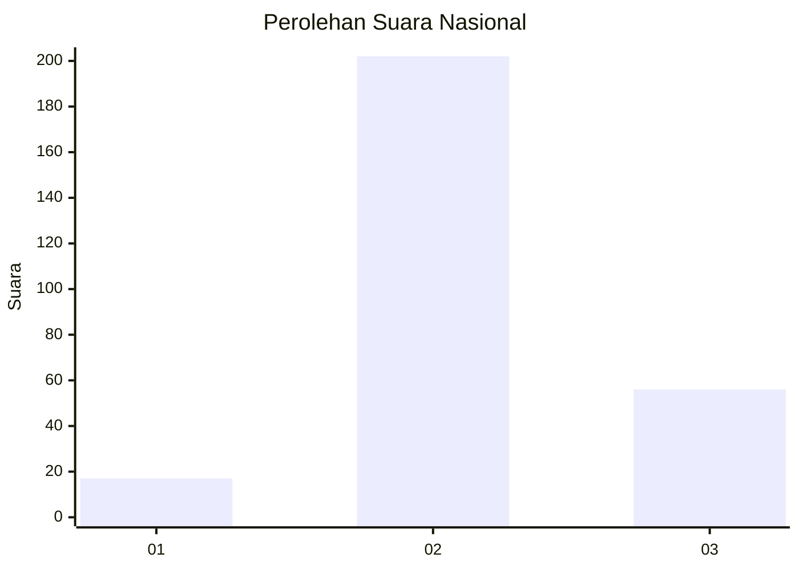

# Hasil

## Grafik

## Tabel

| No. | Nama Paslon    | Suara | Suara (raw) | Persentase |
|:--- |:-------------- | -----:| -----------:| ----------:|
| 1   | ANIES MUHAIMIN | 17    | [17][p-1]   | 6,18       |
| 2   | PRABOWO GIBRAN | 202   | [202][p-2]  | 73,45      |
| 3   | GANJAR MAHFUD  | 56    | [56][p-3]   | 20,36      |

[p-1]: https://github.com/gigit-pemilu/pemilu-2024/blob/main/pilpres/hitung-suara/sub/51-bali/sub/03-badung/sub/01-kuta/sub/1003-kedonganan/sub/003-tps/sub/paslon-1.txt
[p-2]: https://github.com/gigit-pemilu/pemilu-2024/blob/main/pilpres/hitung-suara/sub/51-bali/sub/03-badung/sub/01-kuta/sub/1003-kedonganan/sub/003-tps/sub/paslon-2.txt
[p-3]: https://github.com/gigit-pemilu/pemilu-2024/blob/main/pilpres/hitung-suara/sub/51-bali/sub/03-badung/sub/01-kuta/sub/1003-kedonganan/sub/003-tps/sub/paslon-3.txt

## Foto C Plano

https://sirekap-obj-formc.kpu.go.id/1b13/pemilu/ppwp/51/03/01/10/03/5103011003003-20240215-031741--e23598ef-3fed-4a0e-a3e0-5f292cfb9fdb.jpg

https://sirekap-obj-formc.kpu.go.id/1b13/pemilu/ppwp/51/03/01/10/03/5103011003003-20240215-032127--e33d562d-37be-4cfe-b437-292068f91207.jpg

https://sirekap-obj-formc.kpu.go.id/1b13/pemilu/ppwp/51/03/01/10/03/5103011003003-20240215-032326--ed25f876-8c1d-4011-8130-94be06a37846.jpg

## Metadata

| Key        | Value               |
| ---------- | ------------------- |
| Time Stamp | 2024-02-25 11:00:00 |

