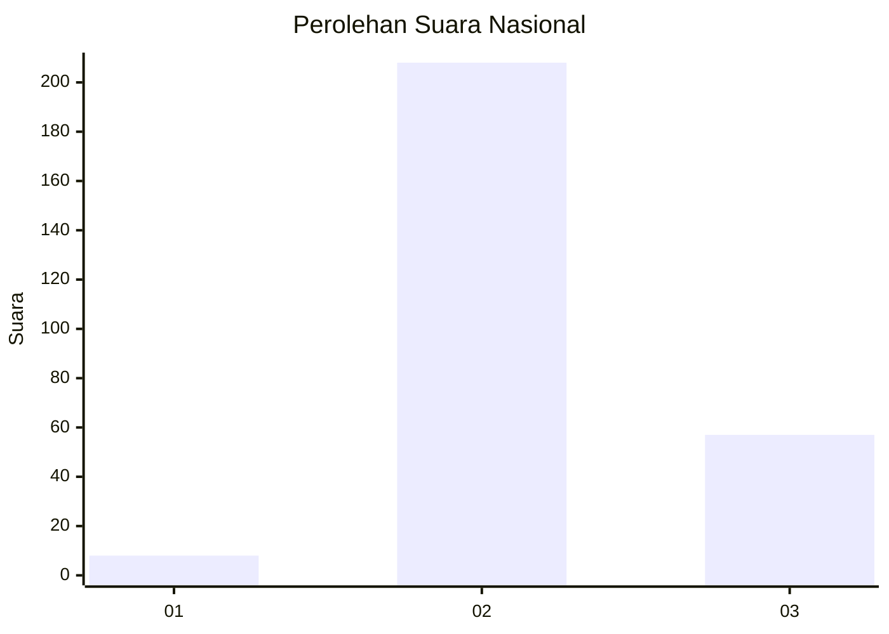

# Hasil

## Grafik

## Tabel

| No. | Nama Paslon    | Suara | Suara (raw) | Persentase |
|:--- |:-------------- | -----:| -----------:| ----------:|
| 1   | ANIES MUHAIMIN | 8     | [8][p-1]    | 2,93       |
| 2   | PRABOWO GIBRAN | 208   | [208][p-2]  | 76,19      |
| 3   | GANJAR MAHFUD  | 57    | [57][p-3]   | 20,88      |

[p-1]: https://github.com/gigit-pemilu/pemilu-2024/blob/main/pilpres/hitung-suara/sub/51-bali/sub/03-badung/sub/01-kuta/sub/1003-kedonganan/sub/006-tps/sub/paslon-1.txt
[p-2]: https://github.com/gigit-pemilu/pemilu-2024/blob/main/pilpres/hitung-suara/sub/51-bali/sub/03-badung/sub/01-kuta/sub/1003-kedonganan/sub/006-tps/sub/paslon-2.txt
[p-3]: https://github.com/gigit-pemilu/pemilu-2024/blob/main/pilpres/hitung-suara/sub/51-bali/sub/03-badung/sub/01-kuta/sub/1003-kedonganan/sub/006-tps/sub/paslon-3.txt

## Foto C Plano

https://sirekap-obj-formc.kpu.go.id/6e74/pemilu/ppwp/51/03/01/10/03/5103011003006-20240215-002611--fe63ed3d-e643-4c98-b457-fa9ca6f59a64.jpg

https://sirekap-obj-formc.kpu.go.id/6e74/pemilu/ppwp/51/03/01/10/03/5103011003006-20240215-002437--53b4f75a-1323-4c0a-bfe9-5c52249da203.jpg

https://sirekap-obj-formc.kpu.go.id/6e74/pemilu/ppwp/51/03/01/10/03/5103011003006-20240215-002325--09275bef-4ca4-42e0-ba7d-d4a2740c946f.jpg

## Metadata

| Key        | Value               |
| ---------- | ------------------- |
| Time Stamp | 2024-02-25 12:00:00 |

