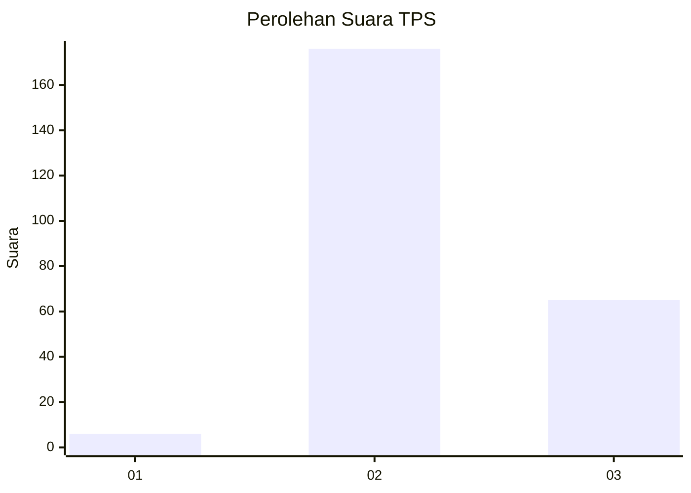
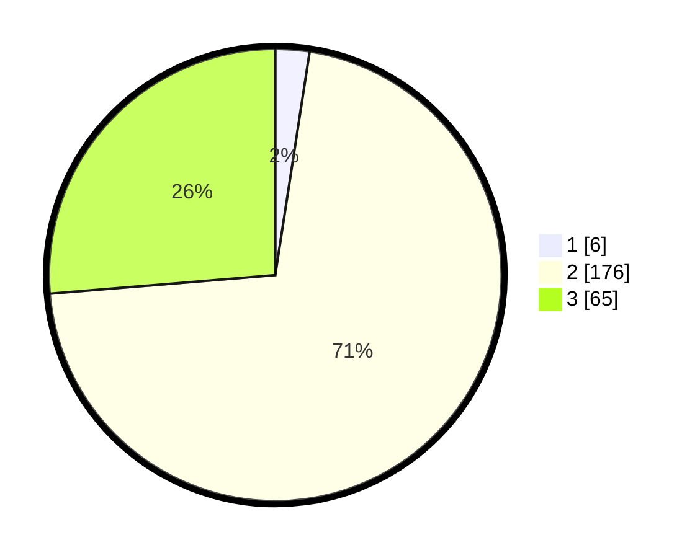

# Hasil

## Grafik

## Tabel

| No. | Nama Paslon    | Suara | Suara (raw) | Persentase |
|:--- |:-------------- | -----:| -----------:| ----------:|
| 1   | ANIES MUHAIMIN | 6     | [6][p-1]    | 2,43       |
| 2   | PRABOWO GIBRAN | 176   | [176][p-2]  | 71,26      |
| 3   | GANJAR MAHFUD  | 65    | [65][p-3]   | 26,32      |

[p-1]: https://github.com/gigit-pemilu/pemilu-2024-51-bali/blob/main/pilpres/hitung-suara/sub/51-bali/sub/03-badung/sub/01-kuta/sub/1003-kedonganan/sub/010-tps/sub/paslon-1.txt
[p-2]: https://github.com/gigit-pemilu/pemilu-2024-51-bali/blob/main/pilpres/hitung-suara/sub/51-bali/sub/03-badung/sub/01-kuta/sub/1003-kedonganan/sub/010-tps/sub/paslon-2.txt
[p-3]: https://github.com/gigit-pemilu/pemilu-2024-51-bali/blob/main/pilpres/hitung-suara/sub/51-bali/sub/03-badung/sub/01-kuta/sub/1003-kedonganan/sub/010-tps/sub/paslon-3.txt

## Foto C Plano

https://sirekap-obj-formc.kpu.go.id/f8f2/pemilu/ppwp/51/03/01/10/03/5103011003010-20240214-234932--9e8f9ee4-1f18-4293-b3bd-20f084b234ef.jpg

https://sirekap-obj-formc.kpu.go.id/f8f2/pemilu/ppwp/51/03/01/10/03/5103011003010-20240214-235010--b9f6f13a-d4f7-49f2-9ebb-abf48f258112.jpg

https://sirekap-obj-formc.kpu.go.id/f8f2/pemilu/ppwp/51/03/01/10/03/5103011003010-20240214-235033--1e979135-6e5e-46d2-98f5-5ec2975de948.jpg

## Metadata

| Key        | Value               |
| ---------- | ------------------- |
| Time Stamp | 2024-02-24 22:31:28 |

