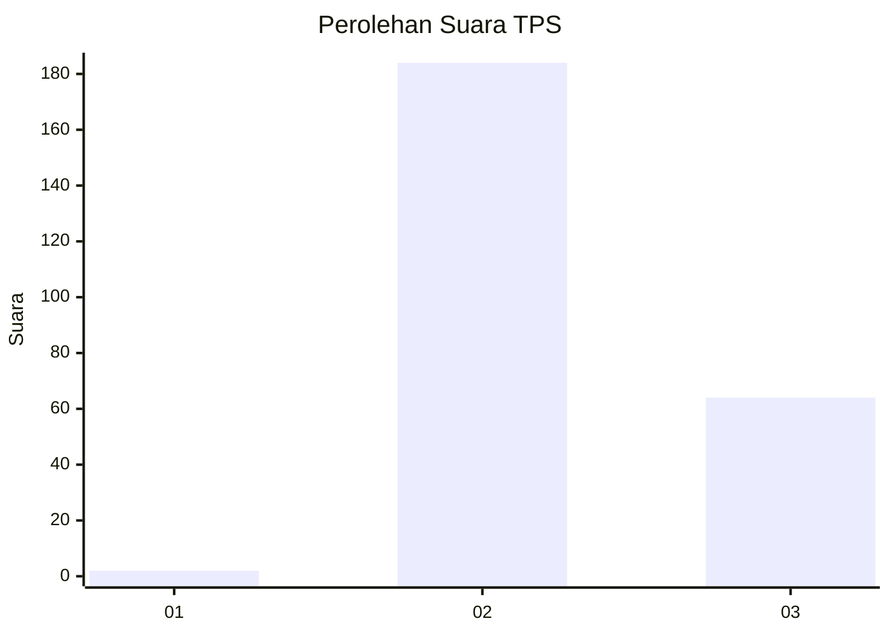
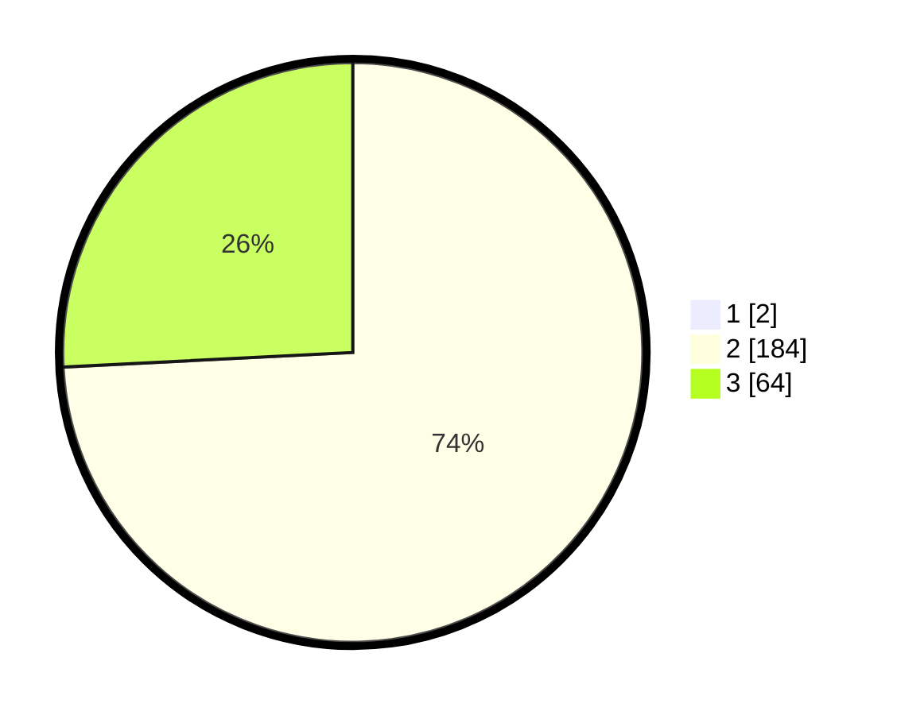

# Hasil

## Grafik

## Tabel

| No. | Nama Paslon    | Suara | Suara (raw) | Persentase |
|:--- |:-------------- | -----:| -----------:| ----------:|
| 1   | ANIES MUHAIMIN | 2     | [2][p-1]    | 0,80       |
| 2   | PRABOWO GIBRAN | 184   | [184][p-2]  | 73,60      |
| 3   | GANJAR MAHFUD  | 64    | [64][p-3]   | 25,60      |

[p-1]: https://github.com/gigit-pemilu/pemilu-2024-51-bali/blob/main/pilpres/hitung-suara/sub/51-bali/sub/03-badung/sub/01-kuta/sub/1003-kedonganan/sub/013-tps/sub/paslon-1.txt
[p-2]: https://github.com/gigit-pemilu/pemilu-2024-51-bali/blob/main/pilpres/hitung-suara/sub/51-bali/sub/03-badung/sub/01-kuta/sub/1003-kedonganan/sub/013-tps/sub/paslon-2.txt
[p-3]: https://github.com/gigit-pemilu/pemilu-2024-51-bali/blob/main/pilpres/hitung-suara/sub/51-bali/sub/03-badung/sub/01-kuta/sub/1003-kedonganan/sub/013-tps/sub/paslon-3.txt

## Foto C Plano

https://sirekap-obj-formc.kpu.go.id/3271/pemilu/ppwp/51/03/01/10/03/5103011003013-20240215-015421--d96d1241-cbf1-4451-9caf-7fe5d2fc107b.jpg

https://sirekap-obj-formc.kpu.go.id/3271/pemilu/ppwp/51/03/01/10/03/5103011003013-20240215-015512--4a7075dc-5db7-4415-9269-2fc5cdc9347c.jpg

https://sirekap-obj-formc.kpu.go.id/3271/pemilu/ppwp/51/03/01/10/03/5103011003013-20240215-015602--431b61ef-9c0e-486c-9c3d-ae0b070e90d1.jpg

## Metadata

| Key        | Value               |
| ---------- | ------------------- |
| Time Stamp | 2024-02-24 22:31:28 |

