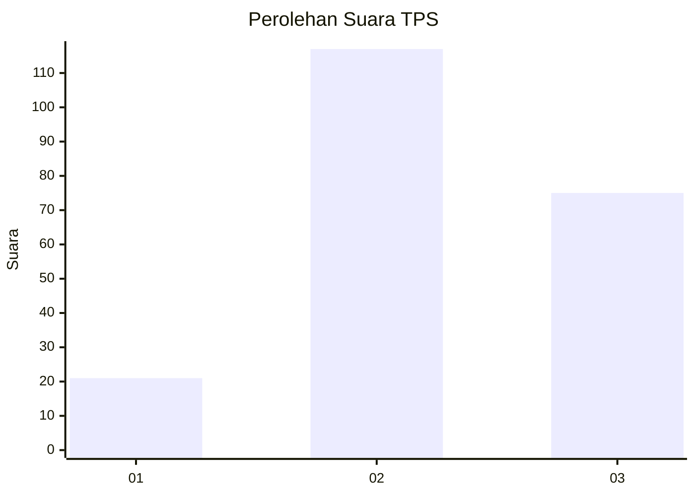
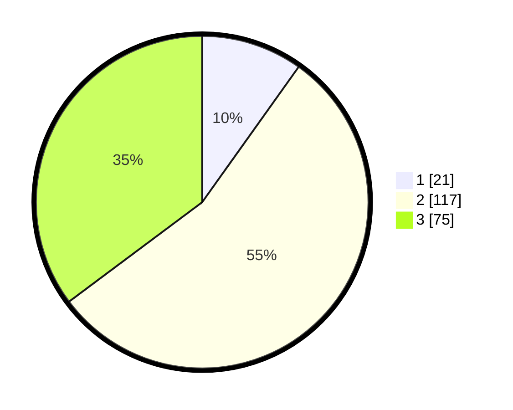

# Hasil

## Grafik

## Tabel

| No. | Nama Paslon    | Suara | Suara (raw) | Persentase |
|:--- |:-------------- | -----:| -----------:| ----------:|
| 1   | ANIES MUHAIMIN | 21    | [21][p-1]   | 9,86       |
| 2   | PRABOWO GIBRAN | 117   | [117][p-2]  | 54,93      |
| 3   | GANJAR MAHFUD  | 75    | [75][p-3]   | 35,21      |

[p-1]: https://github.com/gigit-pemilu/pemilu-2024-51-bali/blob/main/pilpres/hitung-suara/sub/51-bali/sub/03-badung/sub/01-kuta/sub/1004-legian/sub/001-tps/sub/paslon-1.txt
[p-2]: https://github.com/gigit-pemilu/pemilu-2024-51-bali/blob/main/pilpres/hitung-suara/sub/51-bali/sub/03-badung/sub/01-kuta/sub/1004-legian/sub/001-tps/sub/paslon-2.txt
[p-3]: https://github.com/gigit-pemilu/pemilu-2024-51-bali/blob/main/pilpres/hitung-suara/sub/51-bali/sub/03-badung/sub/01-kuta/sub/1004-legian/sub/001-tps/sub/paslon-3.txt

## Foto C Plano

https://sirekap-obj-formc.kpu.go.id/ba4f/pemilu/ppwp/51/03/01/10/04/5103011004001-20240214-215101--ec387224-14de-492f-967e-36dfa15da30c.jpg

https://sirekap-obj-formc.kpu.go.id/ba4f/pemilu/ppwp/51/03/01/10/04/5103011004001-20240214-215244--eac1a25f-06f9-4a12-b378-32a084e62a22.jpg

https://sirekap-obj-formc.kpu.go.id/ba4f/pemilu/ppwp/51/03/01/10/04/5103011004001-20240214-215405--dfd33d34-5d2f-4c43-af9b-92f82c98ae14.jpg

## Metadata

| Key        | Value               |
| ---------- | ------------------- |
| Time Stamp | 2024-02-19 06:16:00 |

## DATA PEMILIH TETAP

Jumlah pemilih dalam DPT: **288**.
 * L: **146**.
 * P: **142**.

## DATA PENGGUNA HAK PILIH

Jumlah pengguna hak pilih dalam DPT: **206**.
 * L: **104**.
 * P: **102**.

Jumlah pengguna hak pilih dalam DPTb: **8**.
 * L: **5**.
 * P: **3**.

Jumlah pengguna hak pilih dalam DPK: **1**.
 * L: **0**.
 * P: **1**.

Jumlah pengguna hak pilih: **215**.
 * L: **109**.
 * P: **106**.

## JUMLAH SUARA SAH DAN TIDAK SAH

JUMLAH SELURUH SUARA SAH: **213**.

JUMLAH SUARA TIDAK SAH: **2**.

JUMLAH SELURUH SUARA SAH DAN SUARA TIDAK SAH: **0**.

