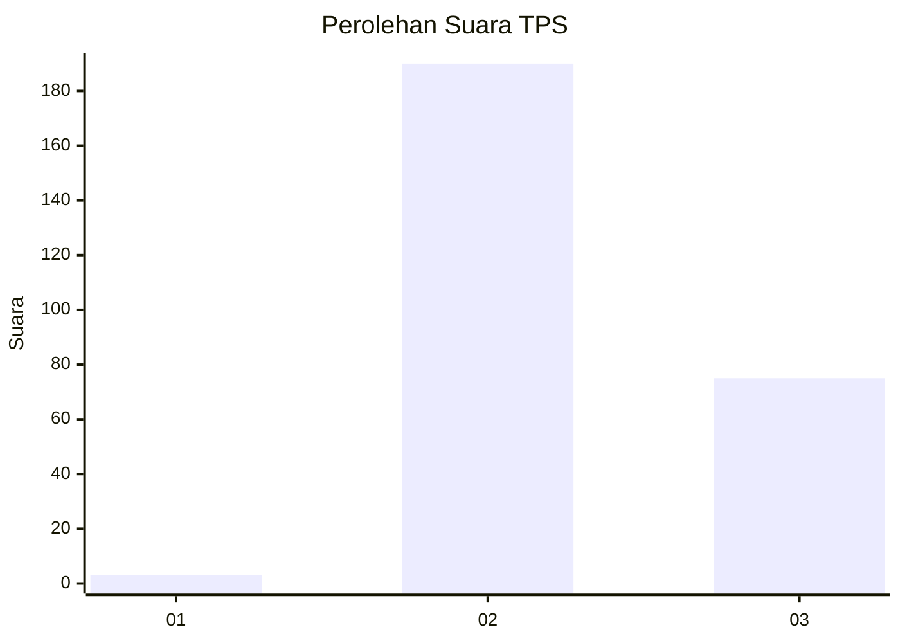
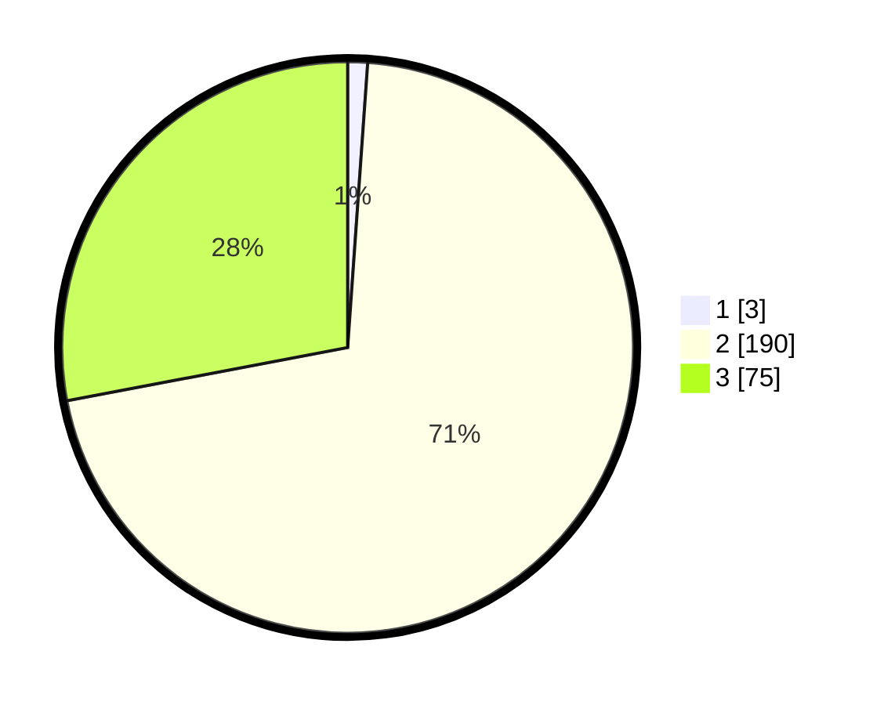

# Hasil

## Grafik

## Tabel

| No. | Nama Paslon    | Suara | Suara (raw) | Persentase |
|:--- |:-------------- | -----:| -----------:| ----------:|
| 1   | ANIES MUHAIMIN | 3     | [3][p-1]    | 1,12       |
| 2   | PRABOWO GIBRAN | 190   | [190][p-2]  | 70,90      |
| 3   | GANJAR MAHFUD  | 75    | [75][p-3]   | 27,99      |

[p-1]: https://github.com/gigit-pemilu/pemilu-2024-51-bali/blob/main/pilpres/hitung-suara/sub/51-bali/sub/03-badung/sub/01-kuta/sub/1004-legian/sub/003-tps/sub/paslon-1.txt
[p-2]: https://github.com/gigit-pemilu/pemilu-2024-51-bali/blob/main/pilpres/hitung-suara/sub/51-bali/sub/03-badung/sub/01-kuta/sub/1004-legian/sub/003-tps/sub/paslon-2.txt
[p-3]: https://github.com/gigit-pemilu/pemilu-2024-51-bali/blob/main/pilpres/hitung-suara/sub/51-bali/sub/03-badung/sub/01-kuta/sub/1004-legian/sub/003-tps/sub/paslon-3.txt

## Foto C Plano

https://sirekap-obj-formc.kpu.go.id/6310/pemilu/ppwp/51/03/01/10/04/5103011004003-20240215-000454--cca0912d-ce10-42a9-b7b7-f5e97d1c6da1.jpg

https://sirekap-obj-formc.kpu.go.id/6310/pemilu/ppwp/51/03/01/10/04/5103011004003-20240215-000535--9b836fc0-a28d-4e6e-9905-c3da1df372f4.jpg

https://sirekap-obj-formc.kpu.go.id/6310/pemilu/ppwp/51/03/01/10/04/5103011004003-20240215-000646--18ee2bbf-f5a8-4db9-8d38-2d7a2b336ed5.jpg

## Metadata

| Key        | Value               |
| ---------- | ------------------- |
| Time Stamp | 2024-03-01 14:00:00 |

