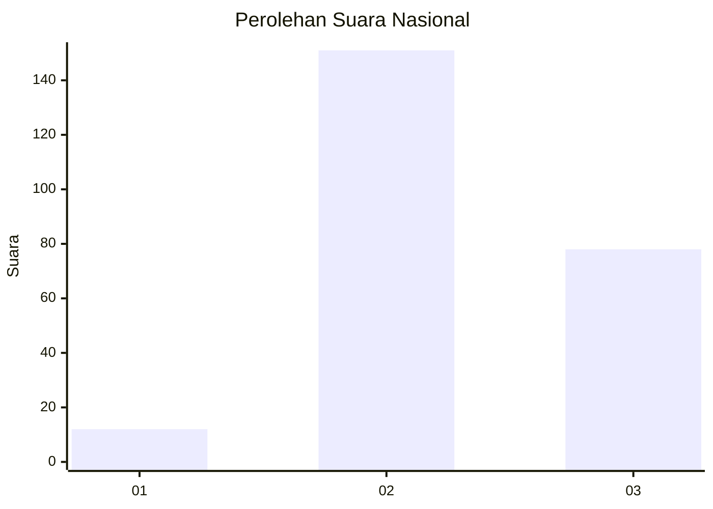
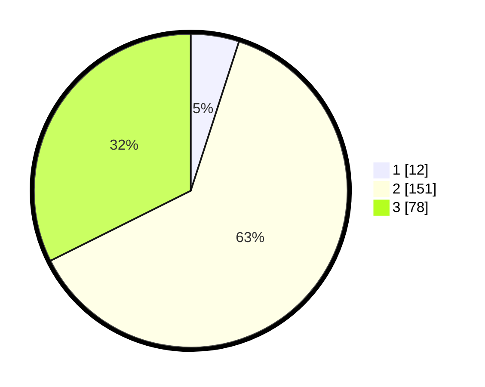

# Hasil

## Grafik

## Tabel

| No. | Nama Paslon    | Suara | Suara (raw) | Persentase |
|:--- |:-------------- | -----:| -----------:| ----------:|
| 1   | ANIES MUHAIMIN | 12    | [12][p-1]   | 4,98       |
| 2   | PRABOWO GIBRAN | 151   | [151][p-2]  | 62,66      |
| 3   | GANJAR MAHFUD  | 78    | [78][p-3]   | 32,37      |

[p-1]: https://github.com/gigit-pemilu/pemilu-2024/blob/main/pilpres/hitung-suara/sub/51-bali/sub/03-badung/sub/01-kuta/sub/1004-legian/sub/005-tps/sub/paslon-1.txt
[p-2]: https://github.com/gigit-pemilu/pemilu-2024/blob/main/pilpres/hitung-suara/sub/51-bali/sub/03-badung/sub/01-kuta/sub/1004-legian/sub/005-tps/sub/paslon-2.txt
[p-3]: https://github.com/gigit-pemilu/pemilu-2024/blob/main/pilpres/hitung-suara/sub/51-bali/sub/03-badung/sub/01-kuta/sub/1004-legian/sub/005-tps/sub/paslon-3.txt

## Foto C Plano

https://sirekap-obj-formc.kpu.go.id/92d0/pemilu/ppwp/51/03/01/10/04/5103011004005-20240215-000003--269cc320-f886-4c2e-bf50-cec1bbad773d.jpg

https://sirekap-obj-formc.kpu.go.id/92d0/pemilu/ppwp/51/03/01/10/04/5103011004005-20240215-000047--885ca745-8783-4ce0-bd59-788a51ab08d1.jpg

https://sirekap-obj-formc.kpu.go.id/92d0/pemilu/ppwp/51/03/01/10/04/5103011004005-20240214-232752--f3108c44-32b9-4c2b-954b-d185425cb8f7.jpg

## Metadata

| Key        | Value               |
| ---------- | ------------------- |
| Time Stamp | 2024-02-25 12:00:00 |

