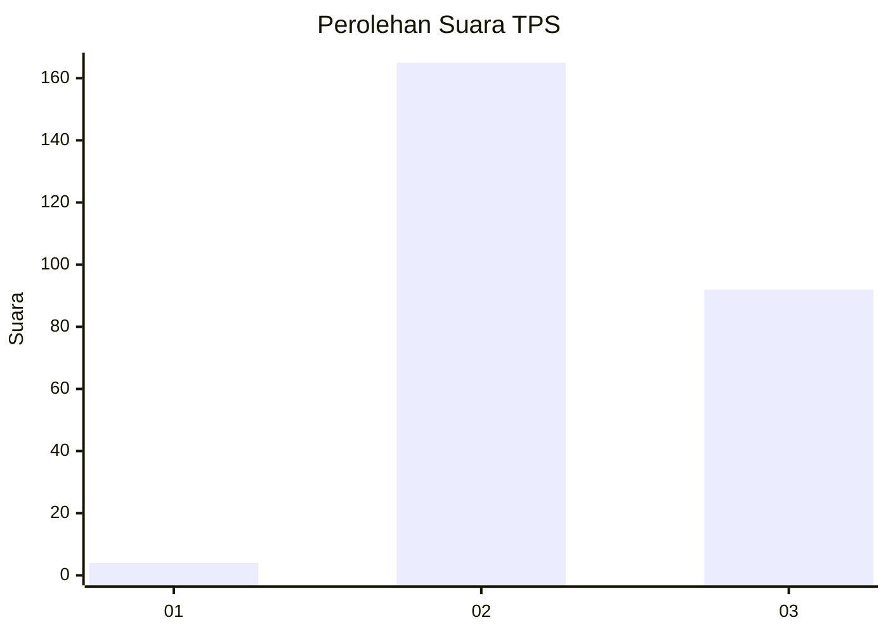
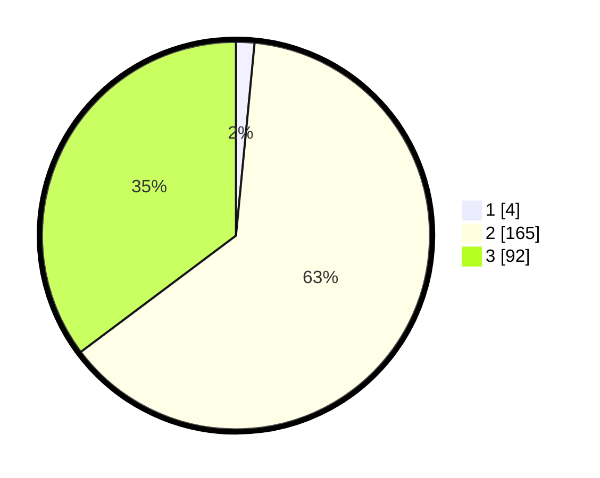

# Hasil

## Grafik

## Tabel

| No. | Nama Paslon    | Suara | Suara (raw) | Persentase |
|:--- |:-------------- | -----:| -----------:| ----------:|
| 1   | ANIES MUHAIMIN | 4     | [4][p-1]    | 1,53       |
| 2   | PRABOWO GIBRAN | 165   | [165][p-2]  | 63,22      |
| 3   | GANJAR MAHFUD  | 92    | [92][p-3]   | 35,25      |

[p-1]: https://github.com/gigit-pemilu/pemilu-2024-51-bali/blob/main/pilpres/hitung-suara/sub/51-bali/sub/03-badung/sub/01-kuta/sub/1004-legian/sub/006-tps/sub/paslon-1.txt
[p-2]: https://github.com/gigit-pemilu/pemilu-2024-51-bali/blob/main/pilpres/hitung-suara/sub/51-bali/sub/03-badung/sub/01-kuta/sub/1004-legian/sub/006-tps/sub/paslon-2.txt
[p-3]: https://github.com/gigit-pemilu/pemilu-2024-51-bali/blob/main/pilpres/hitung-suara/sub/51-bali/sub/03-badung/sub/01-kuta/sub/1004-legian/sub/006-tps/sub/paslon-3.txt

## Foto C Plano

https://sirekap-obj-formc.kpu.go.id/2309/pemilu/ppwp/51/03/01/10/04/5103011004006-20240215-024804--843d2267-9fab-4a4e-b926-5536c445b47f.jpg

https://sirekap-obj-formc.kpu.go.id/2309/pemilu/ppwp/51/03/01/10/04/5103011004006-20240215-024858--8e5602ad-25c6-4866-90c1-9bd2d08123de.jpg

https://sirekap-obj-formc.kpu.go.id/2309/pemilu/ppwp/51/03/01/10/04/5103011004006-20240215-025017--73040b0a-3d4d-44eb-9306-2e9c223aef54.jpg

## Metadata

| Key        | Value               |
| ---------- | ------------------- |
| Time Stamp | 2024-02-24 22:31:28 |

