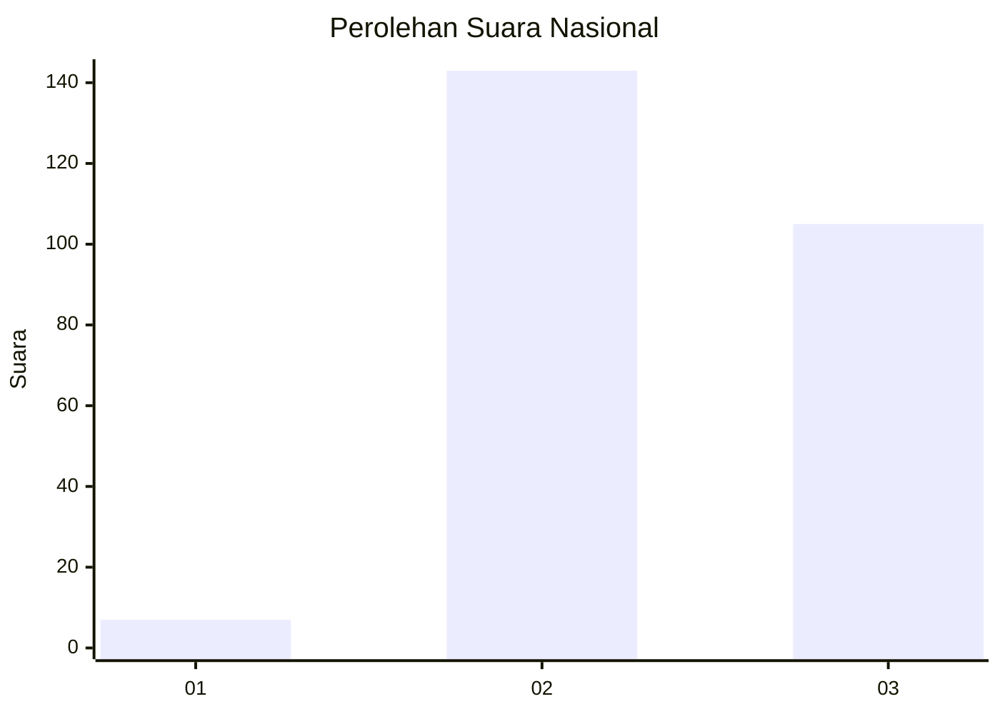
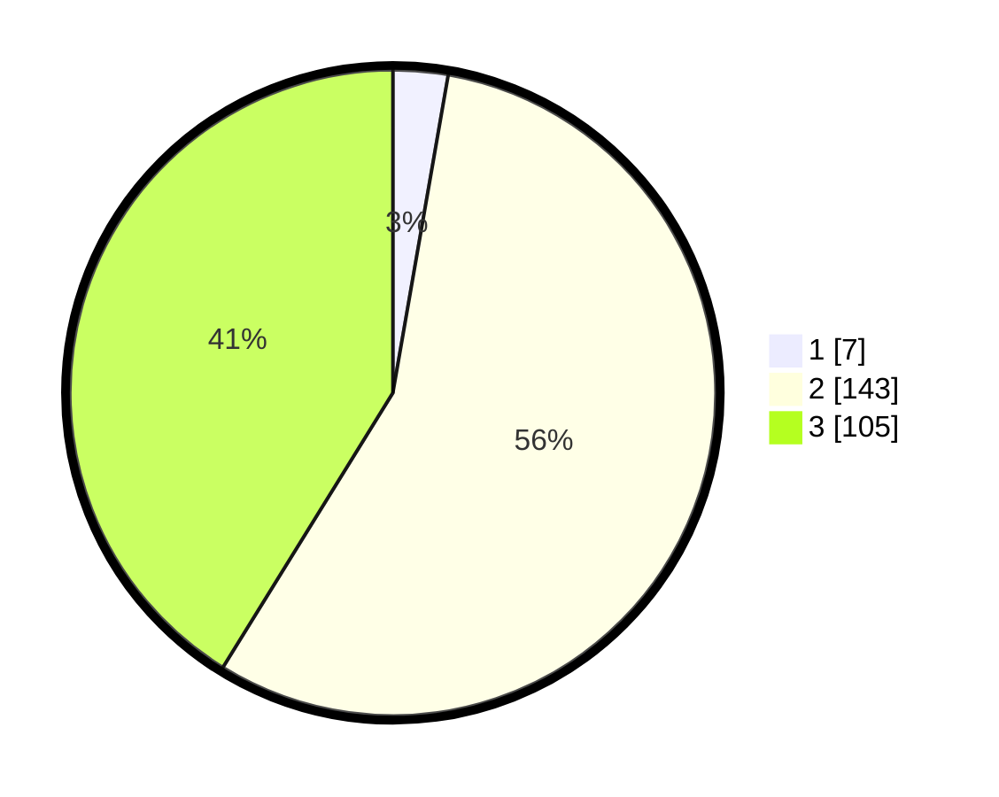

# Hasil

## Grafik

## Tabel

| No. | Nama Paslon    | Suara | Suara (raw) | Persentase |
|:--- |:-------------- | -----:| -----------:| ----------:|
| 1   | ANIES MUHAIMIN | 7     | [7][p-1]    | 2,75       |
| 2   | PRABOWO GIBRAN | 143   | [143][p-2]  | 56,08      |
| 3   | GANJAR MAHFUD  | 105   | [105][p-3]  | 41,18      |

[p-1]: https://github.com/gigit-pemilu/pemilu-2024/blob/main/pilpres/hitung-suara/sub/51-bali/sub/03-badung/sub/01-kuta/sub/1004-legian/sub/007-tps/sub/paslon-1.txt
[p-2]: https://github.com/gigit-pemilu/pemilu-2024/blob/main/pilpres/hitung-suara/sub/51-bali/sub/03-badung/sub/01-kuta/sub/1004-legian/sub/007-tps/sub/paslon-2.txt
[p-3]: https://github.com/gigit-pemilu/pemilu-2024/blob/main/pilpres/hitung-suara/sub/51-bali/sub/03-badung/sub/01-kuta/sub/1004-legian/sub/007-tps/sub/paslon-3.txt

## Foto C Plano

https://sirekap-obj-formc.kpu.go.id/acc6/pemilu/ppwp/51/03/01/10/04/5103011004007-20240215-103508--8d6c1737-91ab-4f5d-878f-35a12363a369.jpg

https://sirekap-obj-formc.kpu.go.id/acc6/pemilu/ppwp/51/03/01/10/04/5103011004007-20240215-000609--beaff78d-7842-421b-bc31-eb0c45c97e1c.jpg

https://sirekap-obj-formc.kpu.go.id/acc6/pemilu/ppwp/51/03/01/10/04/5103011004007-20240215-000738--b793e5ea-5090-435c-9ccd-e2c0e81525dc.jpg

## Metadata

| Key        | Value               |
| ---------- | ------------------- |
| Time Stamp | 2024-02-24 22:31:28 |

