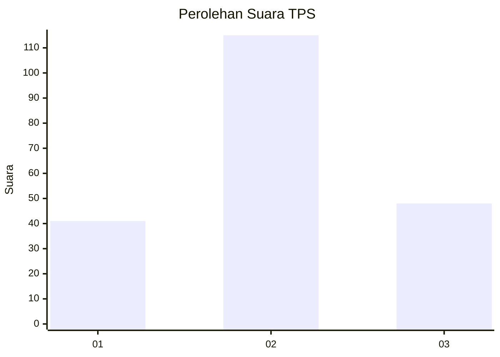
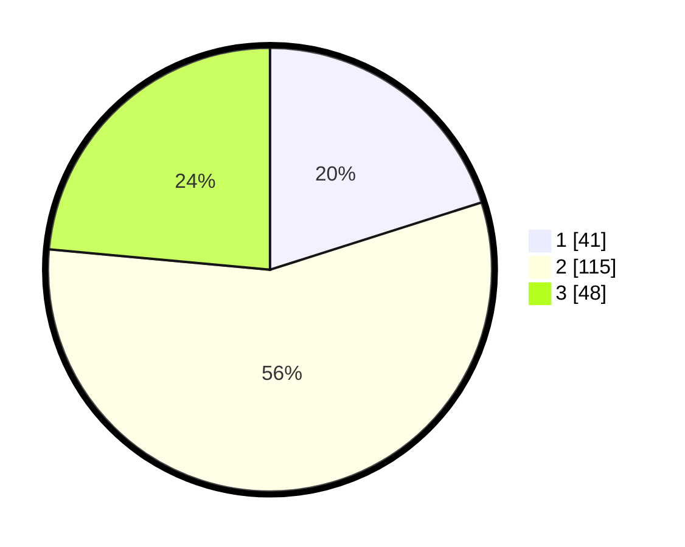

# Hasil

## Grafik

## Tabel

| No. | Nama Paslon    | Suara | Suara (raw) | Persentase |
|:--- |:-------------- | -----:| -----------:| ----------:|
| 1   | ANIES MUHAIMIN | 41    | [41][p-1]   | 20,10      |
| 2   | PRABOWO GIBRAN | 115   | [115][p-2]  | 56,37      |
| 3   | GANJAR MAHFUD  | 48    | [48][p-3]   | 23,53      |

[p-1]: https://github.com/gigit-pemilu/pemilu-2024-51-bali/blob/main/pilpres/hitung-suara/sub/51-bali/sub/03-badung/sub/01-kuta/sub/1004-legian/sub/008-tps/sub/paslon-1.txt
[p-2]: https://github.com/gigit-pemilu/pemilu-2024-51-bali/blob/main/pilpres/hitung-suara/sub/51-bali/sub/03-badung/sub/01-kuta/sub/1004-legian/sub/008-tps/sub/paslon-2.txt
[p-3]: https://github.com/gigit-pemilu/pemilu-2024-51-bali/blob/main/pilpres/hitung-suara/sub/51-bali/sub/03-badung/sub/01-kuta/sub/1004-legian/sub/008-tps/sub/paslon-3.txt

## Foto C Plano

https://sirekap-obj-formc.kpu.go.id/6993/pemilu/ppwp/51/03/01/10/04/5103011004008-20240214-222455--6ef70b08-12d5-4cf2-94f9-ff8d8406967e.jpg

https://sirekap-obj-formc.kpu.go.id/6993/pemilu/ppwp/51/03/01/10/04/5103011004008-20240214-222642--9ccc61d4-3a88-41e7-a338-593098ad01fb.jpg

https://sirekap-obj-formc.kpu.go.id/6993/pemilu/ppwp/51/03/01/10/04/5103011004008-20240214-222758--794d2c24-b1d7-4e61-be67-2def26b235f1.jpg

## Metadata

| Key        | Value               |
| ---------- | ------------------- |
| Time Stamp | 2024-02-25 12:00:00 |

