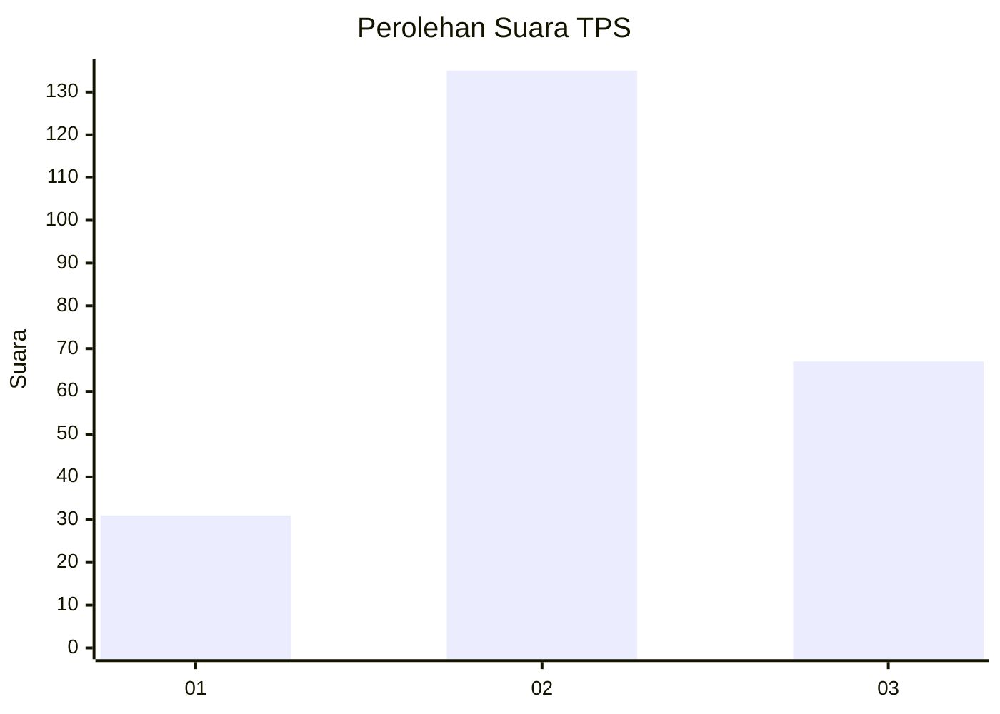
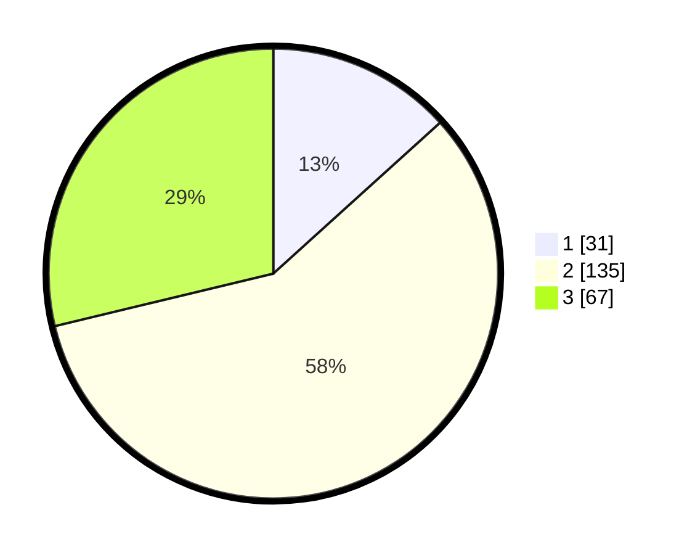

# Hasil

## Grafik

## Tabel

| No. | Nama Paslon    | Suara | Suara (raw) | Persentase |
|:--- |:-------------- | -----:| -----------:| ----------:|
| 1   | ANIES MUHAIMIN | 31    | [31][p-1]   | 13,30      |
| 2   | PRABOWO GIBRAN | 135   | [135][p-2]  | 57,94      |
| 3   | GANJAR MAHFUD  | 67    | [67][p-3]   | 28,76      |

[p-1]: https://github.com/gigit-pemilu/pemilu-2024-51-bali/blob/main/pilpres/hitung-suara/sub/51-bali/sub/03-badung/sub/01-kuta/sub/1004-legian/sub/009-tps/sub/paslon-1.txt
[p-2]: https://github.com/gigit-pemilu/pemilu-2024-51-bali/blob/main/pilpres/hitung-suara/sub/51-bali/sub/03-badung/sub/01-kuta/sub/1004-legian/sub/009-tps/sub/paslon-2.txt
[p-3]: https://github.com/gigit-pemilu/pemilu-2024-51-bali/blob/main/pilpres/hitung-suara/sub/51-bali/sub/03-badung/sub/01-kuta/sub/1004-legian/sub/009-tps/sub/paslon-3.txt

## Foto C Plano

https://sirekap-obj-formc.kpu.go.id/f2fa/pemilu/ppwp/51/03/01/10/04/5103011004009-20240215-010820--7f49c2d7-7bc1-4847-941b-8e24a0989017.jpg

https://sirekap-obj-formc.kpu.go.id/f2fa/pemilu/ppwp/51/03/01/10/04/5103011004009-20240215-010920--a352fe51-a46b-4e2c-8f5f-d2447eb3d0d6.jpg

https://sirekap-obj-formc.kpu.go.id/f2fa/pemilu/ppwp/51/03/01/10/04/5103011004009-20240215-010945--c02a898d-41d4-44d1-bd72-66c0d6e82df8.jpg

## Metadata

| Key        | Value               |
| ---------- | ------------------- |
| Time Stamp | 2024-02-24 22:31:28 |

