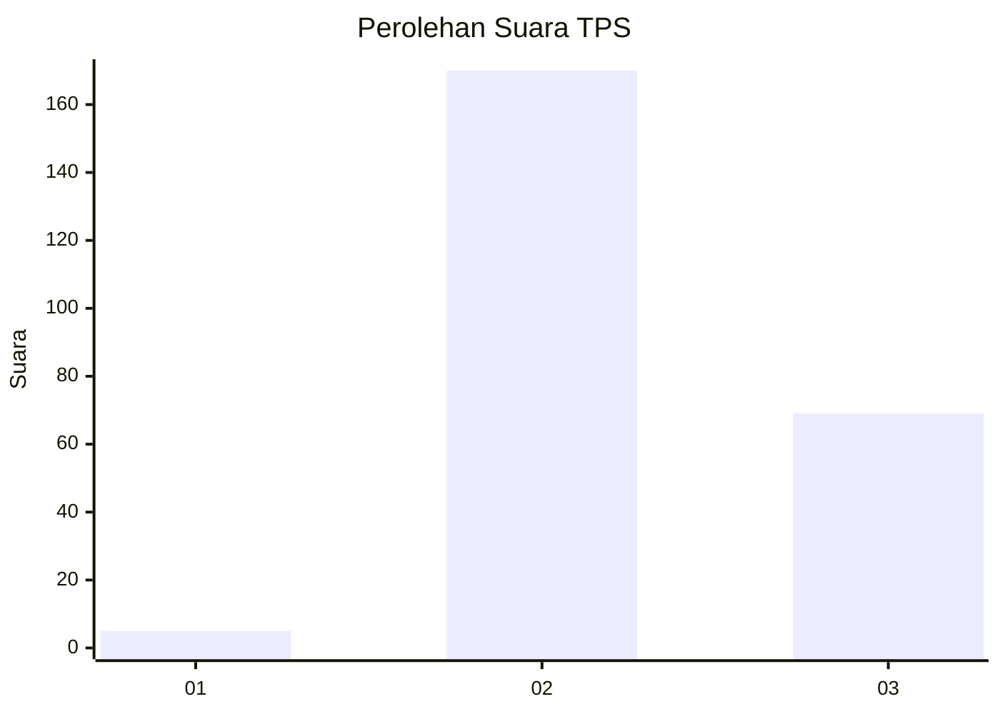
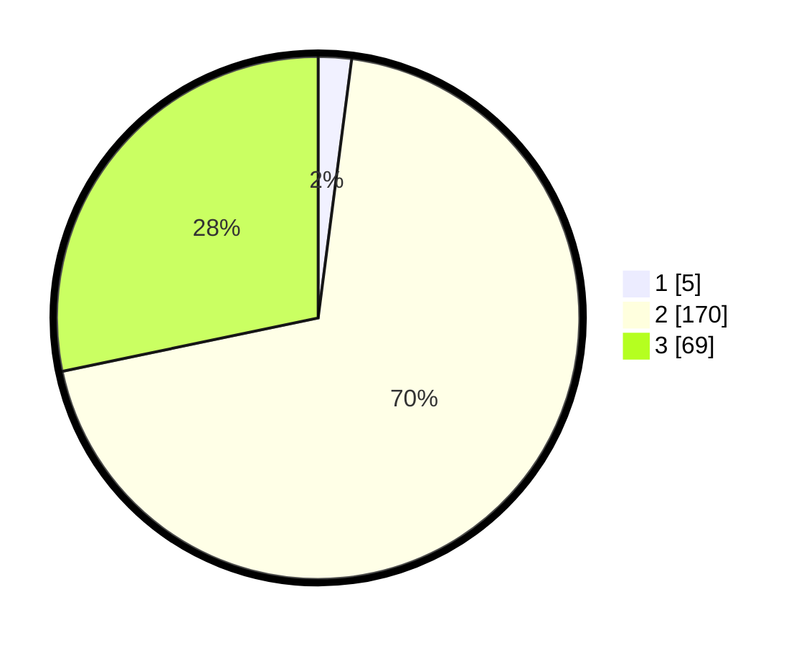

# Hasil

## Grafik

## Tabel

| No. | Nama Paslon    | Suara | Suara (raw) | Persentase |
|:--- |:-------------- | -----:| -----------:| ----------:|
| 1   | ANIES MUHAIMIN | 5     | [5][p-1]    | 2,05       |
| 2   | PRABOWO GIBRAN | 170   | [170][p-2]  | 69,67      |
| 3   | GANJAR MAHFUD  | 69    | [69][p-3]   | 28,28      |

[p-1]: https://github.com/gigit-pemilu/pemilu-2024-51-bali/blob/main/pilpres/hitung-suara/sub/51-bali/sub/03-badung/sub/01-kuta/sub/1004-legian/sub/010-tps/sub/paslon-1.txt
[p-2]: https://github.com/gigit-pemilu/pemilu-2024-51-bali/blob/main/pilpres/hitung-suara/sub/51-bali/sub/03-badung/sub/01-kuta/sub/1004-legian/sub/010-tps/sub/paslon-2.txt
[p-3]: https://github.com/gigit-pemilu/pemilu-2024-51-bali/blob/main/pilpres/hitung-suara/sub/51-bali/sub/03-badung/sub/01-kuta/sub/1004-legian/sub/010-tps/sub/paslon-3.txt

## Foto C Plano

https://sirekap-obj-formc.kpu.go.id/ac50/pemilu/ppwp/51/03/01/10/04/5103011004010-20240214-231154--8b0a73bf-0ae8-494f-9ded-326f95339f11.jpg

https://sirekap-obj-formc.kpu.go.id/ac50/pemilu/ppwp/51/03/01/10/04/5103011004010-20240214-231304--1f7387d1-e545-4693-bb38-70cca6b18613.jpg

https://sirekap-obj-formc.kpu.go.id/ac50/pemilu/ppwp/51/03/01/10/04/5103011004010-20240214-231427--778fdd62-f9a5-42fe-88a9-9bea2fd05056.jpg

## Metadata

| Key        | Value               |
| ---------- | ------------------- |
| Time Stamp | 2024-02-24 22:31:28 |

