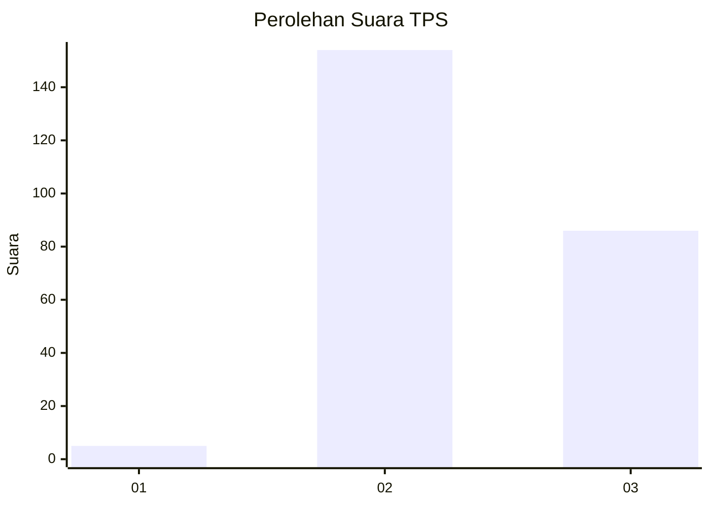
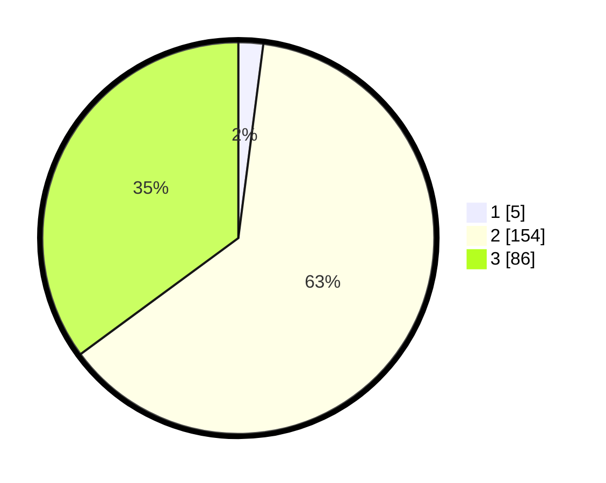

# Hasil

## Grafik

## Tabel

| No. | Nama Paslon    | Suara | Suara (raw) | Persentase |
|:--- |:-------------- | -----:| -----------:| ----------:|
| 1   | ANIES MUHAIMIN | 5     | [5][p-1]    | 2,04       |
| 2   | PRABOWO GIBRAN | 154   | [154][p-2]  | 62,86      |
| 3   | GANJAR MAHFUD  | 86    | [86][p-3]   | 35,10      |

[p-1]: https://github.com/gigit-pemilu/pemilu-2024-51-bali/blob/main/pilpres/hitung-suara/sub/51-bali/sub/03-badung/sub/01-kuta/sub/1004-legian/sub/011-tps/sub/paslon-1.txt
[p-2]: https://github.com/gigit-pemilu/pemilu-2024-51-bali/blob/main/pilpres/hitung-suara/sub/51-bali/sub/03-badung/sub/01-kuta/sub/1004-legian/sub/011-tps/sub/paslon-2.txt
[p-3]: https://github.com/gigit-pemilu/pemilu-2024-51-bali/blob/main/pilpres/hitung-suara/sub/51-bali/sub/03-badung/sub/01-kuta/sub/1004-legian/sub/011-tps/sub/paslon-3.txt

## Foto C Plano

https://sirekap-obj-formc.kpu.go.id/7262/pemilu/ppwp/51/03/01/10/04/5103011004011-20240215-004435--11e5e9e3-52d0-4b7a-a115-0fb375b03638.jpg

https://sirekap-obj-formc.kpu.go.id/7262/pemilu/ppwp/51/03/01/10/04/5103011004011-20240215-004001--a130594f-a7c7-450f-aa3a-8e450b982b42.jpg

https://sirekap-obj-formc.kpu.go.id/7262/pemilu/ppwp/51/03/01/10/04/5103011004011-20240215-004105--ca47c00a-90c2-4537-8d4a-17bae1d3bdaf.jpg

## Metadata

| Key        | Value               |
| ---------- | ------------------- |
| Time Stamp | 2024-02-21 20:00:00 |

## DATA PEMILIH TETAP

Jumlah pemilih dalam DPT: **266**.
 * L: **135**.
 * P: **131**.

## DATA PENGGUNA HAK PILIH

Jumlah pengguna hak pilih dalam DPT: **236**.
 * L: **117**.
 * P: **119**.

Jumlah pengguna hak pilih dalam DPTb: **7**.
 * L: **2**.
 * P: **5**.

Jumlah pengguna hak pilih dalam DPK: **3**.
 * L: **2**.
 * P: **1**.

Jumlah pengguna hak pilih: **246**.
 * L: **121**.
 * P: **125**.

## JUMLAH SUARA SAH DAN TIDAK SAH

JUMLAH SELURUH SUARA SAH: **245**.

JUMLAH SUARA TIDAK SAH: **1**.

JUMLAH SELURUH SUARA SAH DAN SUARA TIDAK SAH: **246**.

