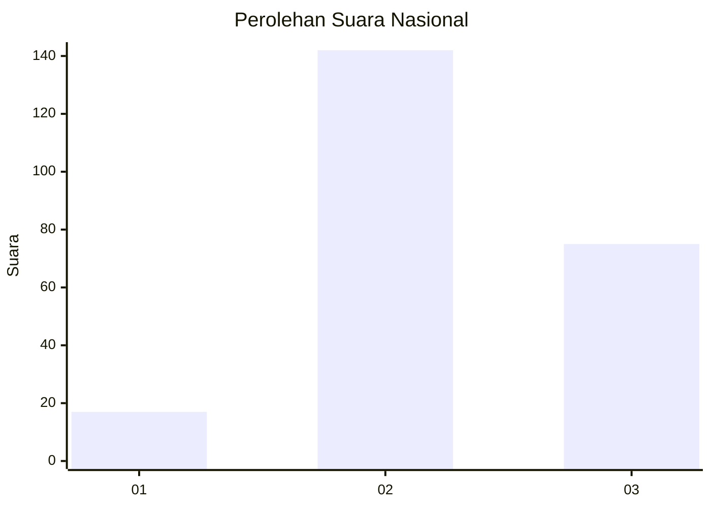
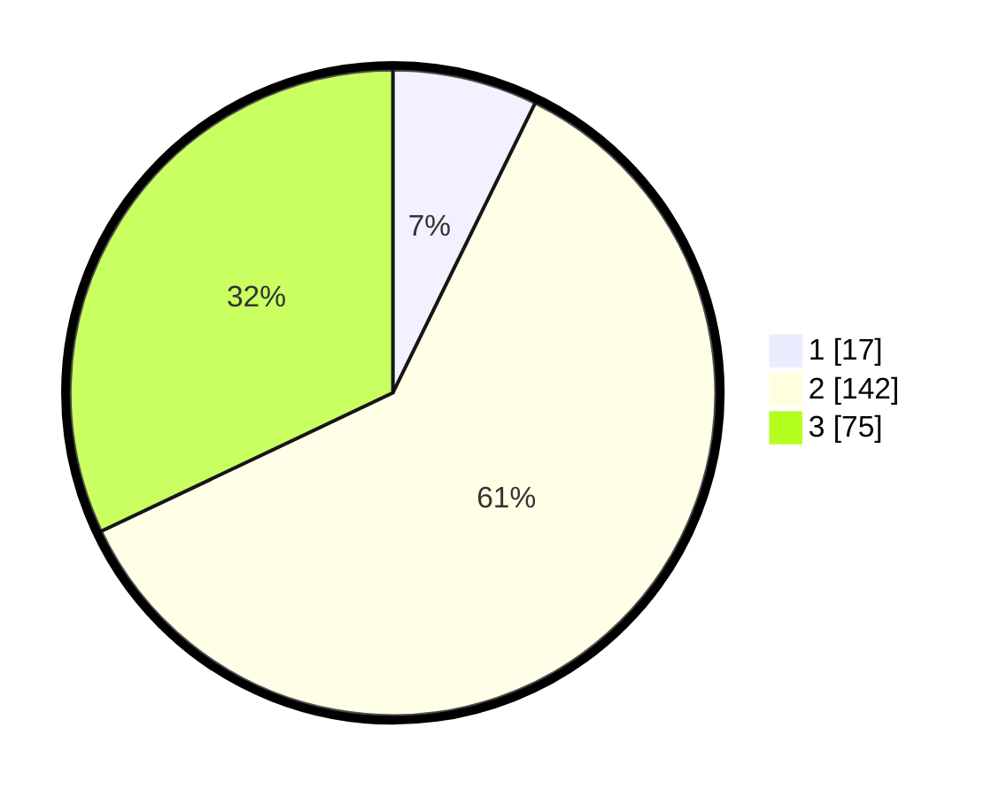

# Hasil

## Grafik

## Tabel

| No. | Nama Paslon    | Suara | Suara (raw) | Persentase |
|:--- |:-------------- | -----:| -----------:| ----------:|
| 1   | ANIES MUHAIMIN | 17    | [17][p-1]   | 7,26       |
| 2   | PRABOWO GIBRAN | 142   | [142][p-2]  | 60,68      |
| 3   | GANJAR MAHFUD  | 75    | [75][p-3]   | 32,05      |

[p-1]: https://github.com/gigit-pemilu/pemilu-2024/blob/main/pilpres/hitung-suara/sub/51-bali/sub/03-badung/sub/01-kuta/sub/1004-legian/sub/012-tps/sub/paslon-1.txt
[p-2]: https://github.com/gigit-pemilu/pemilu-2024/blob/main/pilpres/hitung-suara/sub/51-bali/sub/03-badung/sub/01-kuta/sub/1004-legian/sub/012-tps/sub/paslon-2.txt
[p-3]: https://github.com/gigit-pemilu/pemilu-2024/blob/main/pilpres/hitung-suara/sub/51-bali/sub/03-badung/sub/01-kuta/sub/1004-legian/sub/012-tps/sub/paslon-3.txt

## Foto C Plano

https://sirekap-obj-formc.kpu.go.id/b1c8/pemilu/ppwp/51/03/01/10/04/5103011004012-20240214-231606--bad20923-5740-437d-a789-ce5bf15816a1.jpg

https://sirekap-obj-formc.kpu.go.id/b1c8/pemilu/ppwp/51/03/01/10/04/5103011004012-20240214-230947--a75532d6-8d0a-4e76-b1f0-d9ac8b0128da.jpg

## Metadata

| Key        | Value               |
| ---------- | ------------------- |
| Time Stamp | 2024-02-26 23:00:00 |

