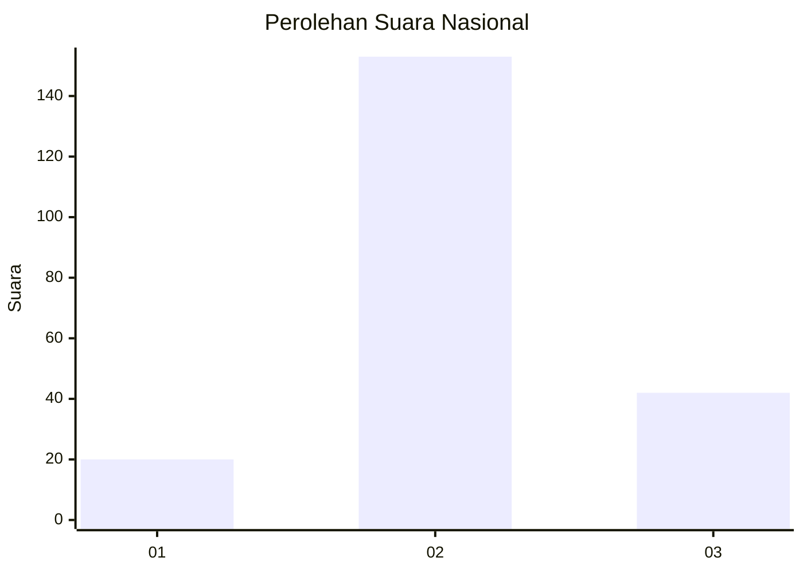
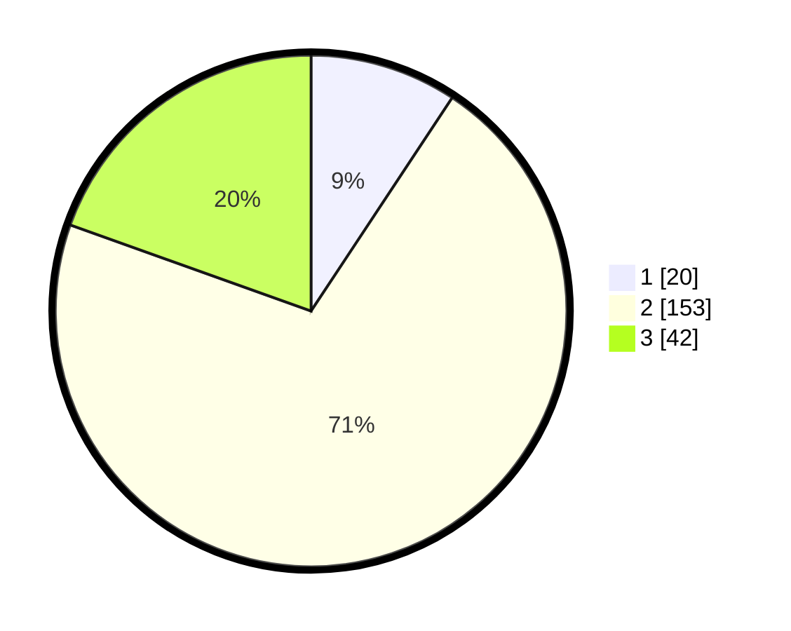

# Hasil

## Grafik

## Tabel

| No. | Nama Paslon    | Suara | Suara (raw) | Persentase |
|:--- |:-------------- | -----:| -----------:| ----------:|
| 1   | ANIES MUHAIMIN | 20    | [20][p-1]   | 9,30       |
| 2   | PRABOWO GIBRAN | 153   | [153][p-2]  | 71,16      |
| 3   | GANJAR MAHFUD  | 42    | [42][p-3]   | 19,53      |

[p-1]: https://github.com/gigit-pemilu/pemilu-2024/blob/main/pilpres/hitung-suara/sub/51-bali/sub/03-badung/sub/01-kuta/sub/1004-legian/sub/013-tps/sub/paslon-1.txt
[p-2]: https://github.com/gigit-pemilu/pemilu-2024/blob/main/pilpres/hitung-suara/sub/51-bali/sub/03-badung/sub/01-kuta/sub/1004-legian/sub/013-tps/sub/paslon-2.txt
[p-3]: https://github.com/gigit-pemilu/pemilu-2024/blob/main/pilpres/hitung-suara/sub/51-bali/sub/03-badung/sub/01-kuta/sub/1004-legian/sub/013-tps/sub/paslon-3.txt

## Foto C Plano

https://sirekap-obj-formc.kpu.go.id/85fb/pemilu/ppwp/51/03/01/10/04/5103011004013-20240215-011302--e7c17f19-63af-4797-8d21-ae3525b5c90b.jpg

https://sirekap-obj-formc.kpu.go.id/85fb/pemilu/ppwp/51/03/01/10/04/5103011004013-20240215-011344--b17bafe8-0b32-4808-92f9-6a7969af0511.jpg

https://sirekap-obj-formc.kpu.go.id/85fb/pemilu/ppwp/51/03/01/10/04/5103011004013-20240215-011430--e5eefb0a-3aa5-4b28-bfa2-fa85c8f897e5.jpg

## Metadata

| Key        | Value               |
| ---------- | ------------------- |
| Time Stamp | 2024-02-16 17:00:00 |

## DATA PEMILIH TETAP

Jumlah pemilih dalam DPT: **272**.
 * L: **132**.
 * P: **140**.

## DATA PENGGUNA HAK PILIH

Jumlah pengguna hak pilih dalam DPT: **206**.
 * L: **102**.
 * P: **104**.

Jumlah pengguna hak pilih dalam DPTb: **8**.
 * L: **6**.
 * P: **2**.

Jumlah pengguna hak pilih dalam DPK: **2**.
 * L: **1**.
 * P: **1**.

Jumlah pengguna hak pilih: **216**.
 * L: **109**.
 * P: **107**.

## JUMLAH SUARA SAH DAN TIDAK SAH

JUMLAH SELURUH SUARA SAH: **215**.

JUMLAH SUARA TIDAK SAH: **1**.

JUMLAH SELURUH SUARA SAH DAN SUARA TIDAK SAH: **216**.

