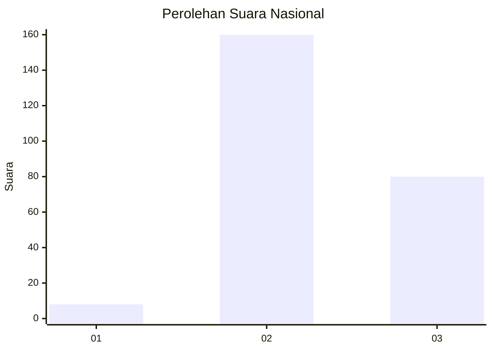
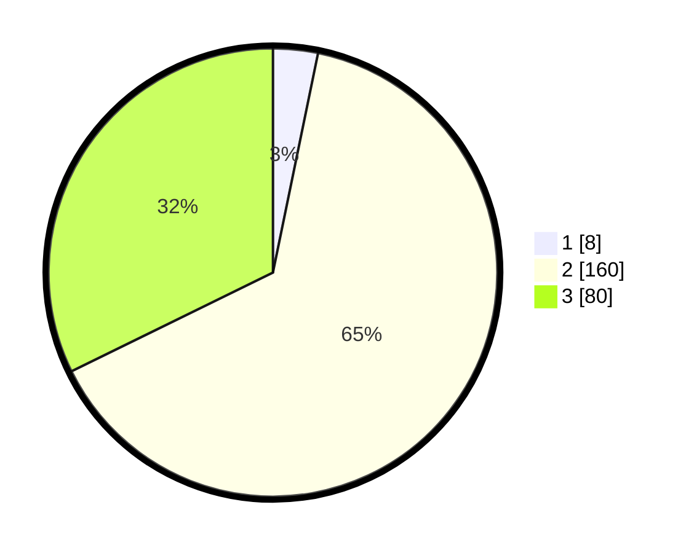

# Hasil

## Grafik

## Tabel

| No. | Nama Paslon    | Suara | Suara (raw) | Persentase |
|:--- |:-------------- | -----:| -----------:| ----------:|
| 1   | ANIES MUHAIMIN | 8     | [8][p-1]    | 3,23       |
| 2   | PRABOWO GIBRAN | 160   | [160][p-2]  | 64,52      |
| 3   | GANJAR MAHFUD  | 80    | [80][p-3]   | 32,26      |

[p-1]: https://github.com/gigit-pemilu/pemilu-2024/blob/main/pilpres/hitung-suara/sub/51-bali/sub/03-badung/sub/01-kuta/sub/1005-seminyak/sub/008-tps/sub/paslon-1.txt
[p-2]: https://github.com/gigit-pemilu/pemilu-2024/blob/main/pilpres/hitung-suara/sub/51-bali/sub/03-badung/sub/01-kuta/sub/1005-seminyak/sub/008-tps/sub/paslon-2.txt
[p-3]: https://github.com/gigit-pemilu/pemilu-2024/blob/main/pilpres/hitung-suara/sub/51-bali/sub/03-badung/sub/01-kuta/sub/1005-seminyak/sub/008-tps/sub/paslon-3.txt

## Foto C Plano

https://sirekap-obj-formc.kpu.go.id/252e/pemilu/ppwp/51/03/01/10/05/5103011005008-20240217-100633--bb72e847-6d53-4e0e-a763-5cccd8e479ff.jpg

https://sirekap-obj-formc.kpu.go.id/252e/pemilu/ppwp/51/03/01/10/05/5103011005008-20240217-100701--00cbd510-c74d-48a3-b2d5-156977c26ce5.jpg

https://sirekap-obj-formc.kpu.go.id/252e/pemilu/ppwp/51/03/01/10/05/5103011005008-20240217-100714--628090f2-a863-42e9-92b9-8e0ec8de24f3.jpg

## Metadata

| Key        | Value               |
| ---------- | ------------------- |
| Time Stamp | 2024-02-24 22:31:28 |

