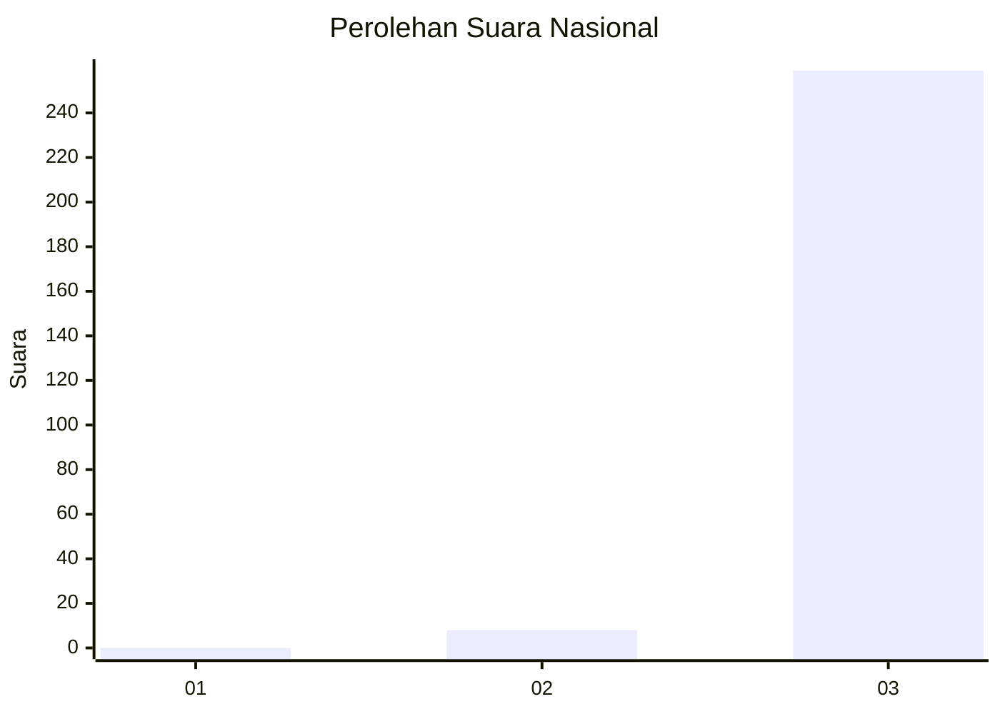
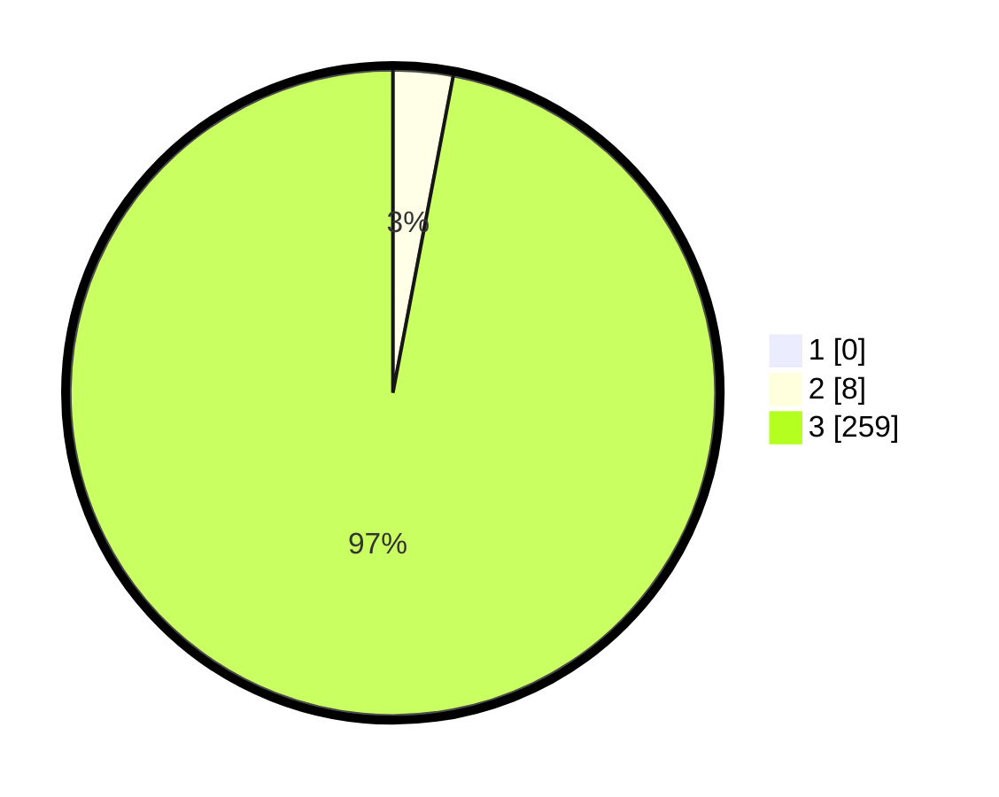

# Hasil

## Grafik

## Tabel

| No. | Nama Paslon    | Suara | Suara (raw) | Persentase |
|:--- |:-------------- | -----:| -----------:| ----------:|
| 1   | ANIES MUHAIMIN | 0     | [0][p-1]    | 0,00       |
| 2   | PRABOWO GIBRAN | 8     | [8][p-2]    | 3,00       |
| 3   | GANJAR MAHFUD  | 259   | [259][p-3]  | 97,00      |

[p-1]: https://github.com/gigit-pemilu/pemilu-2024/blob/main/pilpres/hitung-suara/sub/51-bali/sub/03-badung/sub/02-mengwi/sub/1004-kapal/sub/001-tps/sub/paslon-1.txt
[p-2]: https://github.com/gigit-pemilu/pemilu-2024/blob/main/pilpres/hitung-suara/sub/51-bali/sub/03-badung/sub/02-mengwi/sub/1004-kapal/sub/001-tps/sub/paslon-2.txt
[p-3]: https://github.com/gigit-pemilu/pemilu-2024/blob/main/pilpres/hitung-suara/sub/51-bali/sub/03-badung/sub/02-mengwi/sub/1004-kapal/sub/001-tps/sub/paslon-3.txt

## Foto C Plano

https://sirekap-obj-formc.kpu.go.id/8e33/pemilu/ppwp/51/03/02/10/04/5103021004001-20240214-214728--359c0925-3f65-4251-b1e4-894975d88353.jpg

https://sirekap-obj-formc.kpu.go.id/8e33/pemilu/ppwp/51/03/02/10/04/5103021004001-20240214-214714--ecd4ab75-9501-4dfd-bfd5-1419d9d0d766.jpg

https://sirekap-obj-formc.kpu.go.id/8e33/pemilu/ppwp/51/03/02/10/04/5103021004001-20240214-214618--9fce7e42-82eb-4daa-aed8-37c4fc10a85e.jpg

## Metadata

| Key        | Value               |
| ---------- | ------------------- |
| Time Stamp | 2024-02-24 22:31:28 |

