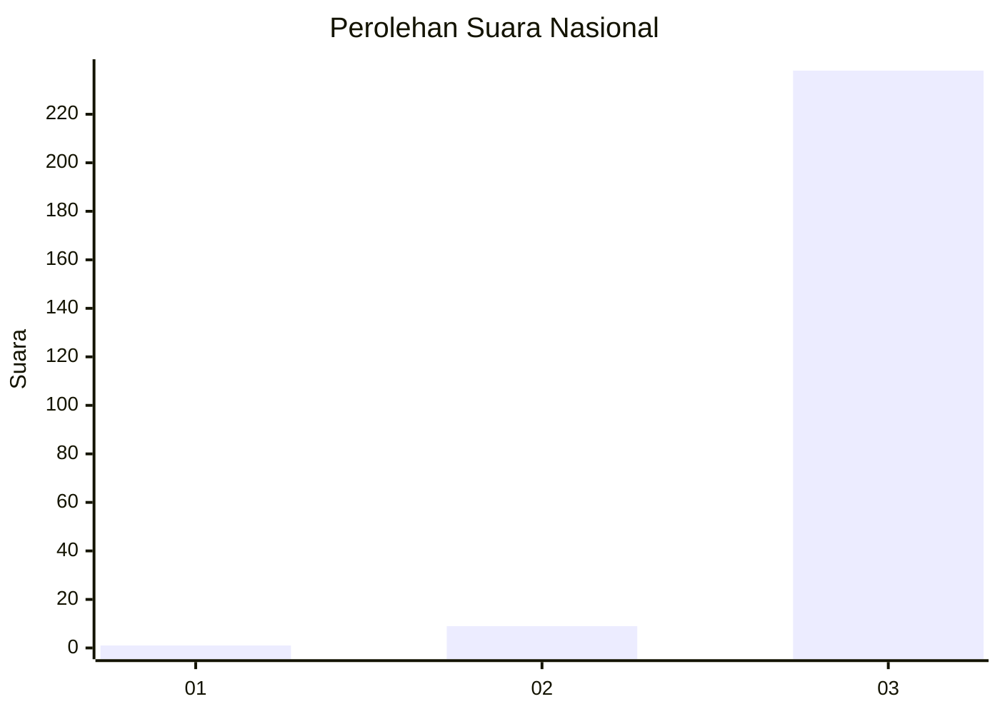
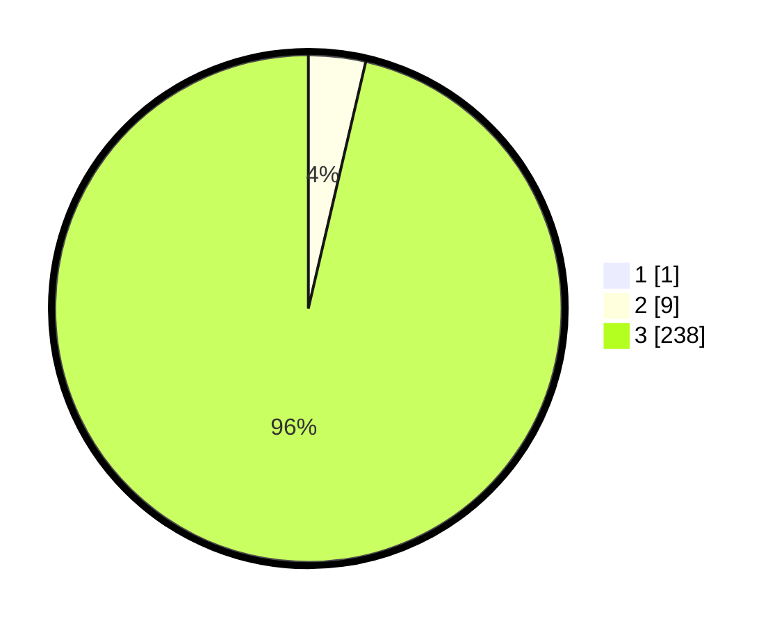

# Hasil

## Grafik

## Tabel

| No. | Nama Paslon    | Suara | Suara (raw) | Persentase |
|:--- |:-------------- | -----:| -----------:| ----------:|
| 1   | ANIES MUHAIMIN | 1     | [1][p-1]    | 0,40       |
| 2   | PRABOWO GIBRAN | 9     | [9][p-2]    | 3,63       |
| 3   | GANJAR MAHFUD  | 238   | [238][p-3]  | 95,97      |

[p-1]: https://github.com/gigit-pemilu/pemilu-2024/blob/main/pilpres/hitung-suara/sub/51-bali/sub/03-badung/sub/02-mengwi/sub/1004-kapal/sub/002-tps/sub/paslon-1.txt
[p-2]: https://github.com/gigit-pemilu/pemilu-2024/blob/main/pilpres/hitung-suara/sub/51-bali/sub/03-badung/sub/02-mengwi/sub/1004-kapal/sub/002-tps/sub/paslon-2.txt
[p-3]: https://github.com/gigit-pemilu/pemilu-2024/blob/main/pilpres/hitung-suara/sub/51-bali/sub/03-badung/sub/02-mengwi/sub/1004-kapal/sub/002-tps/sub/paslon-3.txt

## Foto C Plano

https://sirekap-obj-formc.kpu.go.id/06dc/pemilu/ppwp/51/03/02/10/04/5103021004002-20240214-213824--515d9114-a024-4ed9-a12d-30b40d76451f.jpg

https://sirekap-obj-formc.kpu.go.id/06dc/pemilu/ppwp/51/03/02/10/04/5103021004002-20240214-213950--34b4e18d-1d43-4cb5-a569-2253357666a3.jpg

https://sirekap-obj-formc.kpu.go.id/06dc/pemilu/ppwp/51/03/02/10/04/5103021004002-20240214-214203--3a58d371-a007-4629-a8d1-90047cabd1e9.jpg

## Metadata

| Key        | Value               |
| ---------- | ------------------- |
| Time Stamp | 2024-02-25 12:00:00 |

