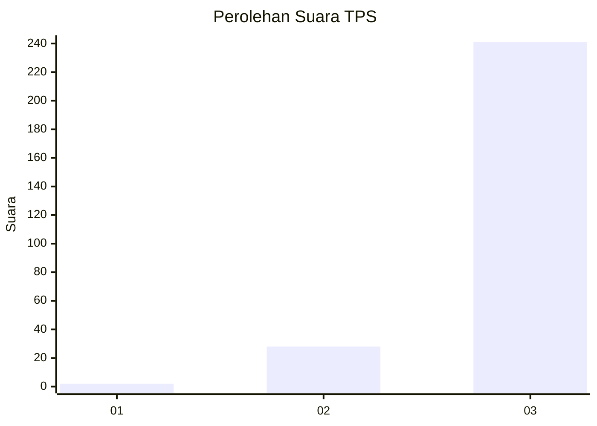
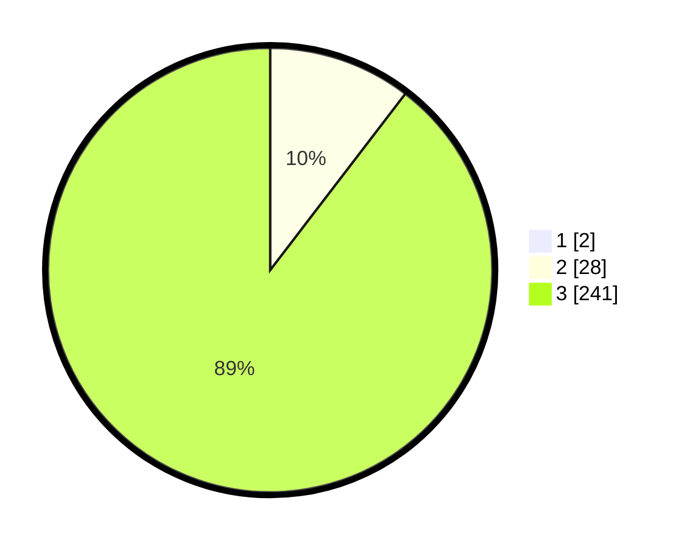

# Hasil

## Grafik

## Tabel

| No. | Nama Paslon    | Suara | Suara (raw) | Persentase |
|:--- |:-------------- | -----:| -----------:| ----------:|
| 1   | ANIES MUHAIMIN | 2     | [2][p-1]    | 0,74       |
| 2   | PRABOWO GIBRAN | 28    | [28][p-2]   | 10,33      |
| 3   | GANJAR MAHFUD  | 241   | [241][p-3]  | 88,93      |

[p-1]: https://github.com/gigit-pemilu/pemilu-2024-51-bali/blob/main/pilpres/hitung-suara/sub/51-bali/sub/03-badung/sub/02-mengwi/sub/1004-kapal/sub/003-tps/sub/paslon-1.txt
[p-2]: https://github.com/gigit-pemilu/pemilu-2024-51-bali/blob/main/pilpres/hitung-suara/sub/51-bali/sub/03-badung/sub/02-mengwi/sub/1004-kapal/sub/003-tps/sub/paslon-2.txt
[p-3]: https://github.com/gigit-pemilu/pemilu-2024-51-bali/blob/main/pilpres/hitung-suara/sub/51-bali/sub/03-badung/sub/02-mengwi/sub/1004-kapal/sub/003-tps/sub/paslon-3.txt

## Foto C Plano

https://sirekap-obj-formc.kpu.go.id/2832/pemilu/ppwp/51/03/02/10/04/5103021004003-20240214-221407--6d2c4a4a-9bac-4123-a704-c22e19ba5025.jpg

https://sirekap-obj-formc.kpu.go.id/2832/pemilu/ppwp/51/03/02/10/04/5103021004003-20240214-221558--88adba78-c92e-4c2a-937d-36c56e78cbe5.jpg

https://sirekap-obj-formc.kpu.go.id/2832/pemilu/ppwp/51/03/02/10/04/5103021004003-20240214-221722--a933b5bb-7f5e-427f-a6ca-e60fc0d6a8bb.jpg

## Metadata

| Key        | Value               |
| ---------- | ------------------- |
| Time Stamp | 2024-02-24 22:31:28 |

