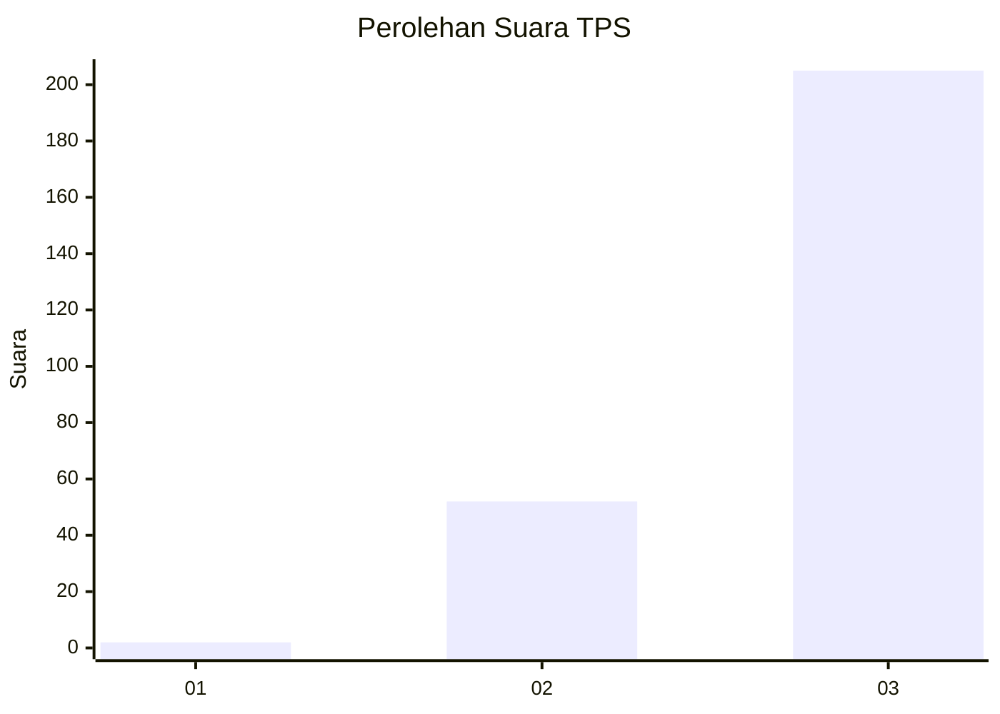
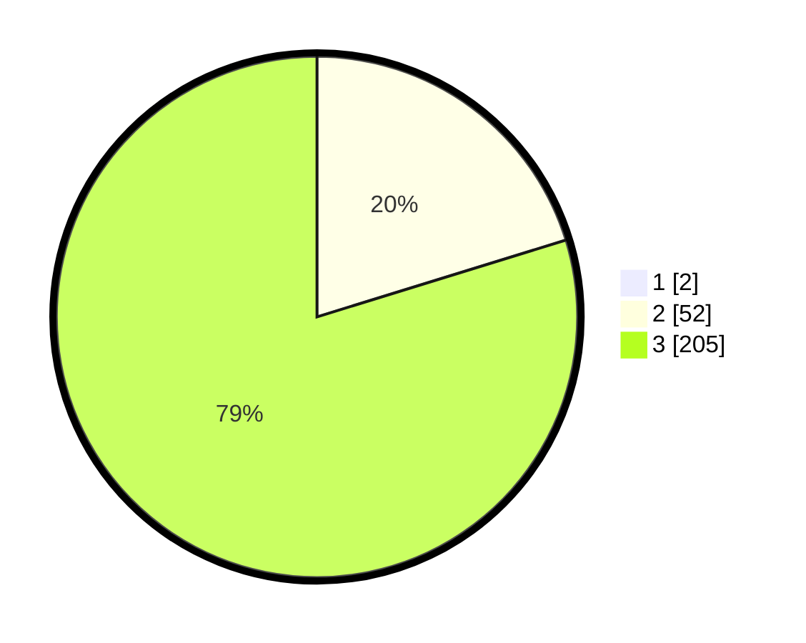

# Hasil

## Grafik

## Tabel

| No. | Nama Paslon    | Suara | Suara (raw) | Persentase |
|:--- |:-------------- | -----:| -----------:| ----------:|
| 1   | ANIES MUHAIMIN | 2     | [2][p-1]    | 0,77       |
| 2   | PRABOWO GIBRAN | 52    | [52][p-2]   | 20,08      |
| 3   | GANJAR MAHFUD  | 205   | [205][p-3]  | 79,15      |

[p-1]: https://github.com/gigit-pemilu/pemilu-2024-51-bali/blob/main/pilpres/hitung-suara/sub/51-bali/sub/03-badung/sub/02-mengwi/sub/1004-kapal/sub/005-tps/sub/paslon-1.txt
[p-2]: https://github.com/gigit-pemilu/pemilu-2024-51-bali/blob/main/pilpres/hitung-suara/sub/51-bali/sub/03-badung/sub/02-mengwi/sub/1004-kapal/sub/005-tps/sub/paslon-2.txt
[p-3]: https://github.com/gigit-pemilu/pemilu-2024-51-bali/blob/main/pilpres/hitung-suara/sub/51-bali/sub/03-badung/sub/02-mengwi/sub/1004-kapal/sub/005-tps/sub/paslon-3.txt

## Foto C Plano

https://sirekap-obj-formc.kpu.go.id/efe7/pemilu/ppwp/51/03/02/10/04/5103021004005-20240215-221024--58a66506-9309-4c6e-b4e2-2caa4dc033dd.jpg

https://sirekap-obj-formc.kpu.go.id/efe7/pemilu/ppwp/51/03/02/10/04/5103021004005-20240214-220907--0961b880-21e5-4854-8226-f4cd26dcb42d.jpg

https://sirekap-obj-formc.kpu.go.id/efe7/pemilu/ppwp/51/03/02/10/04/5103021004005-20240214-221045--17b99d78-8bec-42ea-b83a-2ca2d3f4a1ae.jpg

## Metadata

| Key        | Value               |
| ---------- | ------------------- |
| Time Stamp | 2024-02-16 09:00:28 |

## DATA PEMILIH TETAP

Jumlah pemilih dalam DPT: **273**.
 * L: **130**.
 * P: **143**.

## DATA PENGGUNA HAK PILIH

Jumlah pengguna hak pilih dalam DPT: **273**.
 * L: **130**.
 * P: **143**.

Jumlah pengguna hak pilih dalam DPTb: **0**.
 * L: **0**.
 * P: **0**.

Jumlah pengguna hak pilih dalam DPK: **0**.
 * L: **0**.
 * P: **0**.

Jumlah pengguna hak pilih: **273**.
 * L: **130**.
 * P: **143**.

## JUMLAH SUARA SAH DAN TIDAK SAH

JUMLAH SELURUH SUARA SAH: **259**.

JUMLAH SUARA TIDAK SAH: **14**.

JUMLAH SELURUH SUARA SAH DAN SUARA TIDAK SAH: **273**.

