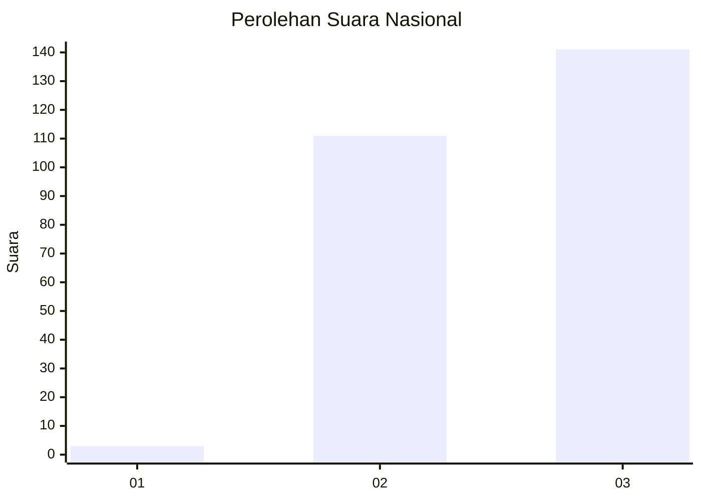
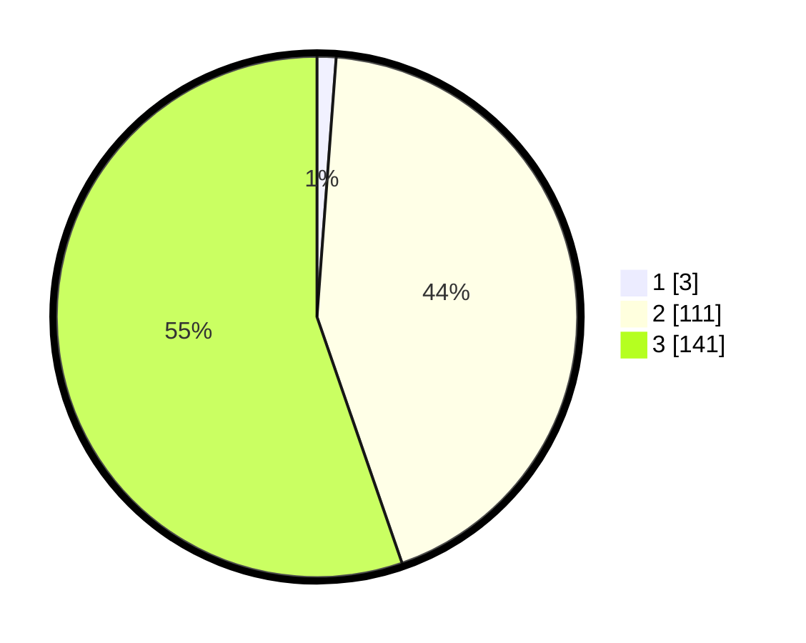

# Hasil

## Grafik

## Tabel

| No. | Nama Paslon    | Suara | Suara (raw) | Persentase |
|:--- |:-------------- | -----:| -----------:| ----------:|
| 1   | ANIES MUHAIMIN | 3     | [3][p-1]    | 1,18       |
| 2   | PRABOWO GIBRAN | 111   | [111][p-2]  | 43,53      |
| 3   | GANJAR MAHFUD  | 141   | [141][p-3]  | 55,29      |

[p-1]: https://github.com/gigit-pemilu/pemilu-2024/blob/main/pilpres/hitung-suara/sub/51-bali/sub/03-badung/sub/02-mengwi/sub/1004-kapal/sub/006-tps/sub/paslon-1.txt
[p-2]: https://github.com/gigit-pemilu/pemilu-2024/blob/main/pilpres/hitung-suara/sub/51-bali/sub/03-badung/sub/02-mengwi/sub/1004-kapal/sub/006-tps/sub/paslon-2.txt
[p-3]: https://github.com/gigit-pemilu/pemilu-2024/blob/main/pilpres/hitung-suara/sub/51-bali/sub/03-badung/sub/02-mengwi/sub/1004-kapal/sub/006-tps/sub/paslon-3.txt

## Foto C Plano

https://sirekap-obj-formc.kpu.go.id/f3ff/pemilu/ppwp/51/03/02/10/04/5103021004006-20240214-221238--61c8f756-a7e4-4bca-b57d-6ae8161afad0.jpg

https://sirekap-obj-formc.kpu.go.id/f3ff/pemilu/ppwp/51/03/02/10/04/5103021004006-20240215-214021--7ee849fc-919b-482e-99db-4ba33e318200.jpg

https://sirekap-obj-formc.kpu.go.id/f3ff/pemilu/ppwp/51/03/02/10/04/5103021004006-20240215-214230--ca34ad21-45e0-4712-bdce-e7531067d00f.jpg

## Metadata

| Key        | Value               |
| ---------- | ------------------- |
| Time Stamp | 2024-02-21 15:00:00 |

## DATA PEMILIH TETAP

Jumlah pemilih dalam DPT: **270**.
 * L: **128**.
 * P: **142**.

## DATA PENGGUNA HAK PILIH

Jumlah pengguna hak pilih dalam DPT: **257**.
 * L: **120**.
 * P: **137**.

Jumlah pengguna hak pilih dalam DPTb: **0**.
 * L: **0**.
 * P: **0**.

Jumlah pengguna hak pilih dalam DPK: **0**.
 * L: **0**.
 * P: **0**.

Jumlah pengguna hak pilih: **257**.
 * L: **120**.
 * P: **137**.

## JUMLAH SUARA SAH DAN TIDAK SAH

JUMLAH SELURUH SUARA SAH: **255**.

JUMLAH SUARA TIDAK SAH: **2**.

JUMLAH SELURUH SUARA SAH DAN SUARA TIDAK SAH: **257**.

