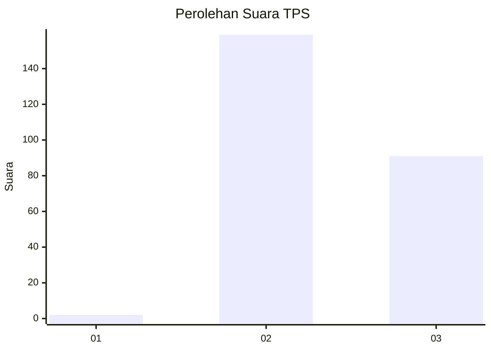
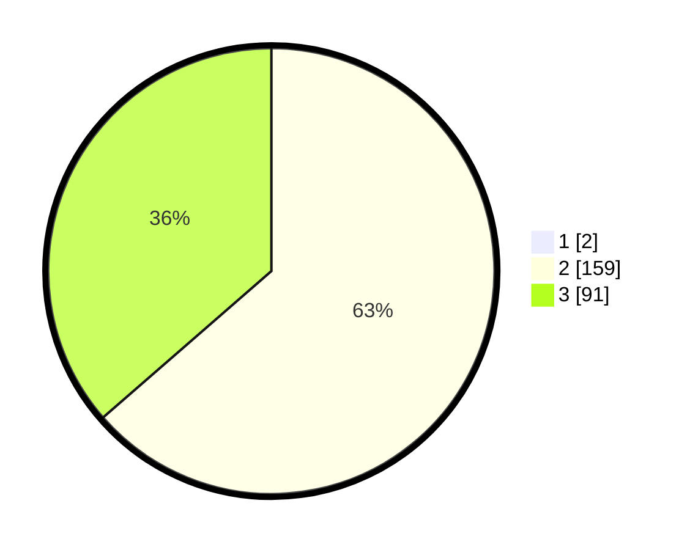

# Hasil

## Grafik

## Tabel

| No. | Nama Paslon    | Suara | Suara (raw) | Persentase |
|:--- |:-------------- | -----:| -----------:| ----------:|
| 1   | ANIES MUHAIMIN | 2     | [2][p-1]    | 0,79       |
| 2   | PRABOWO GIBRAN | 159   | [159][p-2]  | 63,10      |
| 3   | GANJAR MAHFUD  | 91    | [91][p-3]   | 36,11      |

[p-1]: https://github.com/gigit-pemilu/pemilu-2024-51-bali/blob/main/pilpres/hitung-suara/sub/51-bali/sub/03-badung/sub/02-mengwi/sub/1004-kapal/sub/010-tps/sub/paslon-1.txt
[p-2]: https://github.com/gigit-pemilu/pemilu-2024-51-bali/blob/main/pilpres/hitung-suara/sub/51-bali/sub/03-badung/sub/02-mengwi/sub/1004-kapal/sub/010-tps/sub/paslon-2.txt
[p-3]: https://github.com/gigit-pemilu/pemilu-2024-51-bali/blob/main/pilpres/hitung-suara/sub/51-bali/sub/03-badung/sub/02-mengwi/sub/1004-kapal/sub/010-tps/sub/paslon-3.txt

## Foto C Plano

https://sirekap-obj-formc.kpu.go.id/e1fd/pemilu/ppwp/51/03/02/10/04/5103021004010-20240214-201837--6c6d4a14-e952-401f-b0fa-424fa599d7b9.jpg

https://sirekap-obj-formc.kpu.go.id/e1fd/pemilu/ppwp/51/03/02/10/04/5103021004010-20240214-211737--695082c6-0e2e-4732-bc14-cc5a166bfd3b.jpg

https://sirekap-obj-formc.kpu.go.id/e1fd/pemilu/ppwp/51/03/02/10/04/5103021004010-20240214-211849--e3414c13-d373-4502-abac-c99a944e1e68.jpg

## Metadata

| Key        | Value               |
| ---------- | ------------------- |
| Time Stamp | 2024-02-15 02:10:27 |

## DATA PEMILIH TETAP

Jumlah pemilih dalam DPT: **279**.
 * L: **135**.
 * P: **144**.

## DATA PENGGUNA HAK PILIH

Jumlah pengguna hak pilih dalam DPT: **254**.
 * L: **121**.
 * P: **133**.

Jumlah pengguna hak pilih dalam DPTb: **1**.
 * L: **1**.
 * P: **0**.

Jumlah pengguna hak pilih dalam DPK: **4**.
 * L: **1**.
 * P: **3**.

Jumlah pengguna hak pilih: **159**.
 * L: **123**.
 * P: **136**.

## JUMLAH SUARA SAH DAN TIDAK SAH

JUMLAH SELURUH SUARA SAH: **252**.

JUMLAH SUARA TIDAK SAH: **7**.

JUMLAH SELURUH SUARA SAH DAN SUARA TIDAK SAH: **259**.

