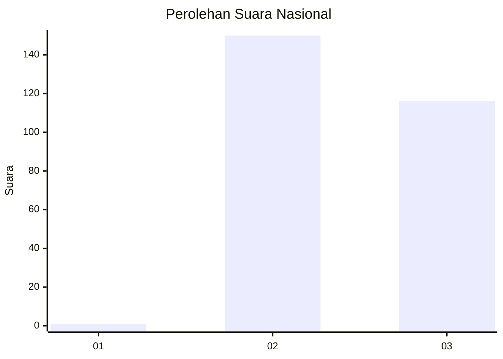
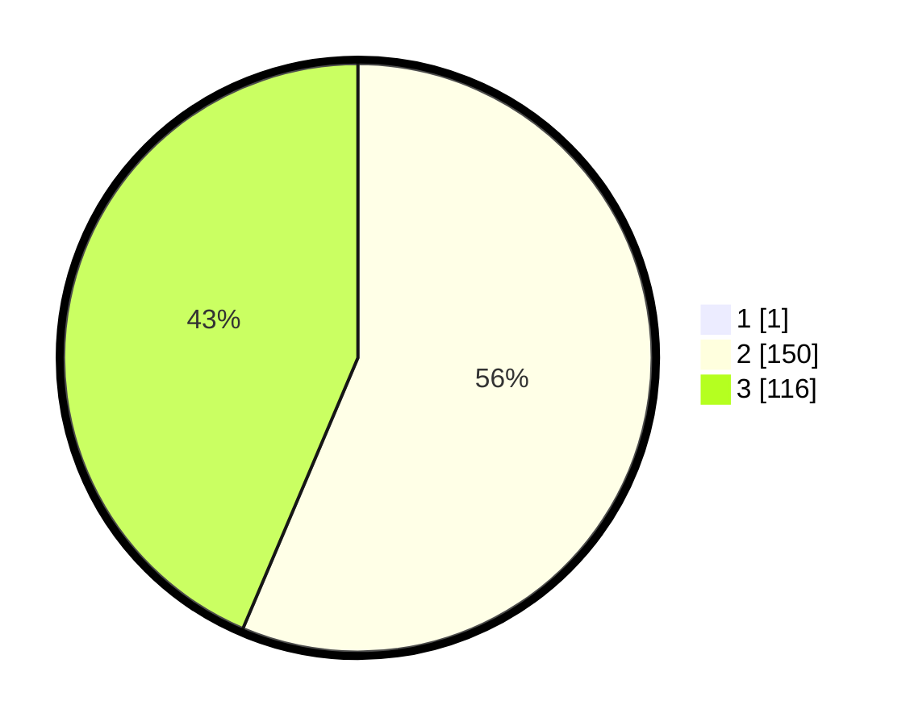

# Hasil

## Grafik

## Tabel

| No. | Nama Paslon    | Suara | Suara (raw) | Persentase |
|:--- |:-------------- | -----:| -----------:| ----------:|
| 1   | ANIES MUHAIMIN | 1     | [1][p-1]    | 0,37       |
| 2   | PRABOWO GIBRAN | 150   | [150][p-2]  | 56,18      |
| 3   | GANJAR MAHFUD  | 116   | [116][p-3]  | 43,45      |

[p-1]: https://github.com/gigit-pemilu/pemilu-2024/blob/main/pilpres/hitung-suara/sub/51-bali/sub/03-badung/sub/02-mengwi/sub/1004-kapal/sub/011-tps/sub/paslon-1.txt
[p-2]: https://github.com/gigit-pemilu/pemilu-2024/blob/main/pilpres/hitung-suara/sub/51-bali/sub/03-badung/sub/02-mengwi/sub/1004-kapal/sub/011-tps/sub/paslon-2.txt
[p-3]: https://github.com/gigit-pemilu/pemilu-2024/blob/main/pilpres/hitung-suara/sub/51-bali/sub/03-badung/sub/02-mengwi/sub/1004-kapal/sub/011-tps/sub/paslon-3.txt

## Foto C Plano

https://sirekap-obj-formc.kpu.go.id/ce18/pemilu/ppwp/51/03/02/10/04/5103021004011-20240214-211106--a722bbcf-9df6-401e-bc11-9181138e3eab.jpg

https://sirekap-obj-formc.kpu.go.id/ce18/pemilu/ppwp/51/03/02/10/04/5103021004011-20240214-211124--217e3ff0-1693-4ff4-bc81-e2da9e05823e.jpg

https://sirekap-obj-formc.kpu.go.id/ce18/pemilu/ppwp/51/03/02/10/04/5103021004011-20240214-225538--b32beb5f-74ef-44b0-8f20-eef3b5cfaddf.jpg

## Metadata

| Key        | Value               |
| ---------- | ------------------- |
| Time Stamp | 2024-02-21 22:00:00 |

## DATA PEMILIH TETAP

Jumlah pemilih dalam DPT: **280**.
 * L: **133**.
 * P: **147**.

## DATA PENGGUNA HAK PILIH

Jumlah pengguna hak pilih dalam DPT: **273**.
 * L: **129**.
 * P: **144**.

Jumlah pengguna hak pilih dalam DPTb: **1**.
 * L: **1**.
 * P: **0**.

Jumlah pengguna hak pilih dalam DPK: **0**.
 * L: **0**.
 * P: **0**.

Jumlah pengguna hak pilih: **274**.
 * L: **130**.
 * P: **144**.

## JUMLAH SUARA SAH DAN TIDAK SAH

JUMLAH SELURUH SUARA SAH: **267**.

JUMLAH SUARA TIDAK SAH: **7**.

JUMLAH SELURUH SUARA SAH DAN SUARA TIDAK SAH: **274**.

