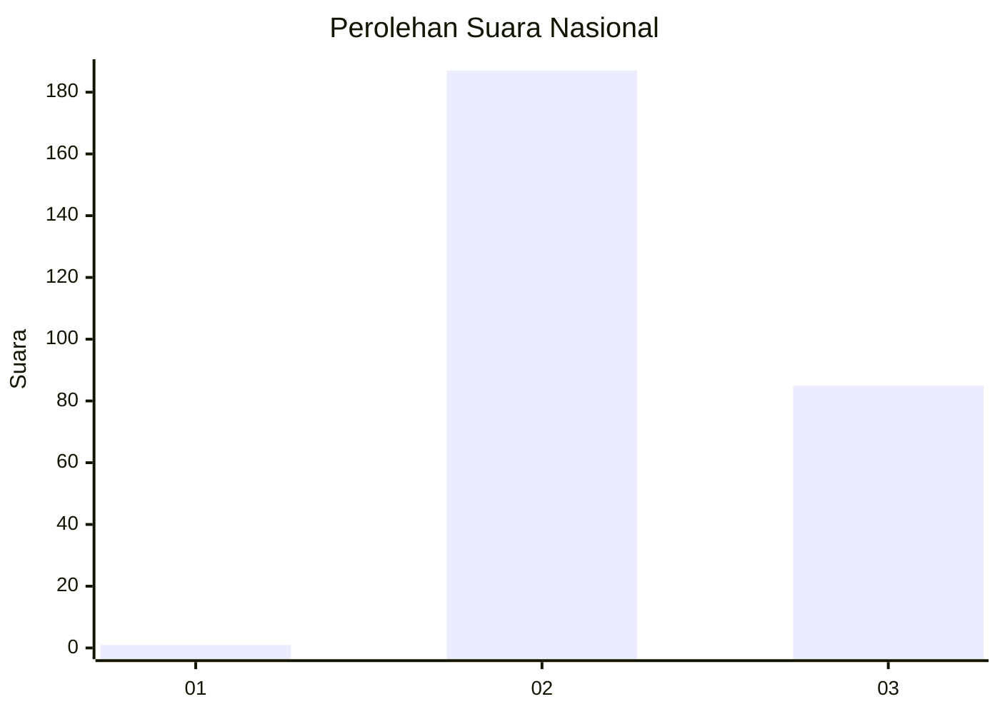
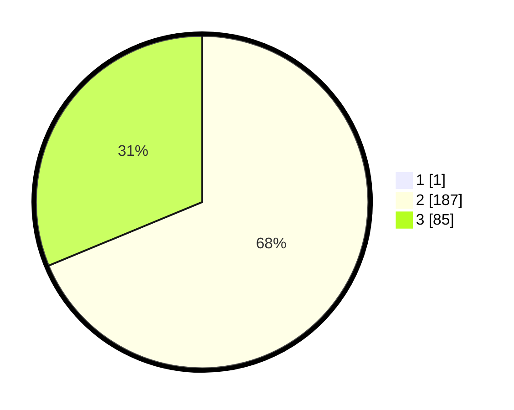

# Hasil

## Grafik

## Tabel

| No. | Nama Paslon    | Suara | Suara (raw) | Persentase |
|:--- |:-------------- | -----:| -----------:| ----------:|
| 1   | ANIES MUHAIMIN | 1     | [1][p-1]    | 0,37       |
| 2   | PRABOWO GIBRAN | 187   | [187][p-2]  | 68,50      |
| 3   | GANJAR MAHFUD  | 85    | [85][p-3]   | 31,14      |

[p-1]: https://github.com/gigit-pemilu/pemilu-2024/blob/main/pilpres/hitung-suara/sub/51-bali/sub/03-badung/sub/02-mengwi/sub/1004-kapal/sub/012-tps/sub/paslon-1.txt
[p-2]: https://github.com/gigit-pemilu/pemilu-2024/blob/main/pilpres/hitung-suara/sub/51-bali/sub/03-badung/sub/02-mengwi/sub/1004-kapal/sub/012-tps/sub/paslon-2.txt
[p-3]: https://github.com/gigit-pemilu/pemilu-2024/blob/main/pilpres/hitung-suara/sub/51-bali/sub/03-badung/sub/02-mengwi/sub/1004-kapal/sub/012-tps/sub/paslon-3.txt

## Foto C Plano

https://sirekap-obj-formc.kpu.go.id/ae11/pemilu/ppwp/51/03/02/10/04/5103021004012-20240214-141521--487a472e-9d8d-457d-b8a3-93b194461f81.jpg

https://sirekap-obj-formc.kpu.go.id/ae11/pemilu/ppwp/51/03/02/10/04/5103021004012-20240214-141609--e6e85c61-7bce-45f8-a517-276e93a10906.jpg

https://sirekap-obj-formc.kpu.go.id/ae11/pemilu/ppwp/51/03/02/10/04/5103021004012-20240214-230720--4710df30-9e53-43cd-8600-d226598e47ba.jpg

## Metadata

| Key        | Value               |
| ---------- | ------------------- |
| Time Stamp | 2024-02-24 22:31:28 |

