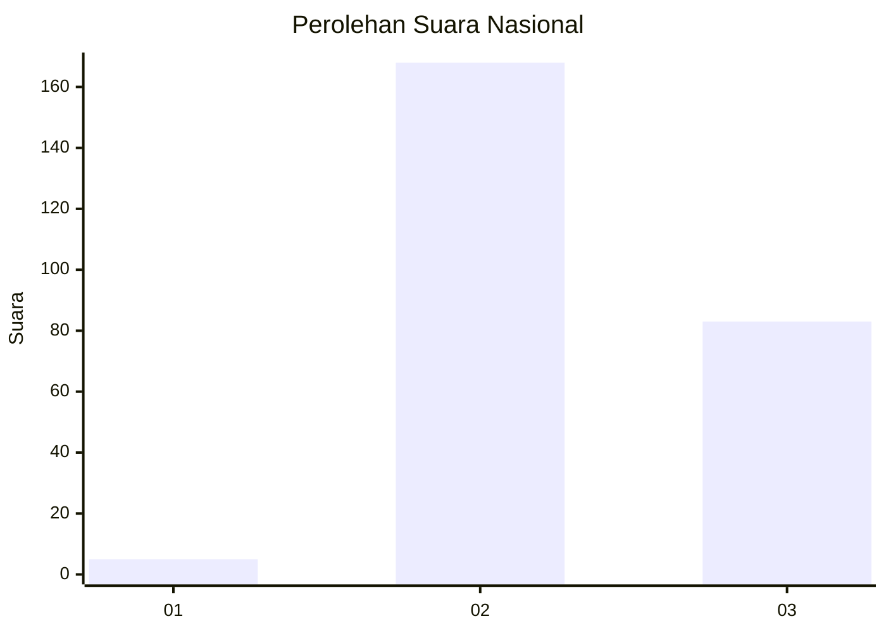
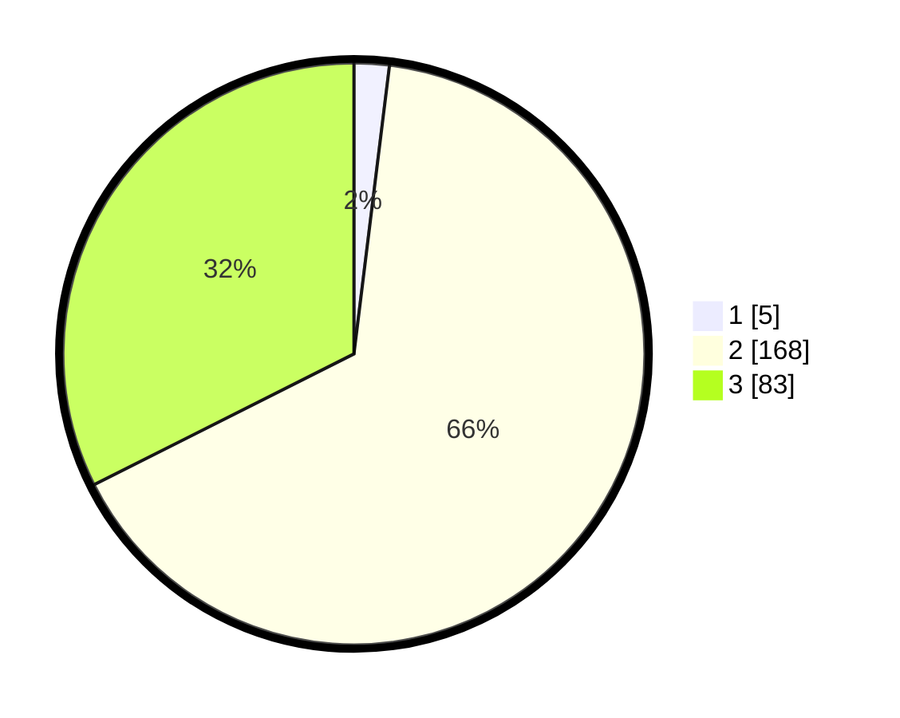

# Hasil

## Grafik

## Tabel

| No. | Nama Paslon    | Suara | Suara (raw) | Persentase |
|:--- |:-------------- | -----:| -----------:| ----------:|
| 1   | ANIES MUHAIMIN | 5     | [5][p-1]    | 1,95       |
| 2   | PRABOWO GIBRAN | 168   | [168][p-2]  | 65,63      |
| 3   | GANJAR MAHFUD  | 83    | [83][p-3]   | 32,42      |

[p-1]: https://github.com/gigit-pemilu/pemilu-2024/blob/main/pilpres/hitung-suara/sub/51-bali/sub/03-badung/sub/02-mengwi/sub/1004-kapal/sub/014-tps/sub/paslon-1.txt
[p-2]: https://github.com/gigit-pemilu/pemilu-2024/blob/main/pilpres/hitung-suara/sub/51-bali/sub/03-badung/sub/02-mengwi/sub/1004-kapal/sub/014-tps/sub/paslon-2.txt
[p-3]: https://github.com/gigit-pemilu/pemilu-2024/blob/main/pilpres/hitung-suara/sub/51-bali/sub/03-badung/sub/02-mengwi/sub/1004-kapal/sub/014-tps/sub/paslon-3.txt

## Foto C Plano

https://sirekap-obj-formc.kpu.go.id/9c9f/pemilu/ppwp/51/03/02/10/04/5103021004014-20240214-232515--a1c5bb3c-bc62-46f7-9f71-d8e8ec2cc18a.jpg

https://sirekap-obj-formc.kpu.go.id/9c9f/pemilu/ppwp/51/03/02/10/04/5103021004014-20240214-232640--b908c8e9-70ac-4d94-9228-f29152e8dfd9.jpg

https://sirekap-obj-formc.kpu.go.id/9c9f/pemilu/ppwp/51/03/02/10/04/5103021004014-20240214-232813--3de66be3-241d-4f9d-a814-7ada59d0fab0.jpg

## Metadata

| Key        | Value               |
| ---------- | ------------------- |
| Time Stamp | 2024-02-21 11:00:00 |

## DATA PEMILIH TETAP

Jumlah pemilih dalam DPT: **261**.
 * L: **122**.
 * P: **139**.

## DATA PENGGUNA HAK PILIH

Jumlah pengguna hak pilih dalam DPT: **254**.
 * L: **120**.
 * P: **134**.

Jumlah pengguna hak pilih dalam DPTb: **0**.
 * L: **0**.
 * P: **0**.

Jumlah pengguna hak pilih dalam DPK: **8**.
 * L: **3**.
 * P: **5**.

Jumlah pengguna hak pilih: **262**.
 * L: **123**.
 * P: **139**.

## JUMLAH SUARA SAH DAN TIDAK SAH

JUMLAH SELURUH SUARA SAH: **256**.

JUMLAH SUARA TIDAK SAH: **6**.

JUMLAH SELURUH SUARA SAH DAN SUARA TIDAK SAH: **262**.

