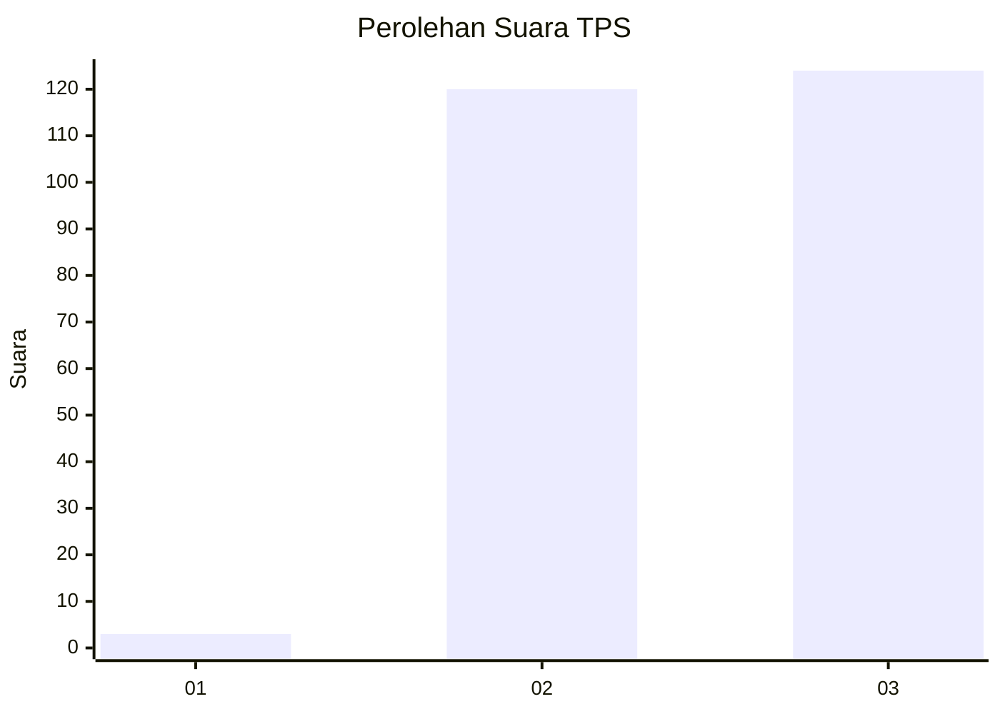
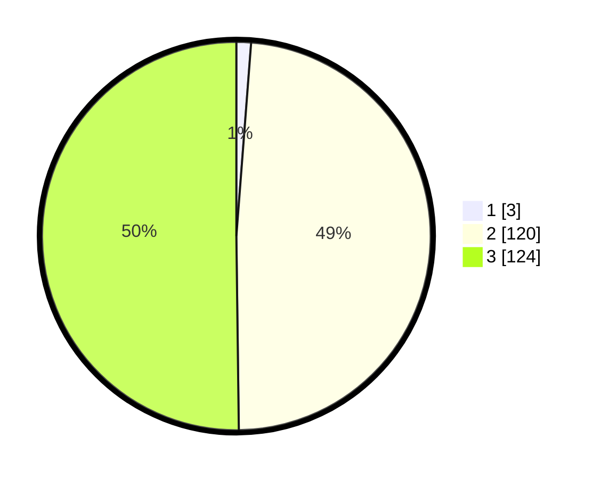

# Hasil

## Grafik

## Tabel

| No. | Nama Paslon    | Suara | Suara (raw) | Persentase |
|:--- |:-------------- | -----:| -----------:| ----------:|
| 1   | ANIES MUHAIMIN | 3     | [3][p-1]    | 1,21       |
| 2   | PRABOWO GIBRAN | 120   | [120][p-2]  | 48,58      |
| 3   | GANJAR MAHFUD  | 124   | [124][p-3]  | 50,20      |

[p-1]: https://github.com/gigit-pemilu/pemilu-2024-51-bali/blob/main/pilpres/hitung-suara/sub/51-bali/sub/03-badung/sub/02-mengwi/sub/1004-kapal/sub/018-tps/sub/paslon-1.txt
[p-2]: https://github.com/gigit-pemilu/pemilu-2024-51-bali/blob/main/pilpres/hitung-suara/sub/51-bali/sub/03-badung/sub/02-mengwi/sub/1004-kapal/sub/018-tps/sub/paslon-2.txt
[p-3]: https://github.com/gigit-pemilu/pemilu-2024-51-bali/blob/main/pilpres/hitung-suara/sub/51-bali/sub/03-badung/sub/02-mengwi/sub/1004-kapal/sub/018-tps/sub/paslon-3.txt

## Foto C Plano

https://sirekap-obj-formc.kpu.go.id/2062/pemilu/ppwp/51/03/02/10/04/5103021004018-20240218-064820--25b5fe72-3fe1-4d27-bca6-e742749a6102.jpg

https://sirekap-obj-formc.kpu.go.id/2062/pemilu/ppwp/51/03/02/10/04/5103021004018-20240214-193234--3db86c2b-16b1-467c-a91b-1de5ed31f663.jpg

https://sirekap-obj-formc.kpu.go.id/2062/pemilu/ppwp/51/03/02/10/04/5103021004018-20240214-193243--3fcda92c-9ac4-4d14-b0f8-b70e77d7e170.jpg

## Metadata

| Key        | Value               |
| ---------- | ------------------- |
| Time Stamp | 2024-02-21 21:00:04 |

