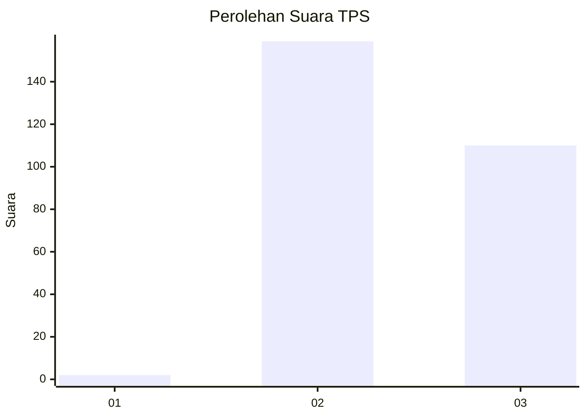
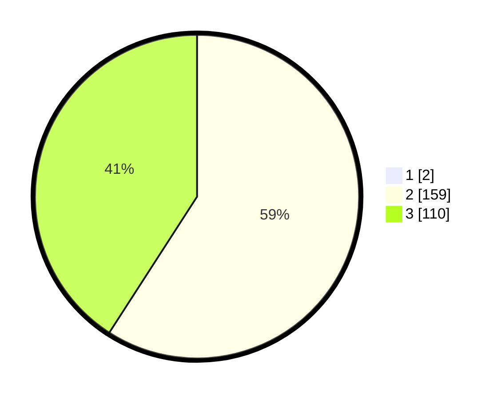

# Hasil

## Grafik

## Tabel

| No. | Nama Paslon    | Suara | Suara (raw) | Persentase |
|:--- |:-------------- | -----:| -----------:| ----------:|
| 1   | ANIES MUHAIMIN | 2     | [2][p-1]    | 0,74       |
| 2   | PRABOWO GIBRAN | 159   | [159][p-2]  | 58,67      |
| 3   | GANJAR MAHFUD  | 110   | [110][p-3]  | 40,59      |

[p-1]: https://github.com/gigit-pemilu/pemilu-2024-51-bali/blob/main/pilpres/hitung-suara/sub/51-bali/sub/03-badung/sub/02-mengwi/sub/1004-kapal/sub/019-tps/sub/paslon-1.txt
[p-2]: https://github.com/gigit-pemilu/pemilu-2024-51-bali/blob/main/pilpres/hitung-suara/sub/51-bali/sub/03-badung/sub/02-mengwi/sub/1004-kapal/sub/019-tps/sub/paslon-2.txt
[p-3]: https://github.com/gigit-pemilu/pemilu-2024-51-bali/blob/main/pilpres/hitung-suara/sub/51-bali/sub/03-badung/sub/02-mengwi/sub/1004-kapal/sub/019-tps/sub/paslon-3.txt

## Foto C Plano

https://sirekap-obj-formc.kpu.go.id/0054/pemilu/ppwp/51/03/02/10/04/5103021004019-20240218-093015--d3b7554f-8738-4921-b168-1907d5c379ef.jpg

https://sirekap-obj-formc.kpu.go.id/0054/pemilu/ppwp/51/03/02/10/04/5103021004019-20240218-095638--211d04c8-e743-4756-809f-1a985d35918c.jpg

https://sirekap-obj-formc.kpu.go.id/0054/pemilu/ppwp/51/03/02/10/04/5103021004019-20240218-100001--2e87e6b7-ca17-4a54-b18a-307c31785af2.jpg

## Metadata

| Key        | Value               |
| ---------- | ------------------- |
| Time Stamp | 2024-02-21 17:00:00 |

