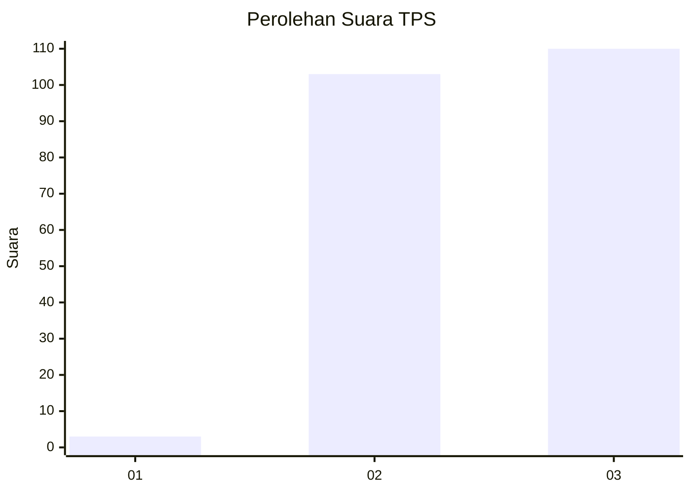
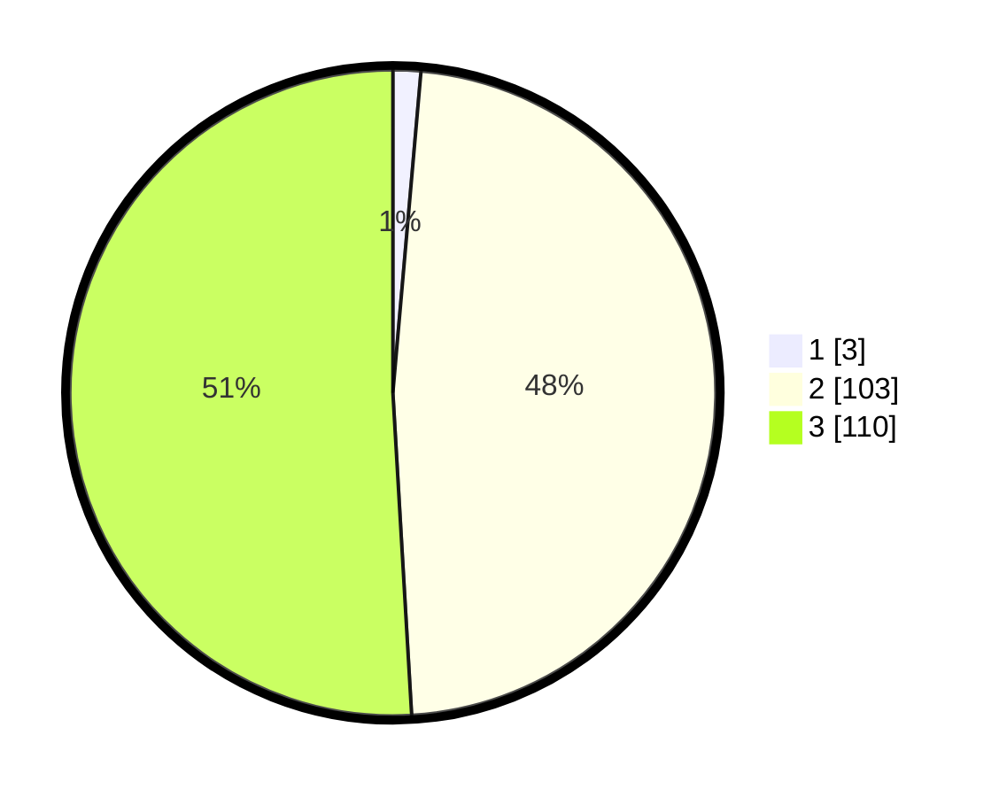

# Hasil

## Grafik

## Tabel

| No. | Nama Paslon    | Suara | Suara (raw) | Persentase |
|:--- |:-------------- | -----:| -----------:| ----------:|
| 1   | ANIES MUHAIMIN | 3     | [3][p-1]    | 1,39       |
| 2   | PRABOWO GIBRAN | 103   | [103][p-2]  | 47,69      |
| 3   | GANJAR MAHFUD  | 110   | [110][p-3]  | 50,93      |

[p-1]: https://github.com/gigit-pemilu/pemilu-2024-51-bali/blob/main/pilpres/hitung-suara/sub/51-bali/sub/03-badung/sub/02-mengwi/sub/1004-kapal/sub/022-tps/sub/paslon-1.txt
[p-2]: https://github.com/gigit-pemilu/pemilu-2024-51-bali/blob/main/pilpres/hitung-suara/sub/51-bali/sub/03-badung/sub/02-mengwi/sub/1004-kapal/sub/022-tps/sub/paslon-2.txt
[p-3]: https://github.com/gigit-pemilu/pemilu-2024-51-bali/blob/main/pilpres/hitung-suara/sub/51-bali/sub/03-badung/sub/02-mengwi/sub/1004-kapal/sub/022-tps/sub/paslon-3.txt

## Foto C Plano

https://sirekap-obj-formc.kpu.go.id/190c/pemilu/ppwp/51/03/02/10/04/5103021004022-20240214-201220--eb6d2ab1-e3ad-4eab-be65-fd8ca5601955.jpg

https://sirekap-obj-formc.kpu.go.id/190c/pemilu/ppwp/51/03/02/10/04/5103021004022-20240214-201537--130304bb-5ae7-4f0d-a31a-4f0599544cef.jpg

https://sirekap-obj-formc.kpu.go.id/190c/pemilu/ppwp/51/03/02/10/04/5103021004022-20240214-201245--63c2d791-9328-45b8-935f-c7348761336a.jpg

## Metadata

| Key        | Value               |
| ---------- | ------------------- |
| Time Stamp | 2024-02-24 22:31:28 |

